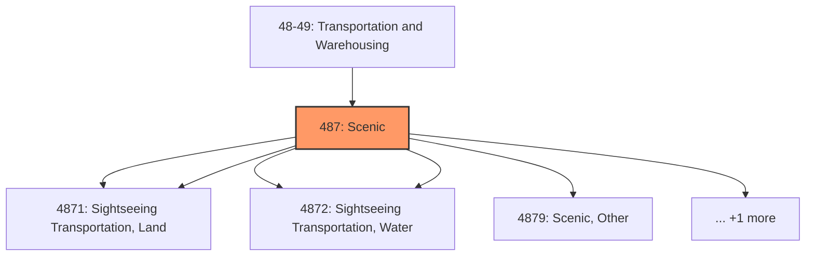
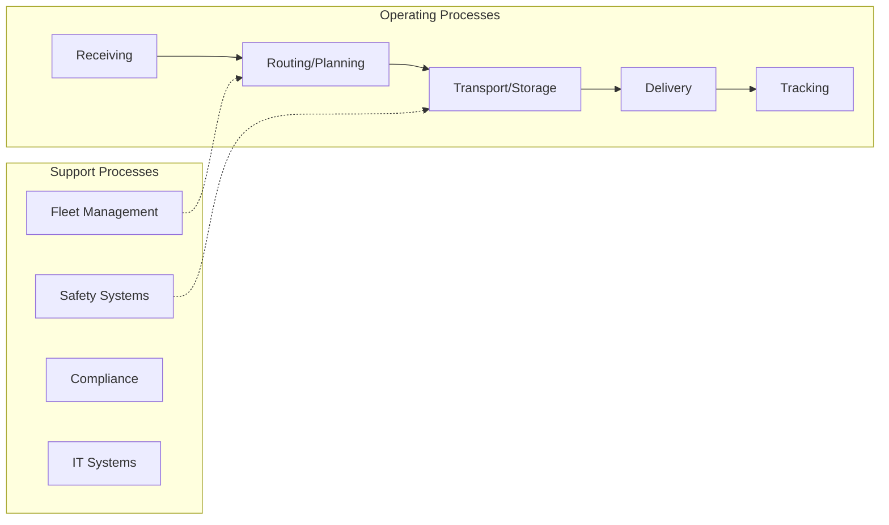

# Scenic

> Industries in the Scenic and Sightseeing Transportation subsector utilize transportation equipment to provide recreation and entertainment.

## Overview

Scenic represents an important category within the Transportation and Warehousing sector (NAICS 48-49).

Industries in the Scenic and Sightseeing Transportation subsector utilize transportation equipment to provide recreation and entertainment. These activities have a production process distinct from passenger transportation carried out for the purpose of other types of for-hire transportation. This process does not emphasize efficient transportation; in fact, such activities often use obsolete vehicles, such as steam trains, to provide some extra ambience. The activity is local in nature, usually involving a same-day return to the point of departure. The Scenic and Sightseeing Transportation subsector is separated into three industries based on the mode: land, water, and other. Activities that are recreational in nature and involve participation by the customer, such as white water rafting, are generally excluded from this subsector, unless they impose an impact on part of the transportation system. Charter boat fishing, for example, is included in the Scenic and Sightseeing Transportation, Water industry.

## Industry Hierarchy

## Key Statistics

| Metric | Value |
|--------|-------|
| NAICS Code | 487 |
| Level | Subsector |
| Child Industries | 6 |

## Sub-Industries

| Industry | Code | Description |
|----------|------|-------------|
| [Scenic, Land](./ScenicLand/) | 4871 | Scenic, Land |
| [Sightseeing Transportation, Land](./SightseeingTransportationLand/) | 4871 | Sightseeing Transportation, Land |
| [Scenic, Water](./ScenicWater/) | 4872 | Scenic, Water |
| [Sightseeing Transportation, Water](./SightseeingTransportationWater/) | 4872 | Sightseeing Transportation, Water |
| [Scenic, Other](./ScenicOther/) | 4879 | Scenic, Other |
| [Sightseeing Transportation, Other](./SightseeingTransportationOther/) | 4879 | Sightseeing Transportation, Other |

## Related Occupations

See the [occupations directory](/occupations) for roles commonly found in this industry.

## Core Business Processes

## Industry Value Chain

## Market Context

Transportation and warehousing enable the movement of goods through supply chains, with technology driving efficiency improvements and last-mile innovations.

| Aspect | Details |
|--------|---------|
| Industry Sector | TransportationAndWarehousing |
| NAICS/SIC Code | 487 |
| Market Segment | Scenic |

## Key Business Processes

- Route planning and optimization
- Freight handling
- Warehouse operations
- Last-mile delivery
- Fleet maintenance

## Common Occupations

- [Transportation Managers](/occupations/Management/TransportationStorageAndDistributionManagers)
- [Truck Drivers](/occupations/Transportation/HeavyAndTractorTrailerTruckDrivers)
- [Warehouse Workers](/occupations/Transportation/LaborersAndFreightStockAndMaterialMovers)
- [Logistics Coordinators](/occupations/Business/Logisticians)

## Regulations and Standards

- Department of Transportation (DOT)
- Federal Motor Carrier Safety Administration (FMCSA)
- Hazardous Materials Regulations (HMR)
- OSHA warehouse safety standards
- State transportation permits

## Technology and Tools

- Fleet management systems
- Warehouse management systems (WMS)
- GPS tracking and telematics
- Automated material handling
- Transportation management systems (TMS)

## Industry Trends

- Digital transformation and automation adoption
- Sustainability and environmental compliance focus
- Workforce development and skills training
- Supply chain resilience and optimization
- Customer experience enhancement

---

*Source: NAICS 487 - Scenic*
