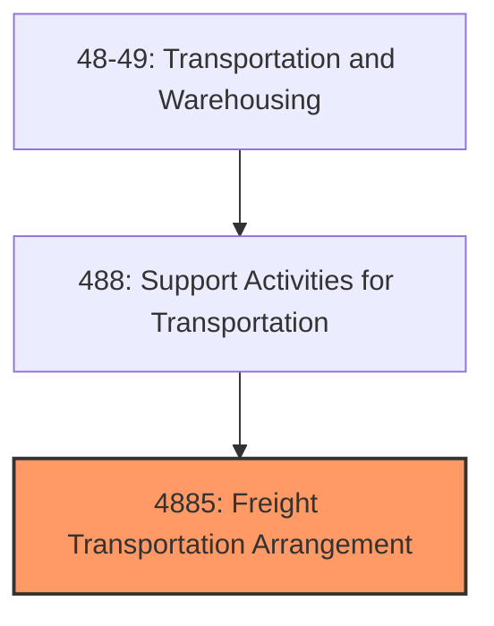
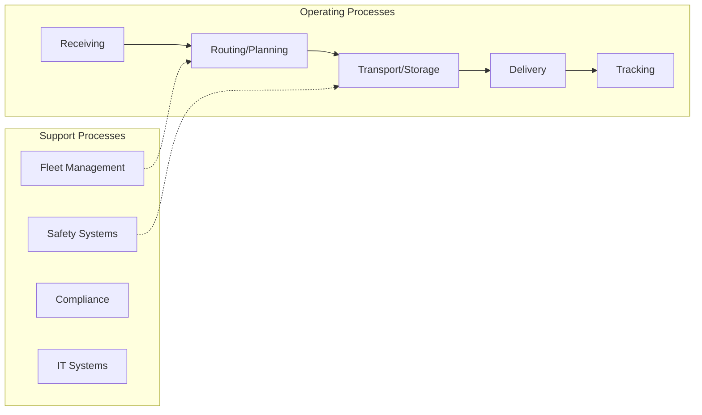

# Freight Transportation Arrangement

> Establishments primarily engaged in freight transportation arrangement.

## Overview

Freight Transportation Arrangement represents an important category within the Transportation and Warehousing sector (NAICS 48-49). This industry group encompasses establishments primarily engaged in freight transportation arrangement.

## Industry Hierarchy

## Key Statistics

| Metric | Value |
|--------|-------|
| NAICS Code | 4885 |
| Level | Industry Group |
| Parent | [Support Activities for Transportation](../) |
| Child Industries | 0 |

## Core Business Processes

## Industry Value Chain

```mermaid
graph LR
    subgraph Inputs["Inputs"]
        I1["Resources"]
        I2["Expertise"]
        I3["Technology"]
    end

    subgraph Primary["Primary Activities"]
        A1["Inbound Logistics"]
        A2["Core Operations"]
        A3["Quality Assurance"]
        A4["Outbound/Delivery"]
    end

    subgraph Outputs["Products/Services"]
        O1["Products"]
        O2["Services"]
        O3["Solutions"]
    end

    subgraph Customers["Markets"]
        C1["Businesses"]
        C2["Consumers"]
        C3["Government"]
        C4["Institutions"]
    end

    Inputs --> Primary --> Outputs --> Customers
```

---

*Source: NAICS 4885 - Freight Transportation Arrangement*
