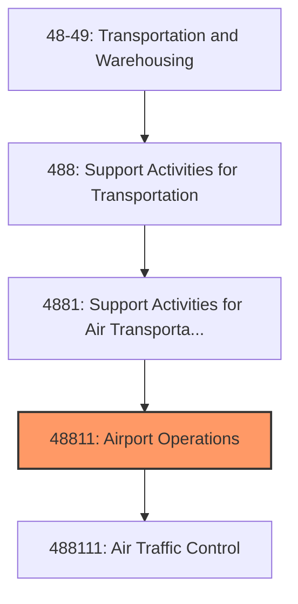
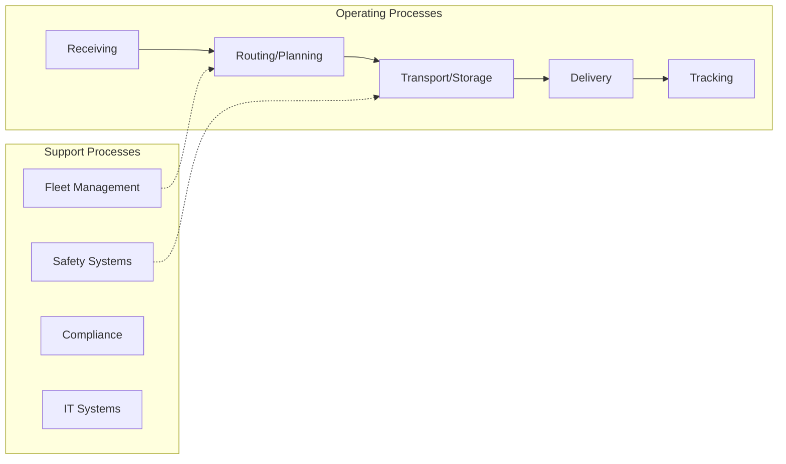

# Airport Operations

> This industry comprises establishments primarily engaged in (1) operating international, national, or civil airports or public flying fields or (2) supporting airport operations (except special food services contractors), such as rental of hangar space, air traffic control (except military) services, baggage handling services, and cargo handling services.

## Overview

Airport Operations represents an important category within the Transportation and Warehousing sector (NAICS 48-49). This industry encompasses establishments primarily engaged in airport operations.

This industry comprises establishments primarily engaged in (1) operating international, national, or civil airports or public flying fields or (2) supporting airport operations (except special food services contractors), such as rental of hangar space, air traffic control (except military) services, baggage handling services, and cargo handling services. Cross-References.

## Industry Hierarchy

## Key Statistics

| Metric | Value |
|--------|-------|
| NAICS Code | 48811 |
| Level | Industry |
| Parent | [Support Activities for Air Transportation](../) |
| Child Industries | 1 |

## Sub-Industries

| Industry | Code | Description |
|----------|------|-------------|
| [Air Traffic Control](./AirTrafficControl.mdx) | 488111 | This U |

## Related Occupations

- [Transportation, Storage, and Distribution Managers](/occupations/Management/TransportationStorageAndDistributionManagers) - Plan and direct transportation operations
- [Logisticians](/occupations/Business/Logisticians) - Analyze and coordinate supply chain
- [Transportation Engineers](/occupations/Architecture/TransportationEngineers) - Design transportation infrastructure
- [Logistics Analysts](/occupations/Business/LogisticsAnalysts) - Analyze logistics data to optimize operations

## Core Business Processes

## Industry Value Chain

## Regulatory Environment

- **DOT** (Department of Transportation) - Regulates transportation safety and operations
- **FMCSA** (Federal Motor Carrier Safety Administration) - Oversees commercial vehicle operations
- **FAA** (Federal Aviation Administration) - Regulates air transportation
- **FRA** (Federal Railroad Administration) - Governs railroad safety and operations

## Technology & Innovation

- **Autonomous Vehicles** - Self-driving trucks, delivery drones, and autonomous ships
- **Fleet Telematics** - Real-time GPS tracking, fuel optimization, and predictive maintenance
- **Electric Transportation** - EV fleet adoption, charging infrastructure, and battery technology
- **Digital Freight Platforms** - Online marketplaces matching shippers with carriers

## Industry Outlook

The transportation and warehousing sector is investing heavily in electrification, automation, and digital logistics platforms. E-commerce growth continues to drive demand for last-mile delivery and warehouse capacity. Autonomous vehicle technology, drone delivery, and sustainable fleet management are key areas of innovation, while labor market tightness drives investment in driver retention and automated operations.

---

*Source: NAICS 48811 - Airport Operations*
