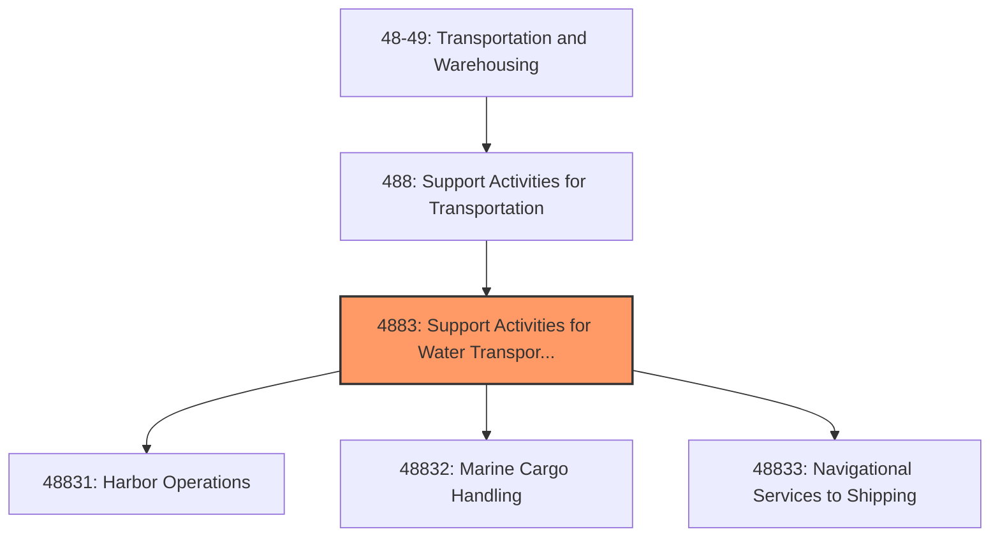
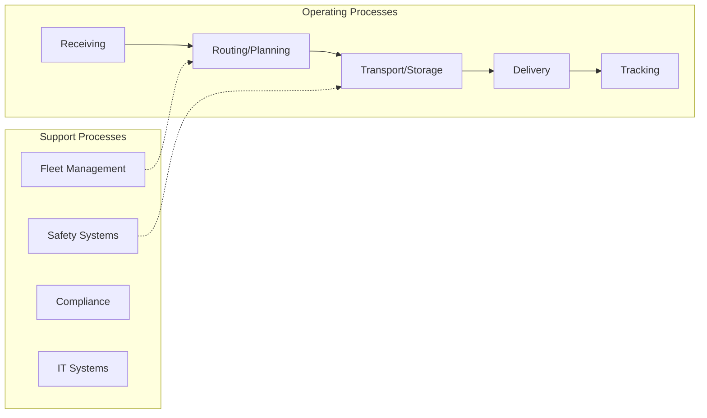

# Support Activities for Water Transportation

> This industry group comprises establishments primarily engaged in one of the following: (1) operating ports, harbors (including docking and pier facilities), or canals; (2) providing stevedoring and other marine cargo handling services (except warehousing); (3) providing navigational services to shipping; or (4) providing other services to water transportation.

## Overview

Support Activities for Water Transportation represents an important category within the Transportation and Warehousing sector (NAICS 48-49). This industry group encompasses establishments primarily engaged in support activities for water transportation.

This industry group comprises establishments primarily engaged in one of the following: (1) operating ports, harbors (including docking and pier facilities), or canals; (2) providing stevedoring and other marine cargo handling services (except warehousing); (3) providing navigational services to shipping; or (4) providing other services to water transportation.

## Industry Hierarchy

## Key Statistics

| Metric | Value |
|--------|-------|
| NAICS Code | 4883 |
| Level | Industry Group |
| Parent | [Support Activities for Transportation](../) |
| Child Industries | 3 |

## Sub-Industries

| Industry | Code | Description |
|----------|------|-------------|
| [Harbor Operations](./HarborOperations/) | 48831 | See industry description for 488310 |
| [Marine Cargo Handling](./MarineCargoHandling/) | 48832 | See industry description for 488320 |
| [Navigational Services to Shipping](./NavigationalServicesToShipping/) | 48833 | See industry description for 488330 |

## Core Business Processes

## Industry Value Chain

## Market Context

Transportation and warehousing enable the movement of goods through supply chains, with technology driving efficiency improvements and last-mile innovations.

| Aspect | Details |
|--------|---------|
| Industry Sector | TransportationAndWarehousing |
| NAICS/SIC Code | 4883 |
| Market Segment | Support Activities for Water Transportation |

## Key Business Processes

- Route planning and optimization
- Freight handling
- Warehouse operations
- Last-mile delivery
- Fleet maintenance

## Common Occupations

- [Transportation Managers](/occupations/Management/TransportationStorageAndDistributionManagers)
- [Truck Drivers](/occupations/Transportation/HeavyAndTractorTrailerTruckDrivers)
- [Warehouse Workers](/occupations/Transportation/LaborersAndFreightStockAndMaterialMovers)
- [Logistics Coordinators](/occupations/Business/Logisticians)

## Regulations and Standards

- Department of Transportation (DOT)
- Federal Motor Carrier Safety Administration (FMCSA)
- Hazardous Materials Regulations (HMR)
- OSHA warehouse safety standards
- State transportation permits

## Technology and Tools

- Fleet management systems
- Warehouse management systems (WMS)
- GPS tracking and telematics
- Automated material handling
- Transportation management systems (TMS)

## Industry Trends

- Digital transformation and automation adoption
- Sustainability and environmental compliance focus
- Workforce development and skills training
- Supply chain resilience and optimization
- Customer experience enhancement

---

*Source: NAICS 4883 - Support Activities for Water Transportation*
