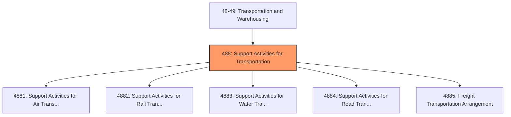
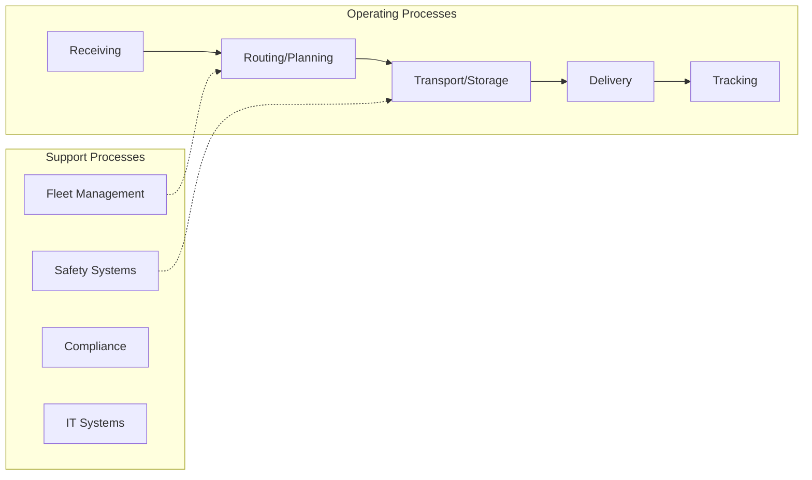

# Support Activities for Transportation

> Industries in the Support Activities for Transportation subsector provide services which support transportation.

## Overview

Support Activities for Transportation represents an important category within the Transportation and Warehousing sector (NAICS 48-49). This subsector encompasses establishments primarily engaged in support activities for transportation.

Industries in the Support Activities for Transportation subsector provide services which support transportation. These services may be provided to transportation carrier establishments or to the general public. This subsector includes a wide array of establishments, including air traffic control services, marine cargo handling, and motor vehicle towing. The Support Activities for Transportation subsector includes services to transportation, separated by type of mode serviced. The Support Activities for Rail Transportation industry includes services to the rail industry (e.g., railroad switching and terminal establishments). Ship repair and maintenance services not done in a shipyard are included in the Other Support Activities for Water Transportation industry. An example would be floating drydock services in a harbor. Excluded from this subsector are establishments primarily engaged in providing factory conversion and overhaul of transportation equipment, which are classified in Subsector 336, Transportation Equipment Manufacturing. Establishments primarily engaged in providing rental and leasing of transportation equipment without operator are classified in Subsector 532, Rental and Leasing Services. Also, establishments primarily engaged in providing travel arrangement and reservation services are classified in Industry Group 5615, Travel Arrangement and Reservation Services.

## Industry Hierarchy

## Key Statistics

| Metric | Value |
|--------|-------|
| NAICS Code | 488 |
| Level | Subsector |
| Child Industries | 5 |

## Sub-Industries

| Industry | Code | Description |
|----------|------|-------------|
| [Support Activities for Air Transportation](./SupportActivitiesForAirTransportation/) | 4881 | This industry group comprises establishments primarily engaged in providing serv |
| [Support Activities for Rail Transportation](./SupportActivitiesForRailTransportation/) | 4882 | Support Activities for Rail Transportation |
| [Support Activities for Water Transportation](./SupportActivitiesForWaterTransportation/) | 4883 | This industry group comprises establishments primarily engaged in one of the fol |
| [Support Activities for Road Transportation](./SupportActivitiesForRoadTransportation/) | 4884 | This industry group comprises establishments primarily engaged in (1) towing lig |
| [Freight Transportation Arrangement](./FreightTransportationArrangement/) | 4885 | Freight Transportation Arrangement |

## Core Business Processes

## Industry Value Chain

```mermaid
graph LR
    subgraph Inputs["Inputs"]
        I1["Resources"]
        I2["Expertise"]
        I3["Technology"]
    end

    subgraph Primary["Primary Activities"]
        A1["Inbound Logistics"]
        A2["Core Operations"]
        A3["Quality Assurance"]
        A4["Outbound/Delivery"]
    end

    subgraph Outputs["Products/Services"]
        O1["Products"]
        O2["Services"]
        O3["Solutions"]
    end

    subgraph Customers["Markets"]
        C1["Businesses"]
        C2["Consumers"]
        C3["Government"]
        C4["Institutions"]
    end

    Inputs --> Primary --> Outputs --> Customers
```

---

*Source: NAICS 488 - Support Activities for Transportation*
