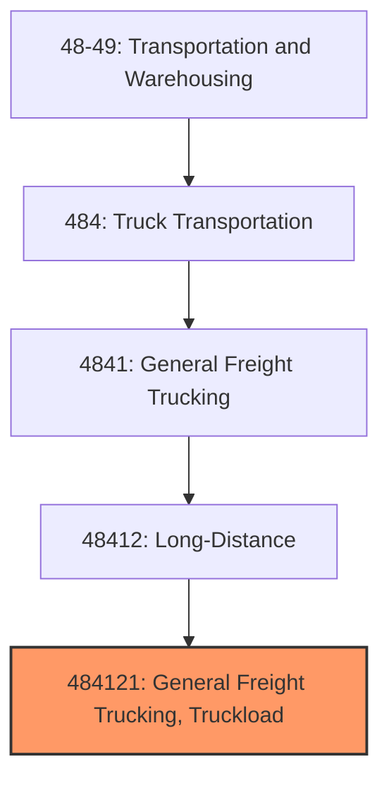
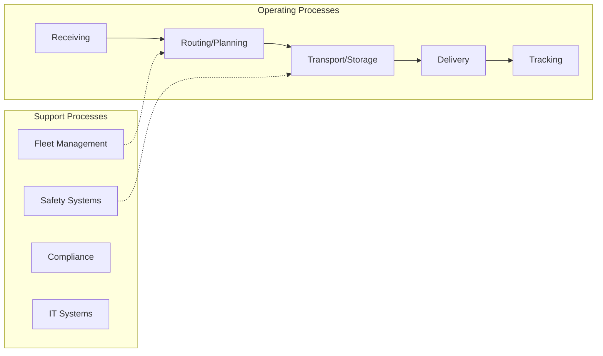

# General Freight Trucking, Truckload

> This U.S. industry comprises establishments primarily engaged in providing long-distance general freight truckload (TL) trucking.
## Overview

General Freight Trucking, Truckload represents a specialized segment within the Transportation and Warehousing sector (NAICS 48-49). This national industry encompasses establishments primarily engaged in general freight trucking, truckload.

This U.S. industry comprises establishments primarily engaged in providing long-distance general freight truckload (TL) trucking. These long-distance general freight truckload carrier establishments provide full truck movement of freight from origin to destination. The shipment of freight on a truck is characterized as a full single load not combined with other shipments. Cross-References. Establishments primarily engaged in--

## Industry Hierarchy

## Key Statistics

| Metric | Value |
|--------|-------|
| NAICS Code | 484121 |
| Level | National Industry |
| Parent | [Long-Distance](../) |
| Child Industries | 0 |

## Core Business Processes

## Industry Value Chain

```mermaid
graph LR
    subgraph Inputs["Inputs"]
        I1["Resources"]
        I2["Expertise"]
        I3["Technology"]
    end

    subgraph Primary["Primary Activities"]
        A1["Inbound Logistics"]
        A2["Core Operations"]
        A3["Quality Assurance"]
        A4["Outbound/Delivery"]
    end

    subgraph Outputs["Products/Services"]
        O1["Products"]
        O2["Services"]
        O3["Solutions"]
    end

    subgraph Customers["Markets"]
        C1["Businesses"]
        C2["Consumers"]
        C3["Government"]
        C4["Institutions"]
    end

    Inputs --> Primary --> Outputs --> Customers
```

---

*Source: NAICS 484121 - General Freight Trucking, Truckload*
