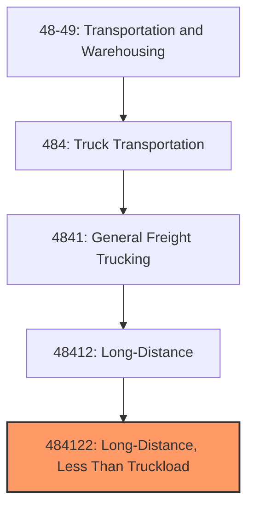
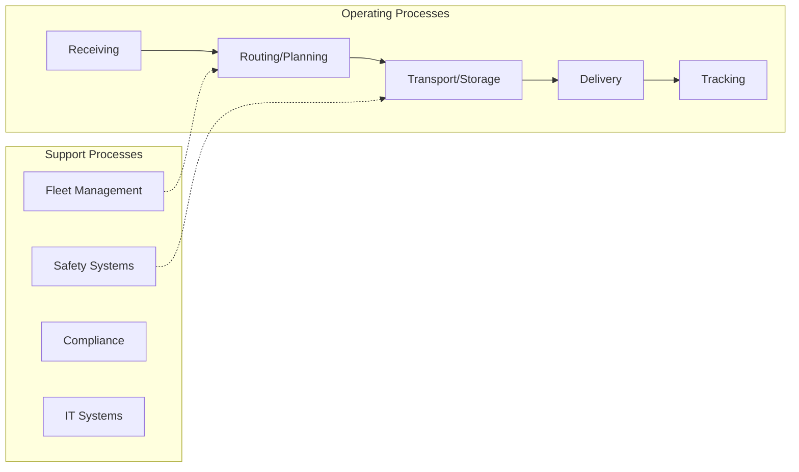

# Long-Distance, Less Than Truckload

> This U.

## Overview

Long-Distance, Less Than Truckload represents a specialized segment within the Transportation and Warehousing sector (NAICS 48-49).

This U.S. industry comprises establishments primarily engaged in providing long-distance, general freight, less than truckload (LTL) trucking. LTL carriage is characterized as multiple shipments combined onto a single truck for multiple deliveries within a network. These establishments are generally characterized by the following network activities: local pick-up, local sorting and terminal operations, line-haul, destination sorting and terminal operations, and local delivery. Cross-References. Establishments primarily engaged in--

## Industry Hierarchy

## Key Statistics

| Metric | Value |
|--------|-------|
| NAICS Code | 484122 |
| Level | National Industry |
| Parent | [Long-Distance](../) |
| Child Industries | 0 |

## Related Occupations

See the [occupations directory](/occupations) for roles commonly found in this industry.

## Core Business Processes

## Industry Value Chain

```mermaid
graph LR
    subgraph Inputs["Inputs"]
        I1["Resources"]
        I2["Expertise"]
        I3["Technology"]
    end

    subgraph Primary["Primary Activities"]
        A1["Inbound Logistics"]
        A2["Core Operations"]
        A3["Quality Assurance"]
        A4["Outbound/Delivery"]
    end

    subgraph Outputs["Products/Services"]
        O1["Products"]
        O2["Services"]
        O3["Solutions"]
    end

    subgraph Customers["Markets"]
        C1["Businesses"]
        C2["Consumers"]
        C3["Government"]
        C4["Institutions"]
    end

    Inputs --> Primary --> Outputs --> Customers
```

---

*Source: NAICS 484122 - Long-Distance, Less Than Truckload*
