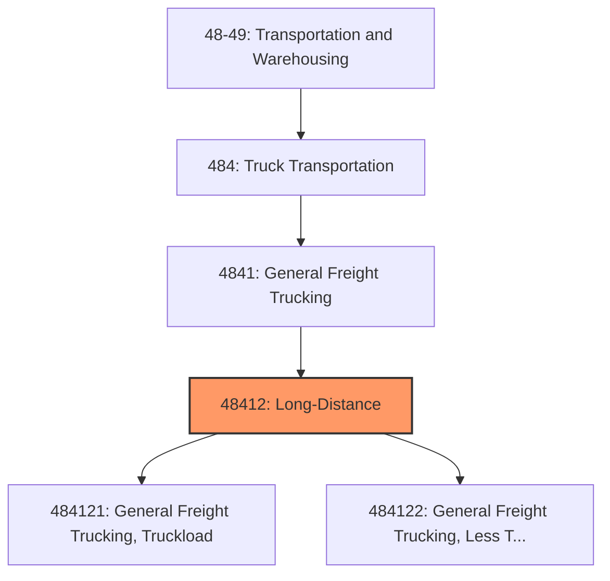
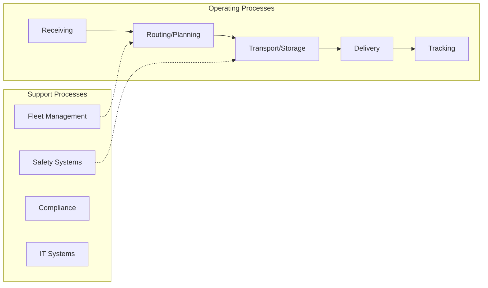

# Long-Distance

> This industry comprises establishments primarily engaged in providing long-distance general freight trucking.

## Overview

Long-Distance represents an important category within the Transportation and Warehousing sector (NAICS 48-49). This industry encompasses establishments primarily engaged in long-distance.

This industry comprises establishments primarily engaged in providing long-distance general freight trucking. General freight trucking establishments handle a wide variety of commodities, generally palletized and transported in a container or van trailer. Long-distance general freight trucking establishments usually provide trucking between metropolitan areas which may cross North American country borders. Included in this industry are establishments operating as truckload (TL) or less than truckload (LTL) carriers. Cross-References. Establishments primarily engaged in--

## Industry Hierarchy

## Key Statistics

| Metric | Value |
|--------|-------|
| NAICS Code | 48412 |
| Level | Industry |
| Parent | [General Freight Trucking](../) |
| Child Industries | 2 |

## Sub-Industries

| Industry | Code | Description |
|----------|------|-------------|
| [General Freight Trucking, Truckload](./GeneralFreightTruckingTruckload.mdx) | 484121 | This U |
| [General Freight Trucking, Less Than Truckload](./GeneralFreightTruckingLessThanTruckload.mdx) | 484122 | This U |

## Core Business Processes

## Industry Value Chain

---

*Source: NAICS 48412 - Long-Distance*
