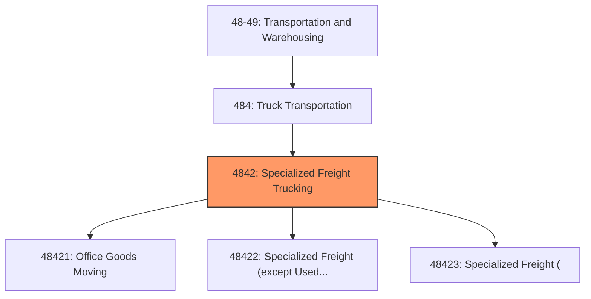
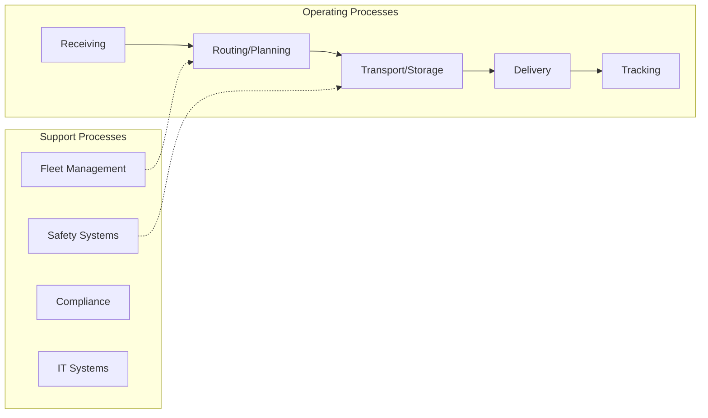

# Specialized Freight Trucking

> This industry group comprises establishments primarily engaged in providing local or long-distance specialized freight trucking.

## Overview

Specialized Freight Trucking represents an important category within the Transportation and Warehousing sector (NAICS 48-49). This industry group encompasses establishments primarily engaged in specialized freight trucking.

This industry group comprises establishments primarily engaged in providing local or long-distance specialized freight trucking. The establishments of this industry are primarily engaged in the transportation of freight which, because of size, weight, shape, or other inherent characteristics, requires specialized equipment, such as flatbeds, tankers, or refrigerated trailers. This industry includes the transportation of used household, institutional, and commercial furniture and equipment.

## Industry Hierarchy

## Key Statistics

| Metric | Value |
|--------|-------|
| NAICS Code | 4842 |
| Level | Industry Group |
| Parent | [Truck Transportation](../) |
| Child Industries | 3 |

## Sub-Industries

| Industry | Code | Description |
|----------|------|-------------|
| [Office Goods Moving](./OfficeGoodsMoving/) | 48421 | See industry description for 484210 |
| [Specialized Freight (except Used Goods) Trucking, Local](./SpecializedFreightExceptUsedGoodsTruckingLocal/) | 48422 | See industry description for 484220 |
| [Specialized Freight (](./SpecializedFreight/) | 48423 | See industry description for 484230 |

## Core Business Processes

## Industry Value Chain

```mermaid
graph LR
    subgraph Inputs["Inputs"]
        I1["Resources"]
        I2["Expertise"]
        I3["Technology"]
    end

    subgraph Primary["Primary Activities"]
        A1["Inbound Logistics"]
        A2["Core Operations"]
        A3["Quality Assurance"]
        A4["Outbound/Delivery"]
    end

    subgraph Outputs["Products/Services"]
        O1["Products"]
        O2["Services"]
        O3["Solutions"]
    end

    subgraph Customers["Markets"]
        C1["Businesses"]
        C2["Consumers"]
        C3["Government"]
        C4["Institutions"]
    end

    Inputs --> Primary --> Outputs --> Customers
```

## Market Context

Transportation and warehousing enable the movement of goods through supply chains, with technology driving efficiency improvements and last-mile innovations.

| Aspect | Details |
|--------|---------|
| Industry Sector | TransportationAndWarehousing |
| NAICS/SIC Code | 4842 |
| Market Segment | Specialized Freight Trucking |

## Key Business Processes

- Route planning and optimization
- Freight handling
- Warehouse operations
- Last-mile delivery
- Fleet maintenance

## Common Occupations

- [Transportation Managers](/occupations/Management/TransportationStorageAndDistributionManagers)
- [Truck Drivers](/occupations/Transportation/HeavyAndTractorTrailerTruckDrivers)
- [Warehouse Workers](/occupations/Transportation/LaborersAndFreightStockAndMaterialMovers)
- [Logistics Coordinators](/occupations/Business/Logisticians)

## Regulations and Standards

- Department of Transportation (DOT)
- Federal Motor Carrier Safety Administration (FMCSA)
- Hazardous Materials Regulations (HMR)
- OSHA warehouse safety standards
- State transportation permits

## Technology and Tools

- Fleet management systems
- Warehouse management systems (WMS)
- GPS tracking and telematics
- Automated material handling
- Transportation management systems (TMS)

## Industry Trends

- Digital transformation and automation adoption
- Sustainability and environmental compliance focus
- Workforce development and skills training
- Supply chain resilience and optimization
- Customer experience enhancement

---

*Source: NAICS 4842 - Specialized Freight Trucking*
