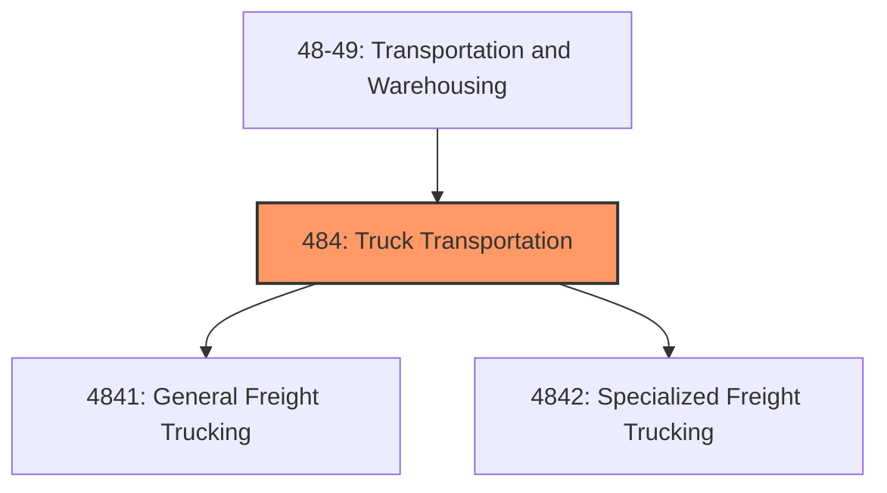
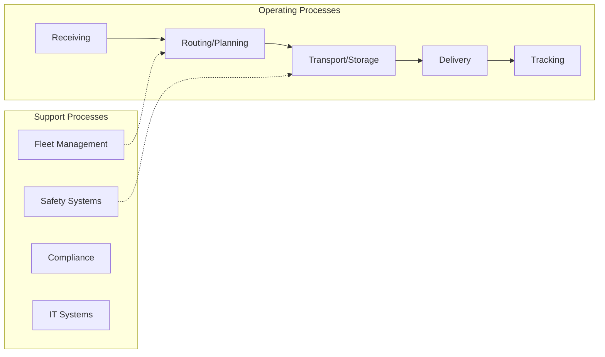

# Truck Transportation

> Industries in the Truck Transportation subsector provide over-the-road transportation of cargo using motor vehicles, such as trucks and tractor trailers.

## Overview

Truck Transportation represents an important category within the Transportation and Warehousing sector (NAICS 48-49). This subsector encompasses establishments primarily engaged in truck transportation.

Industries in the Truck Transportation subsector provide over-the-road transportation of cargo using motor vehicles, such as trucks and tractor trailers. The subsector is subdivided into general freight trucking and specialized freight trucking. This distinction reflects differences in equipment used, type of load carried, scheduling, terminal, and other networking services. General freight transportation establishments handle a wide variety of general commodities, generally palletized, and transported in a container or van trailer. Specialized freight transportation is the transportation of cargo that, because of size, weight, shape, or other inherent characteristics, requires specialized equipment for transportation. Each of these industry groups is further subdivided based on distance traveled. Local trucking establishments primarily carry goods within a single metropolitan area and its adjacent nonurban areas. Long-distance trucking establishments carry goods between metropolitan areas. The Specialized Freight Trucking industry group includes a separate industry for Used Household and Office Goods Moving. The household and office goods movers are separated because of the substantial network of establishments that has developed to deal with local and long-distance moving and the associated storage. In this area, the same establishment provides both local and long-distance services, while other specialized freight establishments generally limit their services to either local or long-distance hauling.

## Industry Hierarchy

## Key Statistics

| Metric | Value |
|--------|-------|
| NAICS Code | 484 |
| Level | Subsector |
| Child Industries | 2 |

## Sub-Industries

| Industry | Code | Description |
|----------|------|-------------|
| [General Freight Trucking](./GeneralFreightTrucking/) | 4841 | This industry group comprises establishments primarily engaged in providing gene |
| [Specialized Freight Trucking](./SpecializedFreightTrucking/) | 4842 | This industry group comprises establishments primarily engaged in providing loca |

## Core Business Processes

## Industry Value Chain

---

*Source: NAICS 484 - Truck Transportation*
