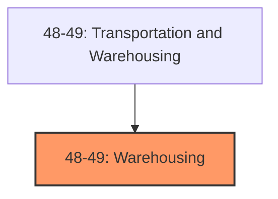
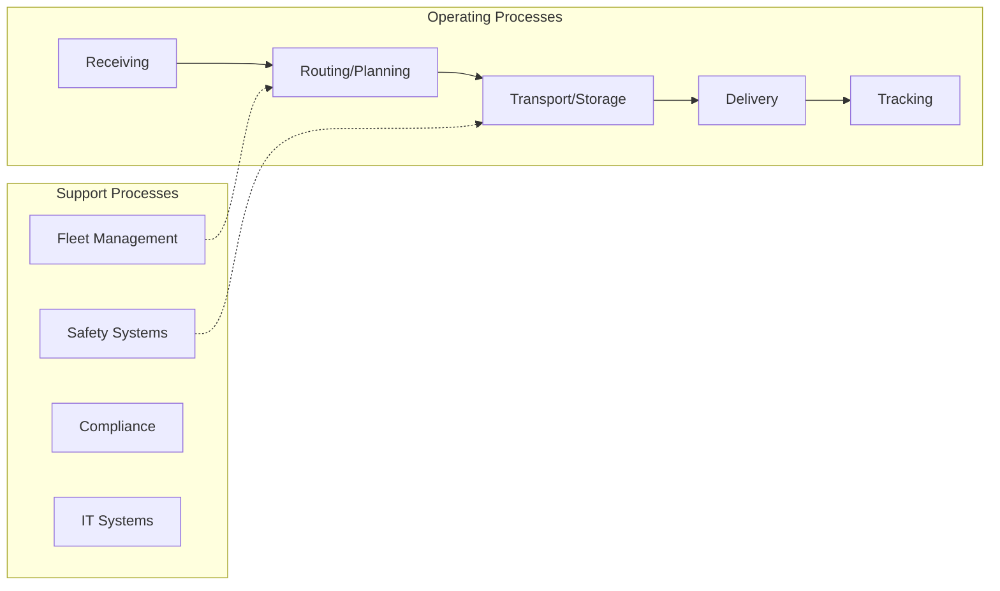

# Warehousing

> The Sector as a Whole The Transportation and Warehousing sector includes industries providing transportation of passengers and cargo, warehousing and storage for goods, scenic and sightseeing transportation, and support activities related to modes of transportation.

## Overview

Warehousing represents an important category within the Transportation and Warehousing sector (NAICS 48-49).

The Sector as a Whole The Transportation and Warehousing sector includes industries providing transportation of passengers and cargo, warehousing and storage for goods, scenic and sightseeing transportation, and support activities related to modes of transportation. Establishments in these industries use transportation equipment or transportation-related facilities as a productive asset. The type of equipment depends on the mode of transportation. The modes of transportation are air, rail, water, road, and pipeline. The Transportation and Warehousing sector distinguishes three basic types of activities: subsectors for each mode of transportation, a subsector for warehousing and storage, and a subsector for establishments providing support activities for transportation. In addition, there are subsectors for establishments that provide passenger transportation for scenic and sightseeing purposes, postal services, and courier services. A separate subsector for support activities is established in the sector because, first, support activities for transportation are inherently multimodal, such as freight transportation arrangement, or have multimodal aspects. Secondly, there are production process similarities among the support activity industries. One of the support activities identified in the Support Activities for Transportation subsector is the routine repair and maintenance of transportation equipment (e.g., aircraft at an airport, railroad rolling stock at a railroad terminal, or ships at a harbor or port facility). Such establishments do not perform complete overhauling or rebuilding of transportation equipment (i.e., periodic restoration of transportation equipment to original design specifications) or transportation equipment conversion (i.e., major modification to systems). An establishment that primarily performs factory (or shipyard) overhauls, rebuilding, or conversions of aircraft, railroad rolling stock, or ships is classified in Subsector 336, Transportation Equipment Manufacturing, according to the type of equipment. Many of the establishments in this sector often operate on networks, with physical facilities, labor forces, and equipment spread over an extensive geographic area. Warehousing establishments in this sector are distinguished from merchant wholesaling in that the warehouse establishments do not sell the goods. Excluded from this sector are establishments primarily engaged in providing travel agent, travel arrangement, and reservation services that support transportation establishments, hotels, other businesses, and government agencies. These establishments are classified in Sector 56, Administrative and Support and Waste Management and Remediation Services. Establishments primarily engaged in providing rental and leasing of transportation equipment without operator are classified in Subsector 532, Rental and Leasing Services. Establishments primarily engaged in providing medical care with transportation are classified in Sector 62, Health Care and Social Assistance.

## Industry Hierarchy

## Key Statistics

| Metric | Value |
|--------|-------|
| NAICS Code | 48-49 |
| Level | Industry Group |
| Child Industries | 0 |

## Related Occupations

See the [occupations directory](/occupations) for roles commonly found in this industry.

## Core Business Processes

## Industry Value Chain

---

*Source: NAICS 48-49 - Warehousing*
