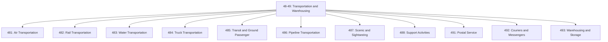
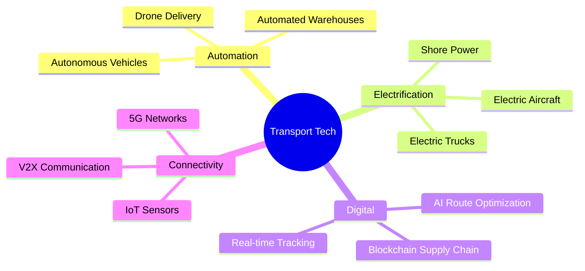
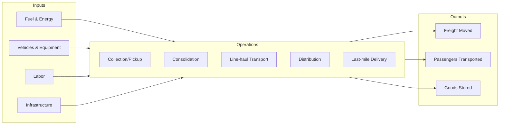

# Transportation and Warehousing

> The Transportation and Warehousing sector includes industries providing transportation of passengers and cargo, warehousing and storage for goods, scenic and sightseeing transportation, and support activities related to modes of transportation.

## Overview

Transportation and Warehousing (NAICS 48-49) is a critical infrastructure sector that enables the movement of people and goods across the economy. The sector employs over 6.5 million workers in the United States and represents approximately 3% of GDP. It encompasses all modes of transportation (air, rail, water, truck, transit, pipeline) along with logistics support services and warehousing operations.

The sector is characterized by:
- Capital-intensive infrastructure requirements
- Heavy regulatory oversight across multiple federal agencies
- Network effects and hub-and-spoke operational models
- Integration with global supply chains
- Rapid technological transformation (automation, electrification, autonomous vehicles)

## NAICS Hierarchy

## Key Statistics

| Metric | Value |
|--------|-------|
| NAICS Code | 48-49 |
| Level | Sector |
| Subsectors | 11 |
| National Industries | 62 |
| US Employment | ~6.5 million |
| Annual Revenue | ~$1.2 trillion |

## Subsectors

| Code | Subsector | Description |
|------|-----------|-------------|
| 481 | [Air Transportation](./AirTransportation/) | Scheduled and nonscheduled air transport of passengers and cargo |
| 482 | [Rail Transportation](./RailTransportation/) | Line-haul and short-line railroad operations |
| 483 | [Water Transportation](./WaterTransportation/) | Deep sea, coastal, Great Lakes, and inland water transport |
| 484 | [Truck Transportation](./TruckTransportation/) | General and specialized freight trucking |
| 485 | [Transit and Ground Passenger](./TransitAndGroundPassenger/) | Urban transit, bus, taxi, limousine services |
| 486 | [Pipeline Transportation](./PipelineTransportation/) | Crude oil, natural gas, and refined products pipelines |
| 487 | [Scenic and Sightseeing](./ScenicAndSightseeing/) | Land, water, and other scenic transportation |
| 488 | [Support Activities](./SupportActivities/) | Airport operations, freight forwarding, cargo handling |
| 491 | [Postal Service](./PostalService/) | National postal services under universal obligation |
| 492 | [Couriers and Messengers](./CouriersAndMessengers/) | Express delivery and local messenger services |
| 493 | [Warehousing and Storage](./WarehousingAndStorage/) | General, refrigerated, and specialized storage facilities |

## Regulatory Framework

### Primary Federal Agencies

| Agency | Acronym | Jurisdiction |
|--------|---------|--------------|
| Department of Transportation | DOT | Overall transportation policy and safety |
| Federal Aviation Administration | FAA | Aviation safety, air traffic control, airports |
| Federal Motor Carrier Safety Administration | FMCSA | Trucking and bus safety regulations |
| Federal Railroad Administration | FRA | Railroad safety standards |
| Federal Maritime Commission | FMC | Ocean shipping regulation |
| Pipeline and Hazardous Materials Safety Administration | PHMSA | Pipeline safety, hazmat transport |
| Surface Transportation Board | STB | Rail and pipeline economic regulation |
| Transportation Security Administration | TSA | Transportation security |

### Key Regulations

- **Hours of Service (HOS)**: Limits on driving/working hours for commercial drivers
- **Hazmat Transportation**: 49 CFR Parts 100-185 regulations
- **Cabotage Laws**: Jones Act (maritime), foreign carrier restrictions
- **Environmental**: EPA emissions standards, CARB regulations
- **Labor**: FMLA, Fair Labor Standards Act, union agreements

## Technology and Innovation

### Current Trends

### Emerging Technologies

| Technology | Application | Timeline |
|------------|-------------|----------|
| Autonomous trucks | Long-haul freight | 2025-2030 |
| Electric aircraft | Regional flights | 2028-2035 |
| Hyperloop | Intercity passenger | 2030+ |
| Drone delivery | Last-mile logistics | 2024-2027 |
| Autonomous ships | Ocean freight | 2030-2040 |

## Industry Value Chain

## Related Industries

- [Retail Trade](/industries/RetailTrade/) - Major customer for logistics
- [Manufacturing](/industries/Manufacturing/) - Supply chain integration
- [Wholesale Trade](/industries/WholesaleTrade/) - Distribution networks
- [Mining](/industries/Mining/) - Bulk commodity transport
- [Agriculture](/industries/Agriculture/) - Farm-to-market logistics

## Related Occupations

| Occupation | Employment | Median Wage |
|------------|------------|-------------|
| Heavy and Tractor-Trailer Truck Drivers | 2,000,000+ | $48,310 |
| Light Truck Drivers | 1,000,000+ | $39,260 |
| Laborers and Material Movers | 800,000+ | $34,570 |
| Bus Drivers | 700,000+ | $46,320 |
| Aircraft Pilots | 130,000+ | $134,630 |

---

*Source: NAICS 48-49 - U.S. Census Bureau, Bureau of Labor Statistics*
