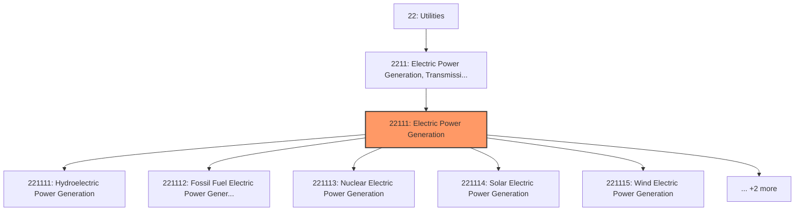
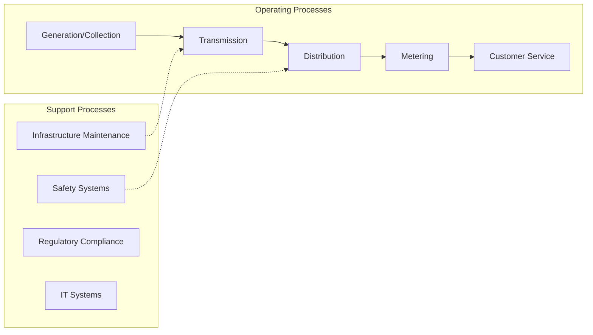

# Electric Power Generation

> This industry comprises establishments primarily engaged in operating electric power generation facilities.

## Overview

Electric Power Generation represents an important category within the Utilities sector (NAICS 22).

This industry comprises establishments primarily engaged in operating electric power generation facilities. These facilities convert other forms of energy, such as water power (i.e., hydroelectric), fossil fuels, nuclear power, and solar power, into electrical energy. The establishments in this industry produce electric energy and provide electricity to transmission systems or to electric power distribution systems. Cross-References. Establishments primarily engaged in--

## Industry Hierarchy

## Key Statistics

| Metric | Value |
|--------|-------|
| NAICS Code | 22111 |
| Level | Industry |
| Parent | [Electric Power Generation, Transmission and Distribution](../) |
| Child Industries | 7 |

## Sub-Industries

| Industry | Code | Description |
|----------|------|-------------|
| [Hydroelectric Power Generation](./HydroelectricPowerGeneration.mdx) | 221111 | This U |
| [Fossil Fuel Electric Power Generation](./FossilFuelElectricPowerGeneration.mdx) | 221112 | This U |
| [Nuclear Electric Power Generation](./NuclearElectricPowerGeneration.mdx) | 221113 | This U |
| [Solar Electric Power Generation](./SolarElectricPowerGeneration.mdx) | 221114 | This U |
| [Wind Electric Power Generation](./WindElectricPowerGeneration.mdx) | 221115 | This U |
| [Geothermal Electric Power Generation](./GeothermalElectricPowerGeneration.mdx) | 221116 | This U |
| [Biomass Electric Power Generation](./BiomassElectricPowerGeneration.mdx) | 221117 | This U |

## Related Occupations

See the [occupations directory](/occupations) for roles commonly found in this industry.

## Core Business Processes

## Industry Value Chain

```mermaid
graph LR
    subgraph Inputs["Inputs"]
        I1["Resources"]
        I2["Expertise"]
        I3["Technology"]
    end

    subgraph Primary["Primary Activities"]
        A1["Inbound Logistics"]
        A2["Core Operations"]
        A3["Quality Assurance"]
        A4["Outbound/Delivery"]
    end

    subgraph Outputs["Products/Services"]
        O1["Products"]
        O2["Services"]
        O3["Solutions"]
    end

    subgraph Customers["Markets"]
        C1["Businesses"]
        C2["Consumers"]
        C3["Government"]
        C4["Institutions"]
    end

    Inputs --> Primary --> Outputs --> Customers
```

---

*Source: NAICS 22111 - Electric Power Generation*
