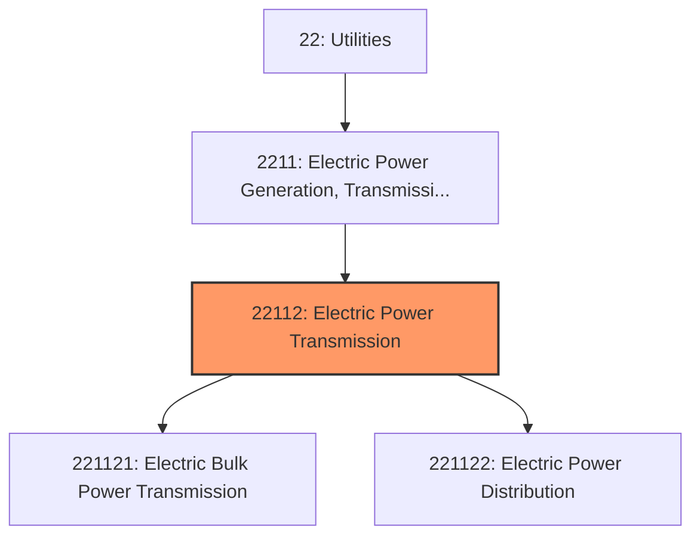
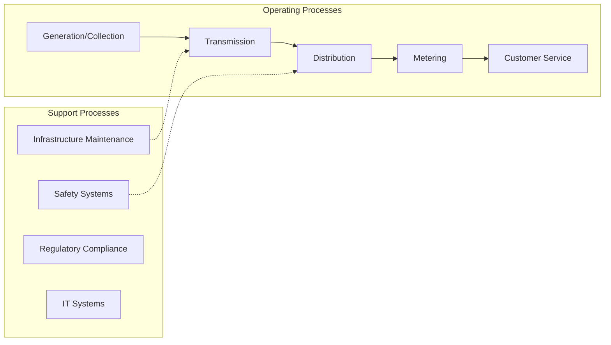

# Electric Power Transmission

> This industry comprises establishments primarily engaged in operating electric power transmission systems, controlling (i.

## Overview

Electric Power Transmission represents an important category within the Utilities sector (NAICS 22).

This industry comprises establishments primarily engaged in operating electric power transmission systems, controlling (i.e., regulating voltages) the transmission of electricity, and/or distributing electricity. The transmission system includes lines and transformer stations. These establishments arrange, facilitate, or coordinate the transmission of electricity from the generating source to the distribution centers, other electric utilities, or final consumers. The distribution system consists of lines, poles, meters, and wiring that deliver the electricity to final consumers. Cross-References.

## Industry Hierarchy

## Key Statistics

| Metric | Value |
|--------|-------|
| NAICS Code | 22112 |
| Level | Industry |
| Parent | [Electric Power Generation, Transmission and Distribution](../) |
| Child Industries | 2 |

## Sub-Industries

| Industry | Code | Description |
|----------|------|-------------|
| [Electric Bulk Power Transmission](./ElectricBulkPowerTransmission.mdx) | 221121 | This U |
| [Electric Power Distribution](./ElectricPowerDistribution.mdx) | 221122 | This U |

## Related Occupations

See the [occupations directory](/occupations) for roles commonly found in this industry.

## Core Business Processes

## Industry Value Chain

```mermaid
graph LR
    subgraph Inputs["Inputs"]
        I1["Resources"]
        I2["Expertise"]
        I3["Technology"]
    end

    subgraph Primary["Primary Activities"]
        A1["Inbound Logistics"]
        A2["Core Operations"]
        A3["Quality Assurance"]
        A4["Outbound/Delivery"]
    end

    subgraph Outputs["Products/Services"]
        O1["Products"]
        O2["Services"]
        O3["Solutions"]
    end

    subgraph Customers["Markets"]
        C1["Businesses"]
        C2["Consumers"]
        C3["Government"]
        C4["Institutions"]
    end

    Inputs --> Primary --> Outputs --> Customers
```

---

*Source: NAICS 22112 - Electric Power Transmission*
