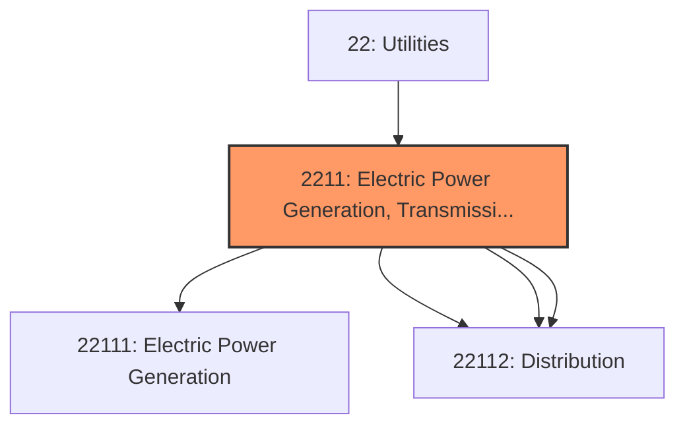
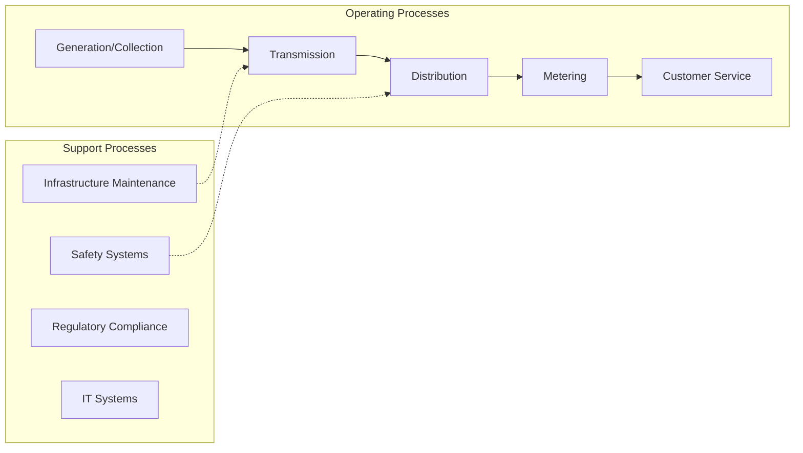

# Electric Power Generation, Transmission and Distribution

> This industry group comprises establishments primarily engaged in generating, transmitting, and/or distributing electric power.

## Overview

Electric Power Generation, Transmission and Distribution represents an important category within the Utilities sector (NAICS 22).

This industry group comprises establishments primarily engaged in generating, transmitting, and/or distributing electric power. Establishments in this industry group may perform one or more of the following activities: (1) operate generation facilities that produce electric energy; (2) operate transmission systems that convey the electricity from the generation facility to the distribution system; and (3) operate distribution systems that convey electric power received from the generation facility or the transmission system to the final consumer.

## Industry Hierarchy

## Key Statistics

| Metric | Value |
|--------|-------|
| NAICS Code | 2211 |
| Level | Industry Group |
| Child Industries | 4 |

## Sub-Industries

| Industry | Code | Description |
|----------|------|-------------|
| [Electric Power Generation](./ElectricPowerGeneration/) | 22111 | This industry comprises establishments primarily engaged in operating electric p |
| [Electric Power Transmission](./ElectricPowerTransmission/) | 22112 | This industry comprises establishments primarily engaged in operating electric p |
| [Control](./Control/) | 22112 | This industry comprises establishments primarily engaged in operating electric p |
| [Distribution](./Distribution/) | 22112 | This industry comprises establishments primarily engaged in operating electric p |

## Related Occupations

See the [occupations directory](/occupations) for roles commonly found in this industry.

## Core Business Processes

## Industry Value Chain

```mermaid
graph LR
    subgraph Inputs["Inputs"]
        I1["Resources"]
        I2["Expertise"]
        I3["Technology"]
    end

    subgraph Primary["Primary Activities"]
        A1["Inbound Logistics"]
        A2["Core Operations"]
        A3["Quality Assurance"]
        A4["Outbound/Delivery"]
    end

    subgraph Outputs["Products/Services"]
        O1["Products"]
        O2["Services"]
        O3["Solutions"]
    end

    subgraph Customers["Markets"]
        C1["Businesses"]
        C2["Consumers"]
        C3["Government"]
        C4["Institutions"]
    end

    Inputs --> Primary --> Outputs --> Customers
```

## Market Context

Manufacturing transforms raw materials into finished goods, with Industry 4.0 driving automation, digitalization, and smart factory implementations.

| Aspect | Details |
|--------|---------|
| Industry Sector | Utilities |
| NAICS/SIC Code | 2211 |
| Market Segment | Electric Power Generation, Transmission and Distribution |

## Key Business Processes

- Production planning
- Manufacturing operations
- Quality assurance
- Inventory management
- Distribution and logistics

## Common Occupations

- [Industrial Production Managers](/occupations/Management/IndustrialProductionManagers)
- [Production Workers](/occupations/Production/ProductionWorkers)
- [Quality Control Inspectors](/occupations/Production/QualityControlInspectors)
- [Industrial Engineers](/occupations/Engineering/IndustrialEngineers)

## Regulations and Standards

- OSHA Manufacturing Standards
- EPA Environmental Regulations
- FDA regulations (where applicable)
- ISO quality standards
- Industry-specific certifications

## Technology and Tools

- Industrial automation and robotics
- Enterprise Resource Planning (ERP)
- Quality management systems
- Predictive maintenance
- IoT and smart manufacturing

## Industry Trends

- Digital transformation and automation adoption
- Sustainability and environmental compliance focus
- Workforce development and skills training
- Supply chain resilience and optimization
- Customer experience enhancement

---

*Source: NAICS 2211 - Electric Power Generation, Transmission and Distribution*
