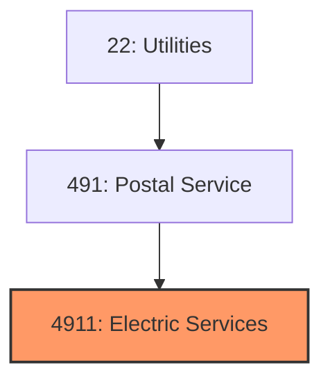
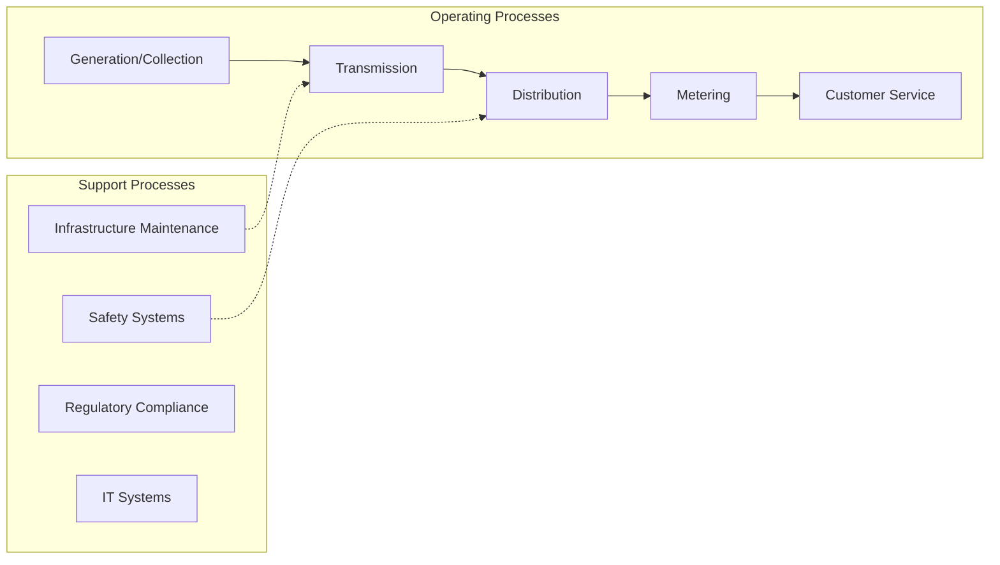

# Electric Services

> Electric Services.

## Overview

Electric Services represents an important category within the Utilities sector (SIC 4911).

## Industry Hierarchy

## Key Statistics

| Metric | Value |
|--------|-------|
| SIC Code | 4911 |
| Level | SIC (4911) |
| Child Industries | 0 |

## Related Occupations

- [Electrical Engineers](/occupations/Architecture/ElectricalEngineers) - Design electrical systems and equipment
- [Energy Engineers](/occupations/Architecture/EnergyEngineersExceptWindAndSolar) - Design energy-efficient systems
- [Power Plant Operators](/occupations/Production/PowerPlantOperators) - Control power generation systems
- [Water Treatment Plant Operators](/occupations/Production/WaterAndWastewaterTreatmentPlantAndSystemOperators) - Operate water treatment facilities

## Core Business Processes

## Industry Value Chain

```mermaid
graph LR
    subgraph Inputs["Inputs"]
        I1["Resources"]
        I2["Expertise"]
        I3["Technology"]
    end

    subgraph Primary["Primary Activities"]
        A1["Inbound Logistics"]
        A2["Core Operations"]
        A3["Quality Assurance"]
        A4["Outbound/Delivery"]
    end

    subgraph Outputs["Products/Services"]
        O1["Products"]
        O2["Services"]
        O3["Solutions"]
    end

    subgraph Customers["Markets"]
        C1["Businesses"]
        C2["Consumers"]
        C3["Government"]
        C4["Institutions"]
    end

    Inputs --> Primary --> Outputs --> Customers
```

## Regulatory Environment

- **FERC** (Federal Energy Regulatory Commission) - Regulates interstate energy transmission
- **EPA** (Environmental Protection Agency) - Enforces emissions and environmental standards
- **NRC** (Nuclear Regulatory Commission) - Oversees nuclear power facilities
- **State Public Utility Commissions** - Set rates and service standards

## Technology & Innovation

- **Renewable Energy** - Solar, wind, and energy storage technologies transforming the grid
- **Smart Grid** - Advanced metering, demand response, and distributed energy management
- **Energy Storage** - Battery technologies, pumped hydro, and hydrogen storage solutions
- **Microgrids** - Decentralized power generation for resilience and efficiency

## Industry Outlook

The utilities sector is undergoing a historic transformation driven by decarbonization mandates, distributed energy resources, and grid modernization. Renewable energy capacity continues to grow, with solar and wind becoming the most cost-effective generation sources. Investment in grid resilience, energy storage, and smart infrastructure is accelerating to support electrification of transportation and buildings.

---

*Source: SIC 4911 - Electric Services*
