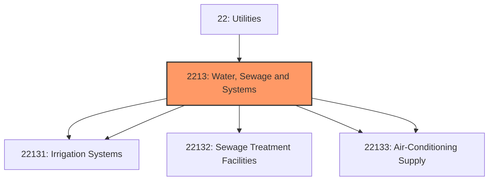
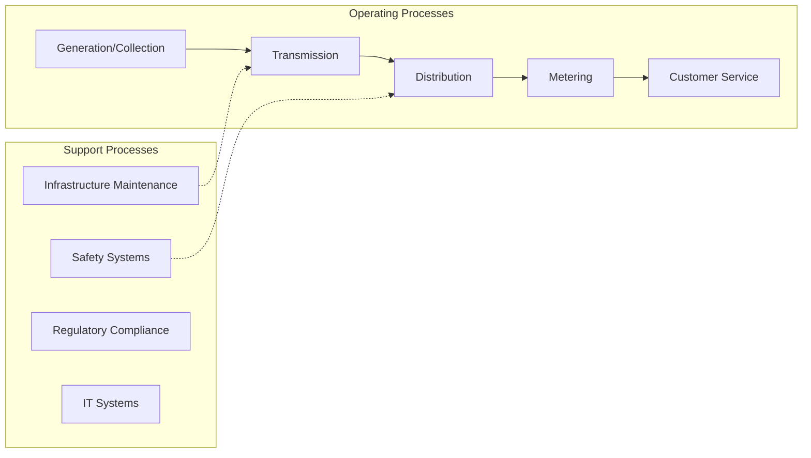

# Water, Sewage and Systems

> This industry group comprises establishments primarily engaged in: (1) operating water treatment plants and/or water supply systems; (2) operating sewer systems or sewage treatment facilities; or (3) providing steam, heated air, or cooled air.

## Overview

Water, Sewage and Systems represents an important category within the Utilities sector (NAICS 22).

This industry group comprises establishments primarily engaged in: (1) operating water treatment plants and/or water supply systems; (2) operating sewer systems or sewage treatment facilities; or (3) providing steam, heated air, or cooled air.

## Industry Hierarchy

## Key Statistics

| Metric | Value |
|--------|-------|
| NAICS Code | 2213 |
| Level | Industry Group |
| Child Industries | 5 |

## Sub-Industries

| Industry | Code | Description |
|----------|------|-------------|
| [Water Supply](./WaterSupply/) | 22131 | See industry description for 221310 |
| [Irrigation Systems](./IrrigationSystems/) | 22131 | See industry description for 221310 |
| [Sewage Treatment Facilities](./SewageTreatmentFacilities/) | 22132 | See industry description for 221320 |
| [Steam](./Steam/) | 22133 | See industry description for 221330 |
| [Air-Conditioning Supply](./AirconditioningSupply/) | 22133 | See industry description for 221330 |

## Related Occupations

See the [occupations directory](/occupations) for roles commonly found in this industry.

## Core Business Processes

## Industry Value Chain

```mermaid
graph LR
    subgraph Inputs["Inputs"]
        I1["Resources"]
        I2["Expertise"]
        I3["Technology"]
    end

    subgraph Primary["Primary Activities"]
        A1["Inbound Logistics"]
        A2["Core Operations"]
        A3["Quality Assurance"]
        A4["Outbound/Delivery"]
    end

    subgraph Outputs["Products/Services"]
        O1["Products"]
        O2["Services"]
        O3["Solutions"]
    end

    subgraph Customers["Markets"]
        C1["Businesses"]
        C2["Consumers"]
        C3["Government"]
        C4["Institutions"]
    end

    Inputs --> Primary --> Outputs --> Customers
```

---

*Source: NAICS 2213 - Water, Sewage and Systems*
