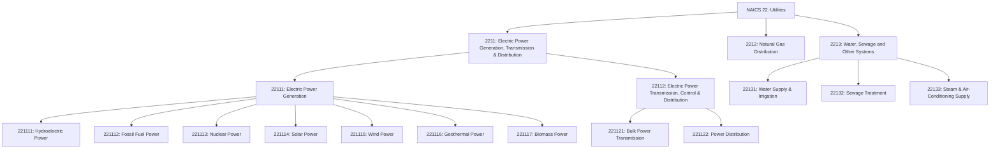
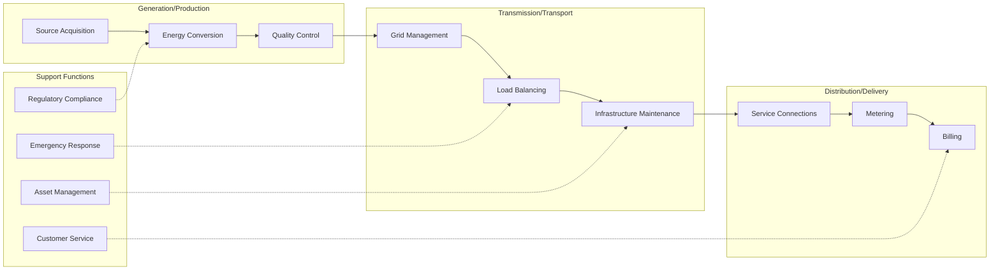
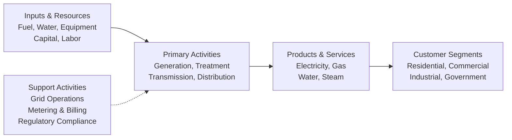

# Utilities

> The Utilities sector comprises establishments engaged in the provision of electric power, natural gas, steam supply, water supply, and sewage treatment and disposal services essential to modern economic activity and daily life.

## Overview

The Utilities sector provides essential infrastructure services that power homes, businesses, and industries. This sector encompasses the generation, transmission, and distribution of electricity; the distribution of natural gas; water treatment and supply; sewage collection, treatment, and disposal; and steam supply services. These services form the backbone of modern civilization, enabling virtually all other economic activities.

Utilities are typically characterized by large capital investments, regulated pricing structures, and natural monopoly characteristics within service areas. The sector is undergoing significant transformation driven by renewable energy adoption, grid modernization, smart infrastructure deployment, and increasing focus on sustainability and resilience.

Within this sector, specific activities vary by utility type: electric power includes generation, transmission, and distribution; natural gas involves distribution; steam supply includes provision and/or distribution; water supply includes treatment and distribution; and sewage removal includes collection, treatment, and disposal through sewer systems and treatment facilities.

## Industry Hierarchy

## Key Statistics

| Metric | Value |
|--------|-------|
| NAICS Code | 22 |
| Level | Sector |
| Subsectors | 3 |
| Industry Groups | 5 |
| Industries | 12+ |

## Sub-Industries

| Subsector | Code | Description |
|-----------|------|-------------|
| Electric Power Generation, Transmission & Distribution | 2211 | Operating generation facilities, transmission systems, and distribution networks for electric power |
| Natural Gas Distribution | 2212 | Operating gas distribution systems including mains, meters, and service connections |
| Water, Sewage and Other Systems | 2213 | Operating water treatment plants, water supply systems, sewer systems, sewage treatment facilities, and steam supply |

## Related Occupations

- [Power Plant Operators](/occupations/PowerPlantOperators) - Operating and controlling power generation equipment
- [Electrical Power-Line Installers](/occupations/ElectricalPowerLineInstallers) - Installing and maintaining electrical power lines
- [Water and Wastewater Treatment Operators](/occupations/WaterAndWastewaterTreatmentOperators) - Operating water and sewage treatment equipment
- [Gas Plant Operators](/occupations/GasPlantOperators) - Distributing gas for utility companies
- [Nuclear Engineers](/occupations/NuclearEngineers) - Designing and operating nuclear power facilities
- [Electrical Engineers](/occupations/ElectricalEngineers) - Designing electrical systems and equipment

## Core Business Processes

### Electric Power Generation

Converting various energy sources (fossil fuels, nuclear, hydro, solar, wind, geothermal, biomass) into electrical energy for transmission and distribution.

**Key Activities:**
- Operate power generation facilities and turbines
- Monitor and optimize generation efficiency
- Manage fuel procurement and storage
- Ensure environmental compliance for emissions

### Transmission and Distribution

Managing the infrastructure that delivers electricity, gas, and water from production facilities to end consumers.

**Key Activities:**
- Operate high-voltage transmission networks
- Manage substations and transformers
- Maintain distribution lines and pipelines
- Implement smart grid technologies

### Water and Wastewater Treatment

Providing clean water supply and treating wastewater to protect public health and the environment.

**Key Activities:**
- Operate water treatment and purification systems
- Manage distribution networks and storage facilities
- Operate sewage collection and treatment systems
- Monitor water quality and regulatory compliance

## Industry Value Chain

## Generation Mix and Trends

### Power Generation Sources

| Generation Type | Description | Trend |
|----------------|-------------|-------|
| Fossil Fuel | Coal, natural gas, and oil power plants | Declining |
| Nuclear | Nuclear fission reactors | Stable |
| Hydroelectric | Water-driven turbines | Stable |
| Solar | Photovoltaic and concentrated solar | Rapidly Growing |
| Wind | Onshore and offshore wind turbines | Rapidly Growing |
| Geothermal | Earth heat extraction | Growing |
| Biomass | Organic material combustion | Stable |

## Regulatory Environment

The utilities sector operates under extensive regulatory oversight at federal, state, and local levels:

- **Federal Energy Regulatory Commission (FERC)**: Interstate electricity transmission and wholesale electricity markets
- **Nuclear Regulatory Commission (NRC)**: Nuclear power plant licensing and safety
- **Environmental Protection Agency (EPA)**: Air and water quality standards, emissions regulations
- **State Public Utility Commissions**: Retail rates, service quality, and local distribution
- **North American Electric Reliability Corporation (NERC)**: Grid reliability standards
- **Safe Drinking Water Act**: Water quality and treatment requirements
- **Clean Water Act**: Wastewater discharge standards

### Key Regulatory Considerations

- Rate-of-return regulation and rate case proceedings
- Integrated resource planning requirements
- Renewable portfolio standards (RPS)
- Energy efficiency mandates
- Grid interconnection rules
- Cybersecurity requirements

## Technology & Innovation

The utilities sector is experiencing significant technological transformation:

- **Smart Grid**: Advanced metering infrastructure (AMI), demand response, and real-time monitoring
- **Renewable Integration**: Battery storage, grid-scale solar, and offshore wind development
- **Grid Modernization**: Digital substations, SCADA systems, and predictive maintenance
- **Distributed Energy Resources (DER)**: Rooftop solar, home batteries, and microgrids
- **Electric Vehicle Infrastructure**: Charging networks and vehicle-to-grid technology
- **Water Technology**: Smart water meters, leak detection, and advanced treatment processes
- **Cybersecurity**: Protection of critical infrastructure from cyber threats
- **Artificial Intelligence**: Load forecasting, predictive maintenance, and grid optimization

## Excluded Activities

Establishments primarily engaged in waste management services (collection, treatment, disposal) that do not use sewer systems or sewage treatment facilities are classified in Subsector 562, Waste Management and Remediation Services, rather than this sector.

---

*Source: NAICS 22 - Utilities*
