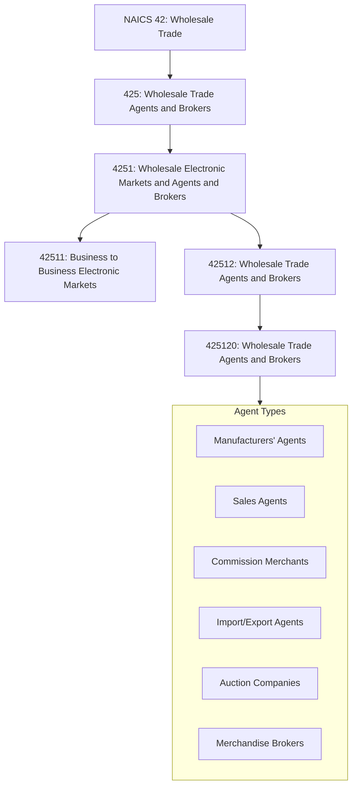
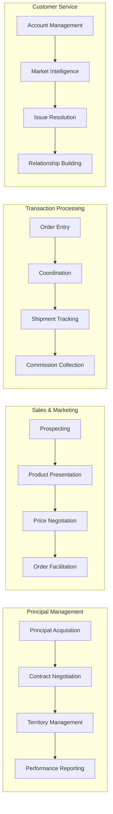

# Wholesale Trade Agents and Brokers

> The Wholesale Trade Agents and Brokers subsector groups establishments that arrange for the sale of goods owned by others, generally on a fee or commission basis. They act on behalf of the buyers and sellers of goods to facilitate wholesale trade without taking title to the merchandise.

## Overview

The Wholesale Trade Agents and Brokers subsector (NAICS 425) encompasses establishments primarily engaged in arranging the purchase or sale of goods owned by others. Unlike merchant wholesalers, agents and brokers do not take title (ownership) to the goods they sell. Instead, they facilitate transactions between buyers and sellers, earning commissions or fees for their services.

This subsector includes manufacturers' agents, sales agents, commission merchants, import/export agents, auction companies, and business-to-business electronic markets. These intermediaries provide valuable market access, negotiation expertise, and transaction facilitation services without the capital requirements of maintaining inventory.

Agents typically represent sellers on a continuing basis, while brokers typically work on individual transactions. Both serve essential functions in connecting manufacturers with customers, particularly for companies that lack the resources to maintain their own sales forces or for products requiring specialized market knowledge.

## Industry Hierarchy

## Key Statistics

| Metric | Value |
|--------|-------|
| NAICS Code | 425 |
| Level | Subsector |
| Parent Sector | [Wholesale Trade](../) (42) |
| Industry Groups | 1 |
| Industries | 2 |
| National Industries | 2 |

## Sub-Industries

| Industry | Code | Description |
|----------|------|-------------|
| Wholesale Electronic Markets and Agents and Brokers | 4251 | B2B electronic markets and traditional agents/brokers |

### Wholesale Electronic Markets and Agents and Brokers (4251)

| Industry | Code | Description |
|----------|------|-------------|
| Business to Business Electronic Markets | 42511 | Online B2B marketplaces facilitating wholesale transactions |
| Wholesale Trade Agents and Brokers | 42512 | Traditional agents, brokers, and commission merchants |

## Agent and Broker Types

### Manufacturers' Agents (Manufacturers' Representatives)
Represent one or more manufacturers on a commission basis, typically within a defined territory. They sell products but do not take title, maintaining long-term relationships with their principals.

**Characteristics:**
- Represent non-competing product lines
- Work within defined geographic territories
- Maintain ongoing relationships with manufacturers
- Earn commission on sales volume
- Often provide market feedback and intelligence

### Sales Agents
Have broader authority than manufacturers' agents, often handling the entire output of a manufacturer. They may have exclusive selling rights and more control over pricing and terms.

**Characteristics:**
- May represent single principal exclusively
- Greater authority on pricing and terms
- Handle complete selling function for manufacturer
- Often in textile, apparel, and fashion industries

### Commission Merchants
Take physical possession of goods but not title, selling them on behalf of principals. Common in agricultural products and livestock markets.

**Characteristics:**
- Take physical possession of goods
- Sell at best available price
- Common in produce and livestock markets
- Operate in terminal markets and auction facilities

### Import/Export Agents
Specialize in facilitating international trade transactions, connecting foreign manufacturers with domestic buyers or domestic manufacturers with overseas markets.

**Characteristics:**
- Expertise in international trade regulations
- Handle customs documentation and compliance
- Knowledge of foreign markets and suppliers
- May represent multiple foreign principals

### Auction Companies
Conduct auction sales of goods for others, earning fees or commissions on sales. May specialize in specific product categories or conduct general merchandise auctions.

**Characteristics:**
- Conduct competitive bidding events
- Specialize in specific product categories
- May operate physical or online auction platforms
- Common for agricultural products, automobiles, and industrial equipment

### Merchandise Brokers
Bring buyers and sellers together for specific transactions, typically working on individual deals rather than ongoing relationships.

**Characteristics:**
- Work on transaction-by-transaction basis
- Specialize in specific product categories
- May represent either buyer or seller
- Common in food products and commodities

## Related Occupations

- [Sales Representatives, Wholesale and Manufacturing](/occupations/SalesRepresentativesWholesaleAndManufacturing) - Represent manufacturers to sell products
- [Purchasing Agents, Except Wholesale, Retail, and Farm Products](/occupations/PurchasingAgents) - Procure goods for organizations
- [Sales Managers](/occupations/SalesManagers) - Direct sales team activities
- [Buyers and Purchasing Agents, Farm Products](/occupations/BuyersAndPurchasingAgentsFarmProducts) - Purchase agricultural commodities
- [Auctioneers](/occupations/Auctioneers) - Conduct auction sales
- [Customs Brokers](/occupations/CustomsBrokers) - Facilitate import/export transactions

## Core Business Processes

### Principal Management

Developing and maintaining relationships with manufacturers and suppliers who engage agents to sell their products.

**Key Activities:**
- Identify and qualify potential principals
- Negotiate representation agreements and commission structures
- Define territory and product line responsibilities
- Report sales activity and market conditions
- Manage portfolio of non-competing product lines

### Sales and Business Development

Identifying prospective customers and facilitating sales transactions between principals and buyers.

**Key Activities:**
- Prospect for new customer accounts
- Present product lines and capabilities
- Negotiate pricing and terms within authority
- Facilitate orders between buyers and principals
- Manage customer relationships

### Transaction Facilitation

Coordinating the flow of orders, documentation, and communication between buyers and sellers.

**Key Activities:**
- Enter and transmit orders to principals
- Coordinate delivery schedules and logistics
- Track shipments and resolve issues
- Ensure proper documentation and invoicing
- Collect commissions on completed transactions

### Market Intelligence and Advisory

Providing market information and strategic advice to both principals and customers.

**Key Activities:**
- Monitor market trends and competitive activity
- Provide feedback on pricing and product positioning
- Advise on new product opportunities
- Share industry intelligence with principals
- Recommend inventory and promotional strategies

## Industry Value Chain

## Business Models

### Commission-Based Representation
The traditional model where agents earn a percentage of sales value as commission, typically ranging from 3-15% depending on product category and service level.

**Revenue Model:**
- Commission percentage of gross sales
- May include draw against commission
- Bonuses for exceeding targets
- Retainer fees for market development

### Fee-Based Services
Some agents charge fixed fees for specific services such as market research, trade show representation, or customer development.

**Revenue Model:**
- Retainer fees for ongoing services
- Project-based consulting fees
- Market research and analysis fees
- Trade show representation fees

### Electronic Marketplace Platforms
B2B electronic markets earn revenue through transaction fees, subscription fees, or advertising from participants.

**Revenue Model:**
- Transaction fees (percentage or flat)
- Subscription/membership fees
- Premium listing and advertising
- Data and analytics services

## Market Segments

### By Product Category
- **Industrial Products**: Machinery, equipment, components, MRO supplies
- **Consumer Products**: Apparel, housewares, gifts, sporting goods
- **Food and Agricultural**: Fresh produce, processed foods, commodities
- **Building Products**: Construction materials, HVAC, electrical
- **Technology**: Electronics, software, telecommunications

### By Client Type
- **Domestic Manufacturers**: U.S. companies seeking sales representation
- **Foreign Manufacturers**: International companies entering U.S. market
- **Retailers**: Companies seeking product sourcing
- **Industrial Buyers**: Manufacturing and processing companies

## Regulatory Environment

Wholesale trade agents and brokers operate under various regulatory frameworks:

- **Agency Law**: Common law principles governing agency relationships
- **Contract Law**: Representation agreements, commission disputes
- **Industry-Specific Regulations**: FDA for food brokers, state licensing for certain products
- **Trade Compliance**: Import/export regulations for international agents
- **Antitrust Considerations**: Exclusive dealing arrangements, territorial restrictions

Key compliance areas include:
- Proper disclosure of agency relationships
- Commission protection laws in some states
- Professional licensing requirements (certain industries)
- Independent contractor classification
- Trade secret and confidentiality obligations

## Technology & Innovation

The agent and broker segment is evolving through technology adoption:

- **B2B E-Commerce Platforms**: Online marketplaces connecting buyers and sellers
- **CRM Systems**: Customer relationship management and sales tracking
- **Mobile Sales Tools**: Tablets and apps for field presentations and ordering
- **Virtual Showrooms**: Digital product presentations and catalogs
- **EDI Integration**: Electronic order processing with principals
- **Market Analytics**: Data-driven market intelligence and forecasting
- **Video Conferencing**: Remote sales presentations and negotiations
- **Digital Marketing**: Email campaigns, social media, and content marketing

## Industry Trends

- **Digital Transformation**: Shift toward electronic markets and digital selling tools
- **Omnichannel Integration**: Coordinating online and traditional sales channels
- **Consolidation**: Larger agencies acquiring smaller firms for scale
- **Specialization**: Increasing focus on vertical market expertise
- **Value-Added Services**: Expanding beyond sales to consulting and marketing
- **International Expansion**: Growing demand for cross-border trade facilitation
- **Disintermediation Pressure**: Direct manufacturer-to-customer channels challenging traditional roles

## Comparison: Agents vs. Brokers vs. Merchant Wholesalers

| Characteristic | Agents | Brokers | Merchant Wholesalers |
|----------------|--------|---------|---------------------|
| Takes Title | No | No | Yes |
| Ongoing Relationship | Yes (with principal) | Transaction-based | Yes (with suppliers & customers) |
| Physical Possession | Rarely | Sometimes | Yes |
| Commission/Margin | Commission | Fee/Commission | Markup/Margin |
| Inventory Risk | None | None | Yes |
| Credit Risk | None | None | Yes |
| Capital Required | Low | Low | High |

## Related Industries

- [Merchant Wholesalers, Durable Goods](../DurableGoods/) - Capital and durable goods distribution
- [Merchant Wholesalers, Nondurable Goods](../NondurableGoods/) - Consumable goods distribution
- [Securities and Commodity Brokers](/industries/Finance/SecuritiesAndCommodityBrokers/) - Financial intermediation
- [Real Estate Agents and Brokers](/industries/RealEstate/RealEstateAgentsAndBrokers/) - Real estate transaction facilitation
- [Insurance Agents and Brokers](/industries/Finance/InsuranceAgentsAndBrokers/) - Insurance intermediation

---

*Source: NAICS 425 - Wholesale Trade Agents and Brokers*
