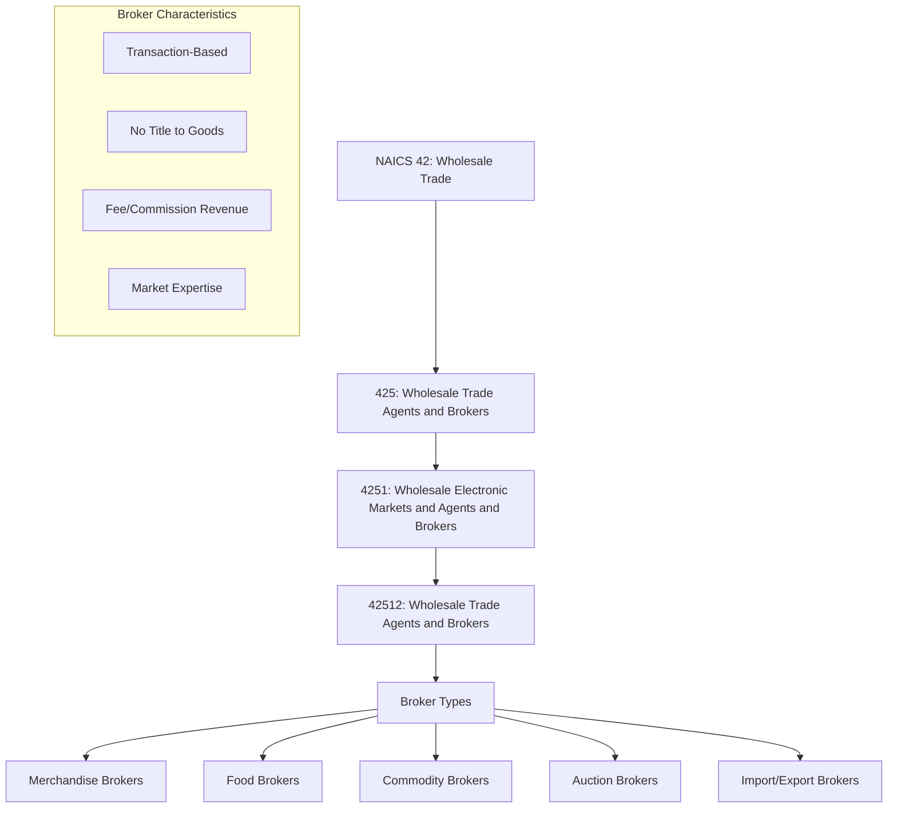

# Wholesale Trade Brokers

> Wholesale trade brokers arrange for the sale of goods owned by others, generally on a fee or commission basis, working on individual transactions rather than ongoing relationships. They bring buyers and sellers together without taking title to merchandise.

## Overview

Wholesale Trade Brokers represent a distinct segment within the Wholesale Trade Agents and Brokers subsector (NAICS 425), specializing in transaction-based intermediation rather than ongoing representation arrangements. Brokers facilitate individual deals between buyers and sellers, earning fees or commissions for bringing parties together and helping negotiate terms.

Unlike agents who maintain continuing relationships with their principals, brokers typically work on a deal-by-deal basis and may represent either the buyer or seller in any given transaction. This flexibility allows brokers to operate across multiple product categories and serve diverse client needs.

Brokers add value through their market knowledge, negotiating expertise, and extensive networks of buyers and sellers. They are particularly prevalent in commodity markets, food products, real estate (as a wholesale business), and other industries where matching supply and demand requires specialized expertise.

## Industry Hierarchy

## Key Statistics

| Metric | Value |
|--------|-------|
| NAICS Code | 4251 (within 425) |
| Level | Industry |
| Parent Subsector | [Wholesale Trade Agents and Brokers](../Agents/) (425) |
| Related Industry | 42512 - Wholesale Trade Agents and Brokers |

## Broker Types and Specializations

### Merchandise Brokers
Facilitate transactions for a wide range of wholesale goods, connecting manufacturers with retailers or other wholesale buyers.

**Key Characteristics:**
- Work on individual transactions
- May specialize in specific product categories
- Represent either buyer or seller per transaction
- Extensive market knowledge and contacts
- Commission typically 2-5% of transaction value

### Food Brokers
Specialize in facilitating sales of food products between manufacturers and retailers, foodservice distributors, or institutional buyers.

**Key Characteristics:**
- Deep expertise in food industry channels
- Knowledge of retailer buying practices
- May handle new product introductions
- Often work with CPG manufacturers
- Commission typically 3-7% of sales

### Commodity Brokers (Wholesale)
Facilitate transactions in agricultural commodities, raw materials, and bulk goods between producers and processors or end users.

**Key Characteristics:**
- Expertise in commodity markets and pricing
- Knowledge of quality grades and specifications
- Often work in terminal markets
- May facilitate futures and physical transactions
- Commission varies by commodity and volume

### Auction Brokers
Conduct or facilitate auction sales for wholesale merchandise, surplus goods, or specialized products.

**Key Characteristics:**
- Operate competitive bidding environments
- May run physical or online auctions
- Handle consigned merchandise
- Specialize in liquidations, surplus, and estates
- Commission typically 10-25% of hammer price

### Import/Export Brokers
Specialize in cross-border transactions, connecting international sellers with domestic buyers or vice versa.

**Key Characteristics:**
- Expertise in international trade regulations
- Knowledge of customs procedures
- May handle documentation and compliance
- Currency and trade finance expertise
- Commission varies by product and complexity

## Related Occupations

- [Sales Representatives, Wholesale and Manufacturing](/occupations/SalesRepresentativesWholesaleAndManufacturing) - Sell products to business customers
- [Purchasing Agents](/occupations/Business/PurchasingAgents) - Procure goods for organizations
- [Buyers and Purchasing Agents, Farm Products](/occupations/Business/BuyersAndPurchasingAgentsFarmProducts) - Purchase agricultural commodities
- [Auctioneers](/occupations/Auctioneers) - Conduct auction sales
- [Customs Brokers](/occupations/Business/CustomsBrokers) - Facilitate import/export transactions
- [Commodity Traders](/occupations/CommodityTraders) - Trade physical commodities

## Core Business Processes

```mermaid
flowchart LR
    subgraph Sourcing["Deal Sourcing"]
        D1["Market Monitoring"]
        D2["Buyer/Seller Identification"]
        D3["Opportunity Assessment"]
        D4["Initial Outreach"]
    end

    subgraph Matching["Transaction Matching"]
        M1["Needs Analysis"]
        M2["Counterparty Introduction"]
        M3["Information Exchange"]
        M4["Due Diligence"]
    end

    subgraph Negotiation["Deal Negotiation"]
        N1["Price Negotiation"]
        N2["Terms & Conditions"]
        N3["Quality Specifications"]
        N4["Delivery Arrangements"]
    end

    subgraph Closing["Transaction Closing"]
        C1["Contract Execution"]
        C2["Logistics Coordination"]
        C3["Payment Facilitation"]
        C4["Commission Collection"]
    end

    D1 --> D2 --> D3 --> D4
    D4 --> M1 --> M2 --> M3 --> M4
    M4 --> N1 --> N2 --> N3 --> N4
    N4 --> C1 --> C2 --> C3 --> C4
```

### Deal Sourcing and Opportunity Identification

Actively monitoring markets and networks to identify potential transactions.

**Key Activities:**
- Monitor market conditions and pricing trends
- Maintain networks of buyers and sellers
- Identify surplus inventory or sourcing needs
- Assess deal viability and profitability
- Initiate contact with potential counterparties

### Transaction Matching and Introduction

Bringing together buyers and sellers whose needs align for potential transactions.

**Key Activities:**
- Understand specific buyer requirements
- Match with appropriate sellers/products
- Make introductions and facilitate communication
- Provide market context and pricing guidance
- Conduct preliminary due diligence

### Price and Terms Negotiation

Facilitating negotiations between parties to reach mutually acceptable terms.

**Key Activities:**
- Facilitate price negotiations
- Negotiate payment terms and conditions
- Define quality specifications and standards
- Arrange delivery and logistics terms
- Resolve disputes and concerns

### Transaction Execution and Closing

Managing the completion of transactions and collection of fees.

**Key Activities:**
- Ensure contract execution
- Coordinate delivery and logistics
- Monitor transaction completion
- Facilitate payment processing
- Collect brokerage fees and commissions

## Industry Value Chain

```mermaid
graph LR
    subgraph Inputs["Broker Resources"]
        I1["Market Intelligence"]
        I2["Contact Network"]
        I3["Negotiation Skills"]
        I4["Industry Expertise"]
        I5["Communication Tools"]
    end

    subgraph Services["Brokerage Services"]
        S1["Deal Sourcing"]
        S2["Buyer/Seller Matching"]
        S3["Negotiation Facilitation"]
        S4["Transaction Closing"]
    end

    subgraph Value["Value Created"]
        V1["Market Access"]
        V2["Price Discovery"]
        V3["Transaction Efficiency"]
        V4["Risk Mitigation"]
    end

    subgraph Clients["Client Types"]
        C1["Manufacturers"]
        C2["Wholesalers"]
        C3["Retailers"]
        C4["Processors"]
    end

    Inputs --> Services --> Value --> Clients
```

## Revenue Models

### Commission-Based
The predominant model where brokers earn a percentage of the transaction value.

| Transaction Type | Typical Commission Range |
|------------------|-------------------------|
| General Merchandise | 2-5% |
| Food Products | 3-7% |
| Commodities | 0.5-3% |
| Auctions | 10-25% |
| Complex/International | 5-10% |

### Fee-Based Services
Some brokers charge flat fees for specific services or transactions.

**Fee Types:**
- Transaction closing fees
- Market research fees
- Due diligence fees
- Consulting fees
- Retainer fees for preferred access

### Hybrid Models
Combinations of commission and fee structures based on service level and transaction complexity.

## Market Segments

### By Product Category

**Food and Agricultural**
- Fresh produce brokers
- Dairy and protein brokers
- Grain and commodity brokers
- Specialty food brokers

**Industrial and Commercial**
- Machinery and equipment brokers
- Building materials brokers
- Surplus and liquidation brokers
- Industrial supplies brokers

**Consumer Products**
- Apparel and textile brokers
- Electronics and appliances brokers
- Gift and housewares brokers
- Closeout and off-price brokers

### By Transaction Type

- **Spot Transactions**: Immediate delivery arrangements
- **Forward Contracts**: Future delivery agreements
- **Consignment**: Goods sold on behalf of owners
- **Auction Sales**: Competitive bidding transactions
- **Closeout/Liquidation**: Excess inventory disposition

## Comparison: Brokers vs. Agents

| Characteristic | Brokers | Agents |
|----------------|---------|--------|
| Relationship Type | Transaction-based | Ongoing/Continuing |
| Client Loyalty | May work for either party | Represents principal |
| Territory | No defined territory | Often territorial |
| Product Lines | Flexible/Opportunistic | Defined product lines |
| Commission | Per-transaction | Ongoing percentage |
| Market Focus | Deal-driven | Relationship-driven |

## Regulatory Environment

Wholesale trade brokers operate under various legal and regulatory frameworks:

- **Agency and Contract Law**: Governing broker-client relationships and commission agreements
- **Fiduciary Duties**: Obligations to act in clients' best interests
- **Industry Licensing**: Some states require licensing for certain product categories
- **Antitrust Compliance**: Restrictions on price-fixing and market manipulation
- **Trade Regulations**: Import/export compliance for international transactions

Key compliance areas include:
- Proper disclosure of dual agency situations
- Accurate representation of goods
- Commission agreement documentation
- Anti-fraud and misrepresentation laws
- Industry-specific regulations (food safety, etc.)

## Technology & Innovation

The brokerage segment is evolving through technology adoption:

- **Online Marketplaces**: Digital platforms for buyer-seller matching
- **Deal Management Software**: CRM and transaction tracking tools
- **Market Data Platforms**: Real-time pricing and market intelligence
- **Communication Tools**: Video conferencing, messaging platforms
- **Electronic Auctions**: Online bidding platforms
- **Blockchain**: Supply chain transparency and transaction verification
- **AI/ML**: Predictive analytics for deal sourcing and pricing
- **Mobile Applications**: On-the-go deal management and communication

## Industry Trends

- **Digital Disruption**: Online platforms changing traditional brokerage models
- **Specialization**: Increasing focus on niche product categories
- **Transparency**: Greater demand for market data and price transparency
- **Consolidation**: Larger brokers acquiring smaller specialists
- **Value-Added Services**: Expanding beyond transaction facilitation
- **International Trade**: Growing cross-border transaction volumes
- **Sustainability**: Increasing focus on sustainable and ethical sourcing

## Challenges and Opportunities

### Challenges
- Disintermediation through direct buyer-seller connections
- Margin pressure from increased market transparency
- Competition from online marketplaces
- Maintaining relevance in digital-first environment

### Opportunities
- Complex international transactions requiring expertise
- Specialty and niche product categories
- Value-added services beyond transaction facilitation
- Technology-enabled market intelligence services
- Sustainable and ethical sourcing facilitation

## Related Industries

- [Wholesale Trade Agents](../Agents/) - Ongoing representation arrangements
- [Merchant Wholesalers, Durable Goods](../DurableGoods/) - Capital goods distribution
- [Merchant Wholesalers, Nondurable Goods](../NondurableGoods/) - Consumable goods distribution
- [Securities, Commodity Contracts, and Other Financial Investments](/industries/Finance/) - Financial brokerage
- [Real Estate](/industries/RealEstate/) - Real estate brokerage

---

*Source: NAICS 4251 - Wholesale Electronic Markets and Agents and Brokers*
