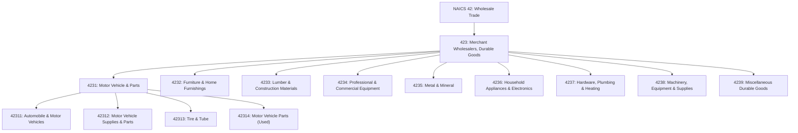
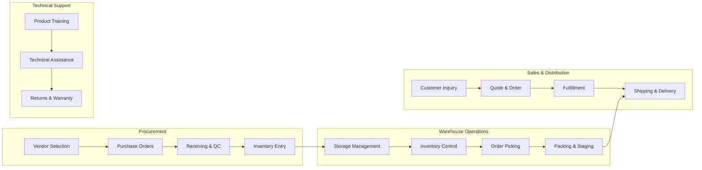

# Merchant Wholesalers, Durable Goods

> Industries in the Merchant Wholesalers, Durable Goods subsector sell capital or durable goods to other businesses. Durable goods are items generally with a normal life expectancy of three years or more. Merchant wholesalers take title to the goods they sell and typically operate from warehouses or offices.

## Overview

The Merchant Wholesalers, Durable Goods subsector (NAICS 423) encompasses establishments primarily engaged in the wholesale distribution of durable goods - products with a useful life of three years or more. This includes motor vehicles, furniture, construction materials, professional equipment, metals, electronics, machinery, and other capital goods.

Merchant wholesalers in this subsector take ownership (title) of the goods they sell, distinguishing them from agents and brokers who arrange sales for others. They typically maintain inventories and operate from warehouse facilities, providing essential distribution services between manufacturers and retailers, industrial users, or other wholesalers.

The subsector plays a critical role in the supply chain by breaking bulk, providing assortments, financing inventory, and offering technical support for complex products. Many establishments specialize in specific product categories, developing deep expertise and customer relationships within their market segments.

## Industry Hierarchy

## Key Statistics

| Metric | Value |
|--------|-------|
| NAICS Code | 423 |
| Level | Subsector |
| Parent Sector | [Wholesale Trade](../) (42) |
| Industry Groups | 9 |
| Industries | 30+ |
| National Industries | 40+ |

## Sub-Industries

| Industry Group | Code | Description |
|----------------|------|-------------|
| Motor Vehicle and Motor Vehicle Parts and Supplies | 4231 | Automobiles, trucks, motor vehicle supplies, tires, and new/used parts |
| Furniture and Home Furnishing | 4232 | Furniture, floor coverings, and household goods |
| Lumber and Other Construction Materials | 4233 | Building materials, lumber, brick, stone, roofing, and prefabricated buildings |
| Professional and Commercial Equipment and Supplies | 4234 | Photographic, office, computer, and medical equipment |
| Metal and Mineral (except Petroleum) | 4235 | Metal service centers, coal, ores, and minerals |
| Household Appliances and Electrical and Electronic Goods | 4236 | Electrical equipment, appliances, consumer electronics, and components |
| Hardware, and Plumbing and Heating Equipment and Supplies | 4237 | Hardware, plumbing fixtures, HVAC equipment, and refrigeration |
| Machinery, Equipment, and Supplies | 4238 | Construction, farm, industrial, and transportation machinery |
| Miscellaneous Durable Goods | 4239 | Sporting goods, toys, jewelry, recyclables, and precious metals |

### Motor Vehicle and Parts (4231)

| Industry | Code | Description |
|----------|------|-------------|
| Automobile and Other Motor Vehicle Merchant Wholesalers | 42311 | New and used automobiles, trucks, and specialty vehicles |
| Motor Vehicle Supplies and New Parts Merchant Wholesalers | 42312 | OEM and aftermarket automotive parts and supplies |
| Tire and Tube Merchant Wholesalers | 42313 | New tires and tubes for all vehicle types |
| Motor Vehicle Parts (Used) Merchant Wholesalers | 42314 | Salvaged and reconditioned automotive parts |

### Professional and Commercial Equipment (4234)

| Industry | Code | Description |
|----------|------|-------------|
| Photographic Equipment and Supplies | 42341 | Cameras, film, darkroom equipment, and supplies |
| Office Equipment | 42342 | Copiers, printers, telecommunications, and office machines |
| Computer and Peripheral Equipment and Software | 42343 | Computers, servers, networking equipment, and software |
| Other Commercial Equipment | 42344 | Restaurant, store fixtures, and commercial equipment |
| Medical, Dental, and Hospital Equipment and Supplies | 42345 | Surgical instruments, diagnostic equipment, and medical supplies |
| Ophthalmic Goods | 42346 | Eyewear, lenses, and optical instruments |

### Machinery, Equipment, and Supplies (4238)

| Industry | Code | Description |
|----------|------|-------------|
| Construction and Mining Machinery and Equipment | 42381 | Heavy equipment for construction, mining, and earthmoving |
| Farm and Garden Machinery and Equipment | 42382 | Tractors, implements, and lawn and garden equipment |
| Industrial Machinery and Equipment | 42383 | Manufacturing machinery, machine tools, and industrial equipment |
| Industrial Supplies | 42384 | MRO supplies, industrial consumables, and fasteners |
| Service Establishment Equipment and Supplies | 42385 | Barber, beauty, laundry, and food service equipment |
| Transportation Equipment and Supplies | 42386 | Marine, aircraft, railroad, and transportation equipment |

## Related Occupations

- [Wholesale and Retail Buyers](/occupations/WholesaleAndRetailBuyers) - Purchase merchandise for resale
- [Sales Representatives, Wholesale and Manufacturing](/occupations/SalesRepresentativesWholesaleAndManufacturing) - Sell technical and scientific products
- [Logisticians](/occupations/Business/Logisticians) - Manage supply chain and distribution operations
- [Purchasing Managers](/occupations/Management/PurchasingManagers) - Direct purchasing activities and vendor relationships
- [Stock Clerks and Order Fillers](/occupations/StockClerksAndOrderFillers) - Receive, store, and issue merchandise
- [Industrial Truck and Tractor Operators](/occupations/Transportation/IndustrialTruckAndTractorOperators) - Operate forklifts and material handling equipment
- [Parts Salespersons](/occupations/Sales/PartsSalespersons) - Sell spare and replacement parts

## Core Business Processes

### Procurement and Vendor Management

Managing supplier relationships and the acquisition of durable goods inventory to meet customer demand.

**Key Activities:**
- Evaluate and qualify suppliers and manufacturers
- Negotiate pricing, terms, and exclusive distribution agreements
- Forecast demand and plan inventory replenishment
- Manage purchase orders and supplier performance
- Coordinate import/export logistics for international sourcing

### Inventory and Warehouse Management

Operating distribution facilities and maintaining optimal inventory levels for durable goods.

**Key Activities:**
- Design warehouse layout for product categories
- Implement inventory management systems
- Manage receiving, put-away, and cycle counting
- Maintain proper storage conditions for sensitive equipment
- Optimize pick, pack, and ship operations

### Sales and Customer Service

Building relationships with business customers and facilitating the sale of durable goods.

**Key Activities:**
- Develop territory and account strategies
- Provide product demonstrations and technical consultations
- Process orders and manage customer accounts
- Coordinate delivery and installation services
- Handle returns, exchanges, and warranty claims

### Technical Support and Value-Added Services

Providing specialized services that differentiate merchant wholesalers from competitors.

**Key Activities:**
- Offer product training and certification programs
- Provide technical assistance and troubleshooting
- Perform assembly, configuration, and customization
- Maintain service and repair capabilities
- Supply technical documentation and specifications

## Industry Value Chain

## Market Segments

### By Customer Type
- **Retailers**: Department stores, specialty retailers, e-commerce platforms
- **Industrial Buyers**: Manufacturers, fabricators, job shops
- **Contractors**: Construction, electrical, plumbing, HVAC trades
- **Institutions**: Hospitals, schools, government agencies
- **End Users**: Large businesses with direct purchasing capability

### By Product Category
- **Capital Equipment**: Machinery, vehicles, and high-value equipment
- **Components and Parts**: Replacement parts, OEM components, aftermarket
- **Supplies and Consumables**: MRO items, industrial supplies
- **Systems and Solutions**: Integrated product and service packages

## Regulatory Environment

Merchant wholesalers of durable goods operate under various regulatory frameworks:

- **Product Safety**: Consumer Product Safety Commission (CPSC) requirements for consumer goods
- **Environmental Compliance**: EPA regulations for batteries, electronics (RCRA), and refrigerants
- **Transportation**: DOT regulations for hazardous materials and commercial vehicles
- **Import/Export**: Customs requirements, tariffs, and trade compliance
- **Industry-Specific**: FDA regulations for medical devices, FCC for electronics, ATF for firearms

Key compliance areas include:
- Hazardous material handling and storage
- Product recall management
- Extended producer responsibility (EPR) programs
- Anti-dumping and countervailing duty compliance
- Export controls (EAR, ITAR for defense-related items)

## Technology & Innovation

The durable goods wholesale sector is advancing through technological adoption:

- **E-Commerce Platforms**: B2B online ordering, customer portals, and digital catalogs
- **Warehouse Management Systems (WMS)**: Real-time inventory tracking, RFID, and barcode scanning
- **Enterprise Resource Planning (ERP)**: Integrated business systems for orders, inventory, and accounting
- **Customer Relationship Management (CRM)**: Sales automation, account management, and analytics
- **Transportation Management**: Route optimization, freight management, and shipment tracking
- **Product Information Management (PIM)**: Digital asset management and product data syndication
- **Automation and Robotics**: Automated storage and retrieval systems (AS/RS), robotic picking
- **Analytics and AI**: Demand forecasting, pricing optimization, and inventory analytics

## Related Industries

- [Merchant Wholesalers, Nondurable Goods](../NondurableGoods/) - Distribution of consumable products
- [Wholesale Trade Agents and Brokers](../Agents/) - Commission-based sales arrangements
- [Retail Trade](/industries/Retail/) - Primary customer segment for consumer durable goods
- [Manufacturing](/industries/Manufacturing/) - Primary suppliers of durable goods
- [Transportation and Warehousing](/industries/Transportation/) - Logistics service providers

---

*Source: NAICS 423 - Merchant Wholesalers, Durable Goods*
