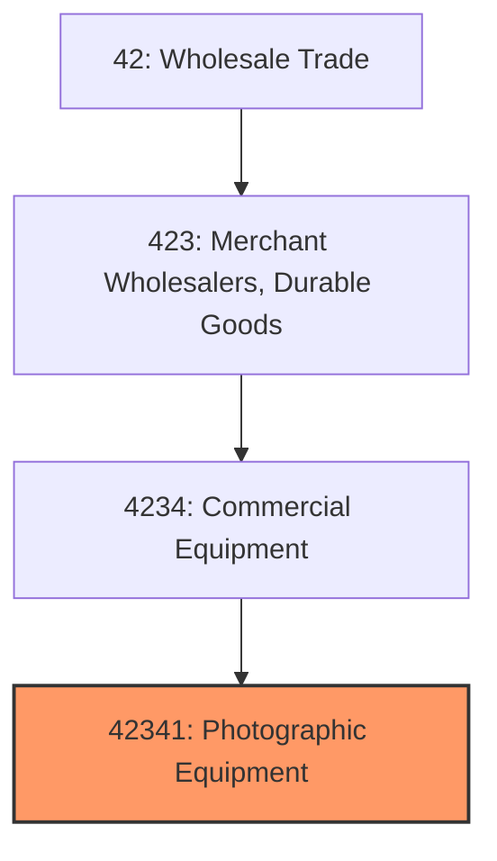
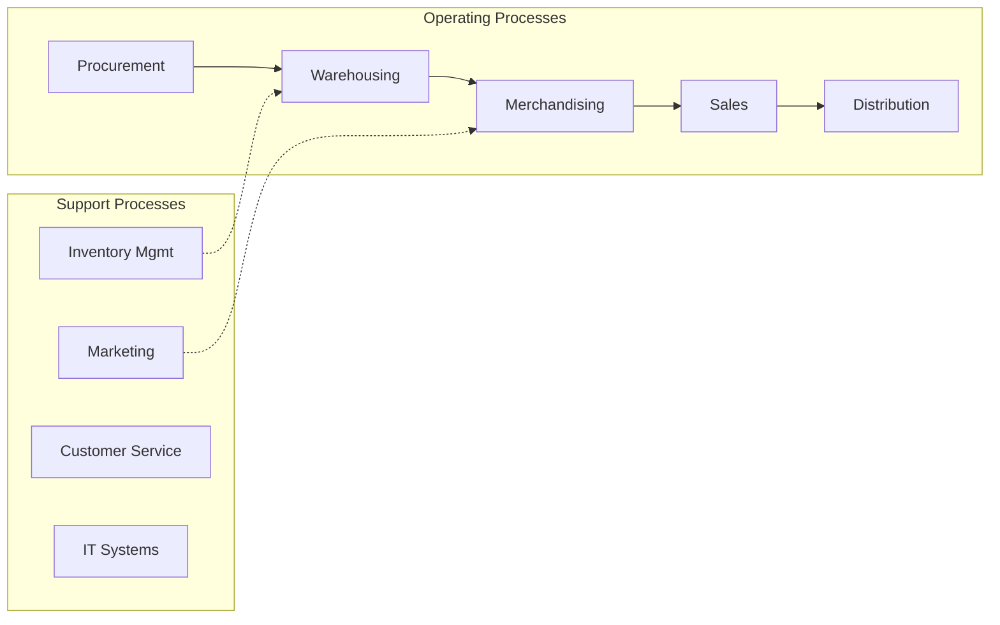

# Photographic Equipment

> See industry description for 423410.

## Overview

Photographic Equipment represents an important category within the Wholesale Trade sector (NAICS 42). This industry encompasses establishments primarily engaged in photographic equipment.

## Industry Hierarchy

## Key Statistics

| Metric | Value |
|--------|-------|
| NAICS Code | 42341 |
| Level | Industry |
| Parent | [Commercial Equipment](../) |
| Child Industries | 0 |

## Related Occupations

- [Purchasing Managers](/occupations/Management/PurchasingManagers) - Plan and coordinate purchasing activities
- [Wholesale and Retail Buyers](/occupations/Business/WholesaleAndRetailBuyersExceptFarmProducts) - Buy merchandise for resale
- [Sales Representatives, Wholesale](/occupations/Sales/SalesRepresentativesWholesaleAndManufacturingExceptTechnicalAndScientificProducts) - Sell goods to businesses
- [Logisticians](/occupations/Business/Logisticians) - Coordinate supply chain operations

## Core Business Processes

## Industry Value Chain

## Regulatory Environment

- **FTC** (Federal Trade Commission) - Regulates fair trade and anti-competitive practices
- **DOT** (Department of Transportation) - Governs shipping and logistics requirements
- **Customs and Border Protection** - Oversees import/export compliance
- **State Licensing Boards** - Regulate wholesale distribution permits

## Technology & Innovation

- **Supply Chain Digitization** - Real-time tracking, blockchain provenance, and automated ordering
- **Warehouse Automation** - Robotic picking, automated storage systems, and drone inventory
- **E-commerce Integration** - B2B online platforms and omnichannel distribution
- **Predictive Analytics** - AI-driven demand forecasting and inventory optimization

## Industry Outlook

The wholesale trade sector is adapting to digital transformation with B2B e-commerce platforms and supply chain automation reshaping traditional distribution models. Real-time inventory management and predictive analytics are improving efficiency, while consolidation continues as companies seek scale. Supply chain resilience and diversification remain top priorities following recent global disruptions.

## Market Context

Wholesale trade bridges manufacturers and retailers, with digital transformation enabling more efficient B2B transactions and supply chain integration.

| Aspect | Details |
|--------|---------|
| Industry Sector | Wholesale |
| NAICS/SIC Code | 42341 |
| Market Segment | Photographic Equipment |

## Key Business Processes

- Sourcing and procurement
- Inventory management
- Order fulfillment
- Sales and distribution
- Customer relationship management

## Common Occupations

- [Wholesale Sales Representatives](/occupations/Sales/WholesaleAndManufacturingSalesRepresentatives)
- [Purchasing Managers](/occupations/Business/PurchasingManagers)
- [Warehouse Managers](/occupations/Management/TransportationStorageAndDistributionManagers)
- [Order Clerks](/occupations/Administrative/OrderClerks)

## Regulations and Standards

- Trade and commerce regulations
- Industry-specific licensing
- Product safety standards
- Import/export compliance
- Contract and commercial law

## Technology and Tools

- Enterprise Resource Planning (ERP)
- Electronic Data Interchange (EDI)
- Inventory management systems
- B2B e-commerce platforms
- Supply chain analytics

## Industry Trends

- Digital transformation and automation adoption
- Sustainability and environmental compliance focus
- Workforce development and skills training
- Supply chain resilience and optimization
- Customer experience enhancement

---

*Source: NAICS 42341 - Photographic Equipment*
