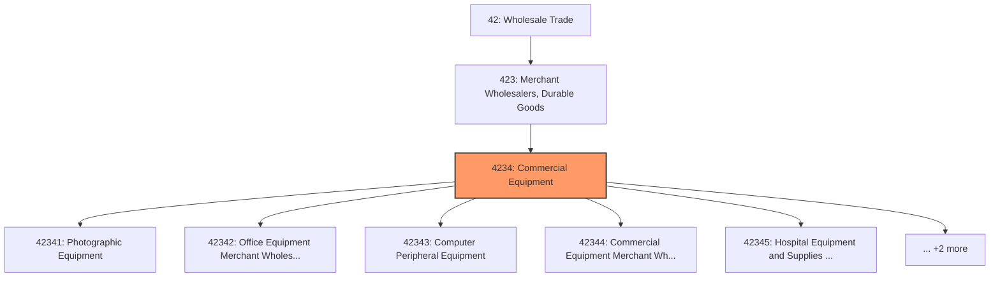
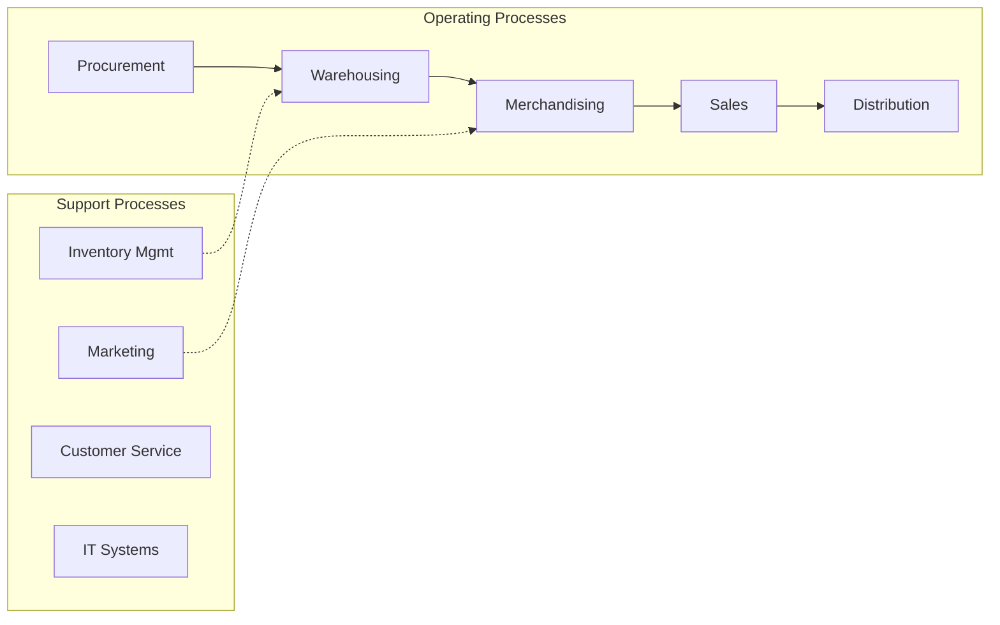

# Commercial Equipment

> This industry group comprises establishments primarily engaged in the merchant wholesale distribution of photographic equipment and supplies; office, computer, and computer peripheral equipment; and medical, dental, hospital, ophthalmic, and other commercial and professional equipment and supplies.

## Overview

Commercial Equipment represents an important category within the Wholesale Trade sector (NAICS 42). This industry group encompasses establishments primarily engaged in commercial equipment.

This industry group comprises establishments primarily engaged in the merchant wholesale distribution of photographic equipment and supplies; office, computer, and computer peripheral equipment; and medical, dental, hospital, ophthalmic, and other commercial and professional equipment and supplies.

## Industry Hierarchy

## Key Statistics

| Metric | Value |
|--------|-------|
| NAICS Code | 4234 |
| Level | Industry Group |
| Parent | [Merchant Wholesalers, Durable Goods](../) |
| Child Industries | 7 |

## Sub-Industries

| Industry | Code | Description |
|----------|------|-------------|
| [Photographic Equipment](./PhotographicEquipment/) | 42341 | See industry description for 423410 |
| [Office Equipment Merchant Wholesalers](./OfficeEquipmentMerchantWholesalers/) | 42342 | See industry description for 423420 |
| [Computer Peripheral Equipment](./ComputerPeripheralEquipment/) | 42343 | See industry description for 423430 |
| [Commercial Equipment Merchant Wholesalers](./CommercialEquipmentMerchantWholesalers/) | 42344 | See industry description for 423440 |
| [Hospital Equipment and Supplies Merchant Wholesalers](./HospitalEquipmentAndSuppliesMerchantWholesalers/) | 42345 | See industry description for 423450 |
| [Ophthalmic Goods Merchant Wholesalers](./OphthalmicGoodsMerchantWholesalers/) | 42346 | See industry description for 423460 |
| [Professional Equipment](./ProfessionalEquipment/) | 42349 | See industry description for 423490 |

## Core Business Processes

## Industry Value Chain

---

*Source: NAICS 4234 - Commercial Equipment*
