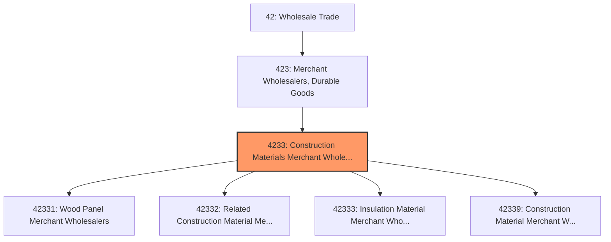
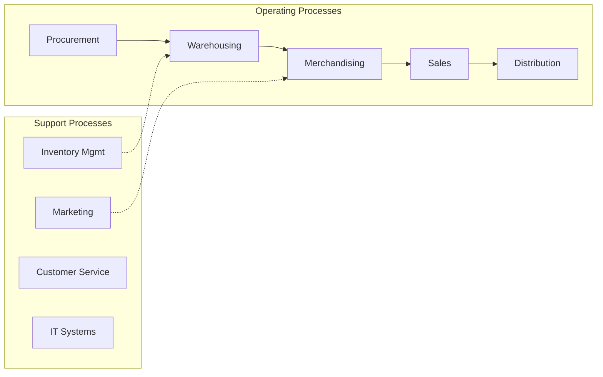

# Construction Materials Merchant Wholesalers

> This industry group comprises establishments primarily engaged in the merchant wholesale distribution of lumber, plywood, millwork, and wood panels; brick, stone, and related construction materials; roofing, siding, and insulation materials; and other construction materials, including manufactured homes (i.

## Overview

Construction Materials Merchant Wholesalers represents an important category within the Wholesale Trade sector (NAICS 42). This industry group encompasses establishments primarily engaged in construction materials merchant wholesalers.

This industry group comprises establishments primarily engaged in the merchant wholesale distribution of lumber, plywood, millwork, and wood panels; brick, stone, and related construction materials; roofing, siding, and insulation materials; and other construction materials, including manufactured homes (i.e., mobile homes) and/or prefabricated buildings.

## Industry Hierarchy

## Key Statistics

| Metric | Value |
|--------|-------|
| NAICS Code | 4233 |
| Level | Industry Group |
| Parent | [Merchant Wholesalers, Durable Goods](../) |
| Child Industries | 4 |

## Sub-Industries

| Industry | Code | Description |
|----------|------|-------------|
| [Wood Panel Merchant Wholesalers](./WoodPanelMerchantWholesalers/) | 42331 | See industry description for 423310 |
| [Related Construction Material Merchant Wholesalers](./RelatedConstructionMaterialMerchantWholesalers/) | 42332 | See industry description for 423320 |
| [Insulation Material Merchant Wholesalers](./InsulationMaterialMerchantWholesalers/) | 42333 | See industry description for 423330 |
| [Construction Material Merchant Wholesalers](./ConstructionMaterialMerchantWholesalers/) | 42339 | See industry description for 423390 |

## Core Business Processes

## Industry Value Chain

## Market Context

Wholesale trade bridges manufacturers and retailers, with digital transformation enabling more efficient B2B transactions and supply chain integration.

| Aspect | Details |
|--------|---------|
| Industry Sector | Wholesale |
| NAICS/SIC Code | 4233 |
| Market Segment | Construction Materials Merchant Wholesalers |

## Key Business Processes

- Sourcing and procurement
- Inventory management
- Order fulfillment
- Sales and distribution
- Customer relationship management

## Common Occupations

- [Wholesale Sales Representatives](/occupations/Sales/WholesaleAndManufacturingSalesRepresentatives)
- [Purchasing Managers](/occupations/Business/PurchasingManagers)
- [Warehouse Managers](/occupations/Management/TransportationStorageAndDistributionManagers)
- [Order Clerks](/occupations/Administrative/OrderClerks)

## Regulations and Standards

- Trade and commerce regulations
- Industry-specific licensing
- Product safety standards
- Import/export compliance
- Contract and commercial law

## Technology and Tools

- Enterprise Resource Planning (ERP)
- Electronic Data Interchange (EDI)
- Inventory management systems
- B2B e-commerce platforms
- Supply chain analytics

## Industry Trends

- Digital transformation and automation adoption
- Sustainability and environmental compliance focus
- Workforce development and skills training
- Supply chain resilience and optimization
- Customer experience enhancement

---

*Source: NAICS 4233 - Construction Materials Merchant Wholesalers*
