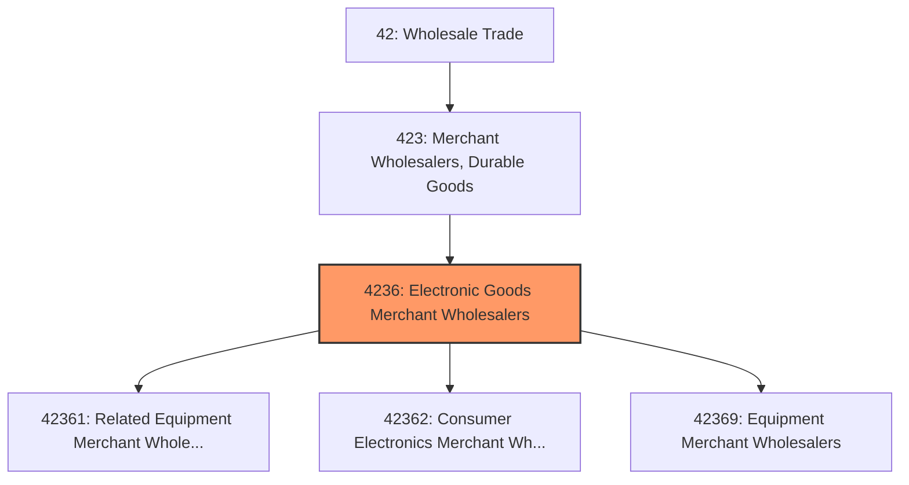
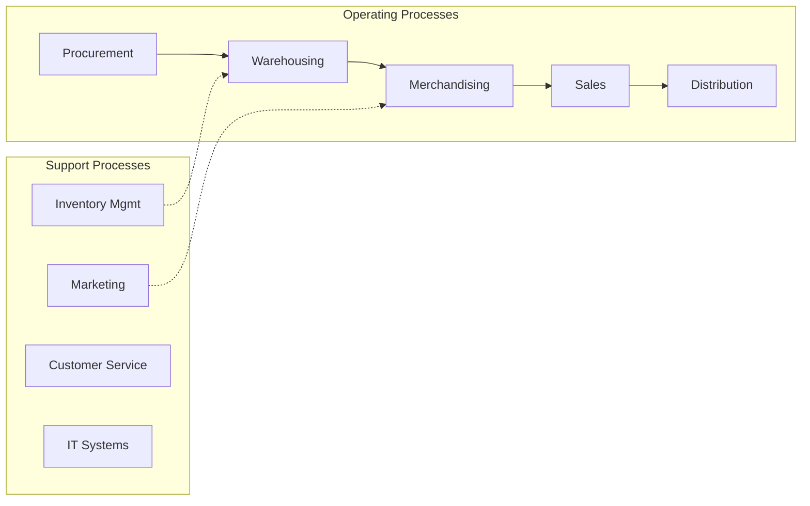

# Electronic Goods Merchant Wholesalers

> This industry group comprises establishments primarily engaged in the merchant wholesale distribution of electrical apparatus and equipment, wiring supplies, and related equipment; household appliances, electric housewares, and consumer electronics; and other electronic parts and equipment.

## Overview

Electronic Goods Merchant Wholesalers represents an important category within the Wholesale Trade sector (NAICS 42). This industry group encompasses establishments primarily engaged in electronic goods merchant wholesalers.

This industry group comprises establishments primarily engaged in the merchant wholesale distribution of electrical apparatus and equipment, wiring supplies, and related equipment; household appliances, electric housewares, and consumer electronics; and other electronic parts and equipment.

## Industry Hierarchy

## Key Statistics

| Metric | Value |
|--------|-------|
| NAICS Code | 4236 |
| Level | Industry Group |
| Parent | [Merchant Wholesalers, Durable Goods](../) |
| Child Industries | 3 |

## Sub-Industries

| Industry | Code | Description |
|----------|------|-------------|
| [Related Equipment Merchant Wholesalers](./RelatedEquipmentMerchantWholesalers/) | 42361 | See industry description for 423610 |
| [Consumer Electronics Merchant Wholesalers](./ConsumerElectronicsMerchantWholesalers/) | 42362 | See industry description for 423620 |
| [Equipment Merchant Wholesalers](./EquipmentMerchantWholesalers/) | 42369 | See industry description for 423690 |

## Core Business Processes

## Industry Value Chain

```mermaid
graph LR
    subgraph Inputs["Inputs"]
        I1["Products"]
        I2["Inventory"]
        I3["Store/Warehouse"]
    end

    subgraph Primary["Primary Activities"]
        A1["Inbound Logistics"]
        A2["Core Operations"]
        A3["Quality Assurance"]
        A4["Outbound/Delivery"]
    end

    subgraph Outputs["Products/Services"]
        O1["Goods for Sale"]
        O2["Services"]
        O3["Delivery"]
    end

    subgraph Customers["Markets"]
        C1["Businesses"]
        C2["Consumers"]
        C3["Institutions"]
        C4["Government"]
    end

    Inputs --> Primary --> Outputs --> Customers
```

---

*Source: NAICS 4236 - Electronic Goods Merchant Wholesalers*
