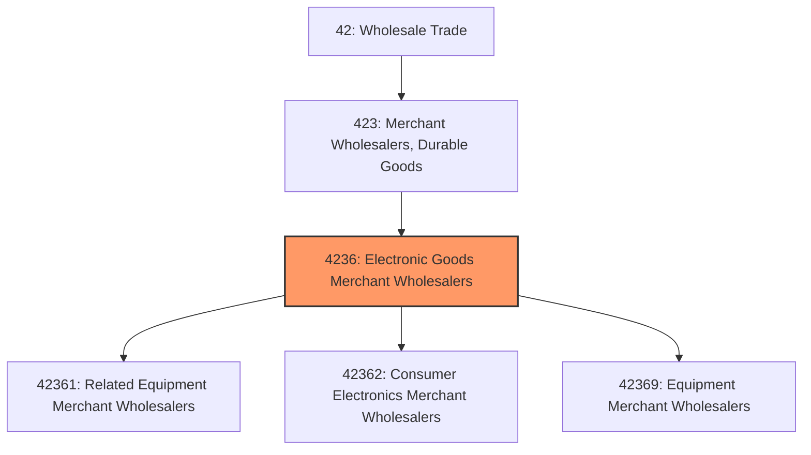
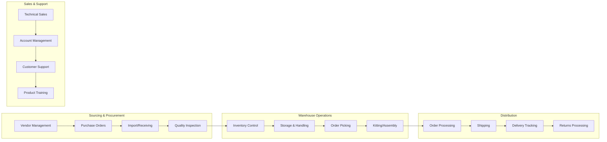

# Electronic Goods Merchant Wholesalers

> This industry group comprises establishments primarily engaged in the merchant wholesale distribution of electrical apparatus and equipment, wiring supplies, and related equipment; household appliances, electric housewares, and consumer electronics; and other electronic parts and equipment.

## Overview

Electronic Goods Merchant Wholesalers serve as the critical link between electronics manufacturers and the diverse downstream markets including retailers, contractors, industrial users, and commercial establishments. This industry group encompasses the distribution of a vast range of products from semiconductors and electronic components to consumer electronics and household appliances.

The electronic goods wholesale sector has evolved significantly with the rapid pace of technological innovation, shorter product life cycles, and the growing complexity of supply chains. Wholesalers in this segment must manage inventory carefully to avoid obsolescence while ensuring product availability for time-sensitive customer demands. The industry serves both B2B customers (contractors, OEMs, industrial users) and B2C channels (retailers, e-commerce platforms).

Global supply chain dynamics play a particularly important role in this sector, with significant product sourcing from Asia and increasing emphasis on supply chain resilience, alternative sourcing, and inventory buffering strategies.

## Industry Hierarchy

## Key Statistics

| Metric | Value |
|--------|-------|
| NAICS Code | 4236 |
| Level | Industry Group |
| Parent | [Merchant Wholesalers, Durable Goods](../) |
| Child Industries | 3 |

## Sub-Industries

| Industry | Code | Description |
|----------|------|-------------|
| [Related Equipment Merchant Wholesalers](./RelatedEquipmentMerchantWholesalers/) | 42361 | Electrical apparatus, wiring supplies, and construction materials |
| [Consumer Electronics Merchant Wholesalers](./ConsumerElectronicsMerchantWholesalers/) | 42362 | Household appliances, TVs, audio equipment, and consumer devices |
| [Equipment Merchant Wholesalers](./EquipmentMerchantWholesalers/) | 42369 | Electronic parts, components, and specialized equipment |

## Related Occupations

- [Purchasing Managers](/occupations/Management/PurchasingManagers) - Plan and coordinate purchasing activities and vendor relationships
- [Wholesale and Retail Buyers](/occupations/Business/WholesaleAndRetailBuyersExceptFarmProducts) - Buy merchandise for resale and manage inventory
- [Sales Representatives, Wholesale](/occupations/Sales/SalesRepresentativesWholesaleAndManufacturingTechnicalAndScientificProducts) - Sell technical products to business customers
- [Logisticians](/occupations/Business/Logisticians) - Coordinate supply chain operations
- [Electrical and Electronics Engineering Technicians](/occupations/Architecture/ElectricalAndElectronicsEngineeringTechnicians) - Provide technical support and product expertise
- [Computer and Information Systems Managers](/occupations/Management/ComputerAndInformationSystemsManagers) - Manage IT systems and e-commerce platforms

## Core Business Processes

### Sourcing and Procurement

Managing relationships with electronics manufacturers, component suppliers, and importers to ensure product availability and competitive pricing.

**Key Activities:**
- Negotiate pricing and terms with manufacturers and authorized distributors
- Manage import logistics and customs clearance for international shipments
- Monitor supplier performance and lead times
- Develop alternative sourcing strategies for supply chain resilience
- Coordinate with manufacturers on product launches and allocations

### Inventory Management

Balancing stock levels across fast-moving consumer electronics and slow-moving specialty components while minimizing obsolescence risk.

**Key Activities:**
- Implement demand forecasting for volatile technology markets
- Manage product lifecycle and phase-out planning
- Coordinate bin locations and warehouse optimization
- Track serial numbers and lot codes for warranty and recall management
- Execute price protection and stock rotation programs

### Technical Sales and Support

Providing product expertise and application support to help customers select appropriate electronic products and solutions.

**Key Activities:**
- Conduct product demonstrations and training sessions
- Provide technical specifications and compatibility guidance
- Support system design and integration projects
- Manage RFQ (Request for Quote) processes for large orders
- Deliver after-sales technical support and troubleshooting

## Industry Value Chain

## Regulatory Environment

- **FCC** (Federal Communications Commission) - Regulates radio frequency devices, electronic emissions, and telecommunications equipment
- **EPA** (Environmental Protection Agency) - Governs electronic waste (e-waste) disposal and hazardous materials handling
- **CPSC** (Consumer Product Safety Commission) - Oversees safety standards for consumer electronics and appliances
- **Customs and Border Protection** - Manages import compliance, tariffs, and country of origin requirements
- **UL/ETL Certification** - Product safety certification requirements for electrical equipment
- **DOE** (Department of Energy) - Energy efficiency standards for appliances and electronics
- **State E-Waste Laws** - Varying state requirements for electronics recycling and disposal

## Technology & Innovation

- **Warehouse Management Systems (WMS)** - Real-time inventory visibility, bin location management, and pick optimization
- **Electronic Data Interchange (EDI)** - Automated ordering, invoicing, and shipping notifications with trading partners
- **E-Commerce Platforms** - B2B online ordering, product configurators, and customer portals
- **Product Information Management (PIM)** - Centralized product data, specifications, and digital assets
- **Barcode/RFID Tracking** - Serial number tracking, lot control, and real-time inventory accuracy
- **Integration APIs** - Real-time inventory feeds and order status to e-commerce platforms and marketplaces
- **Predictive Analytics** - Demand forecasting, pricing optimization, and obsolescence risk modeling

## Market Trends

The electronic goods wholesale sector continues to evolve with several key trends:

- **Supply Chain Diversification** - Shifting from single-source to multi-source strategies and nearshoring initiatives
- **E-Commerce Growth** - Accelerating shift to online B2B purchasing and marketplace integration
- **Product Lifecycle Compression** - Faster innovation cycles requiring agile inventory management
- **Sustainability Focus** - Growing emphasis on e-waste programs, refurbishment, and circular economy initiatives
- **Value-Added Services** - Expanding into kitting, configuration, and integration services
- **Smart Home/IoT Growth** - Increasing demand for connected devices and smart home products
- **Technical Specialization** - Deepening expertise in specific product categories and vertical markets

---

*Source: NAICS 4236 - Electronic Goods Merchant Wholesalers*
