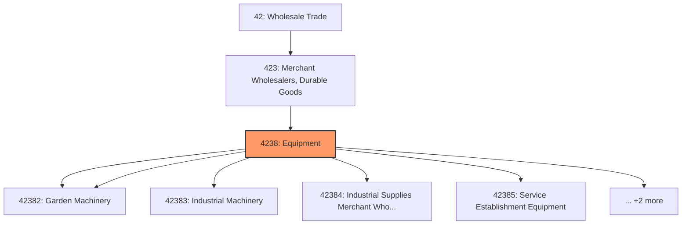
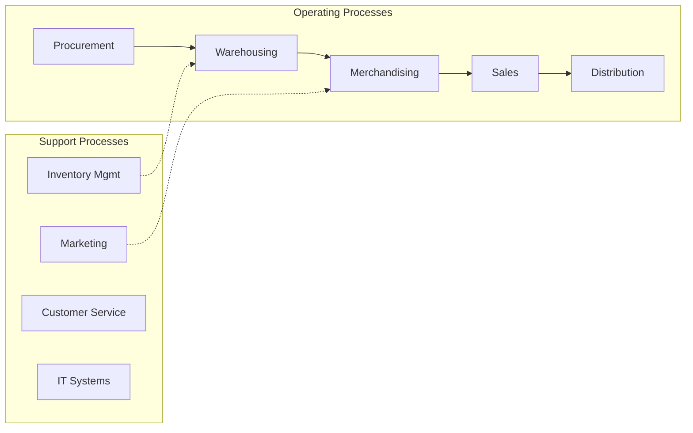

# Equipment

> This industry group comprises establishments primarily engaged in the merchant wholesale distribution of construction, mining, farm, garden, industrial, service establishment, and transportation machinery, equipment, and supplies.

## Overview

Equipment represents an important category within the Wholesale Trade sector (NAICS 42).

This industry group comprises establishments primarily engaged in the merchant wholesale distribution of construction, mining, farm, garden, industrial, service establishment, and transportation machinery, equipment, and supplies.

## Industry Hierarchy

## Key Statistics

| Metric | Value |
|--------|-------|
| NAICS Code | 4238 |
| Level | Industry Group |
| Parent | [Merchant Wholesalers, Durable Goods](../) |
| Child Industries | 7 |

## Sub-Industries

| Industry | Code | Description |
|----------|------|-------------|
| [Farm](./Farm/) | 42382 | See industry description for 423820 |
| [Garden Machinery](./GardenMachinery/) | 42382 | See industry description for 423820 |
| [Industrial Machinery](./IndustrialMachinery/) | 42383 | See industry description for 423830 |
| [Industrial Supplies Merchant Wholesalers](./IndustrialSuppliesMerchantWholesalers/) | 42384 | See industry description for 423840 |
| [Service Establishment Equipment](./ServiceEstablishmentEquipment/) | 42385 | See industry description for 423850 |
| [Transportation Equipment](./TransportationEquipment/) | 42386 | See industry description for 423860 |
| [Supplies (](./Supplies/) | 42386 | See industry description for 423860 |

## Related Occupations

See the [occupations directory](/occupations) for roles commonly found in this industry.

## Core Business Processes

## Industry Value Chain

## Market Context

Wholesale trade bridges manufacturers and retailers, with digital transformation enabling more efficient B2B transactions and supply chain integration.

| Aspect | Details |
|--------|---------|
| Industry Sector | Wholesale |
| NAICS/SIC Code | 4238 |
| Market Segment | Equipment |

## Key Business Processes

- Sourcing and procurement
- Inventory management
- Order fulfillment
- Sales and distribution
- Customer relationship management

## Common Occupations

- [Wholesale Sales Representatives](/occupations/Sales/WholesaleAndManufacturingSalesRepresentatives)
- [Purchasing Managers](/occupations/Business/PurchasingManagers)
- [Warehouse Managers](/occupations/Management/TransportationStorageAndDistributionManagers)
- [Order Clerks](/occupations/Administrative/OrderClerks)

## Regulations and Standards

- Trade and commerce regulations
- Industry-specific licensing
- Product safety standards
- Import/export compliance
- Contract and commercial law

## Technology and Tools

- Enterprise Resource Planning (ERP)
- Electronic Data Interchange (EDI)
- Inventory management systems
- B2B e-commerce platforms
- Supply chain analytics

## Industry Trends

- Digital transformation and automation adoption
- Sustainability and environmental compliance focus
- Workforce development and skills training
- Supply chain resilience and optimization
- Customer experience enhancement

---

*Source: NAICS 4238 - Equipment*
