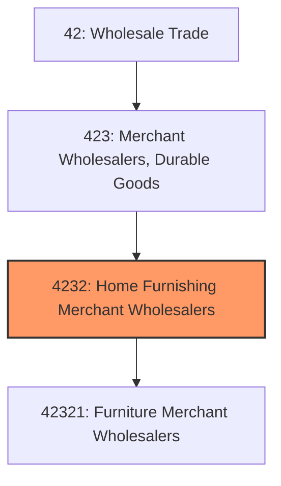
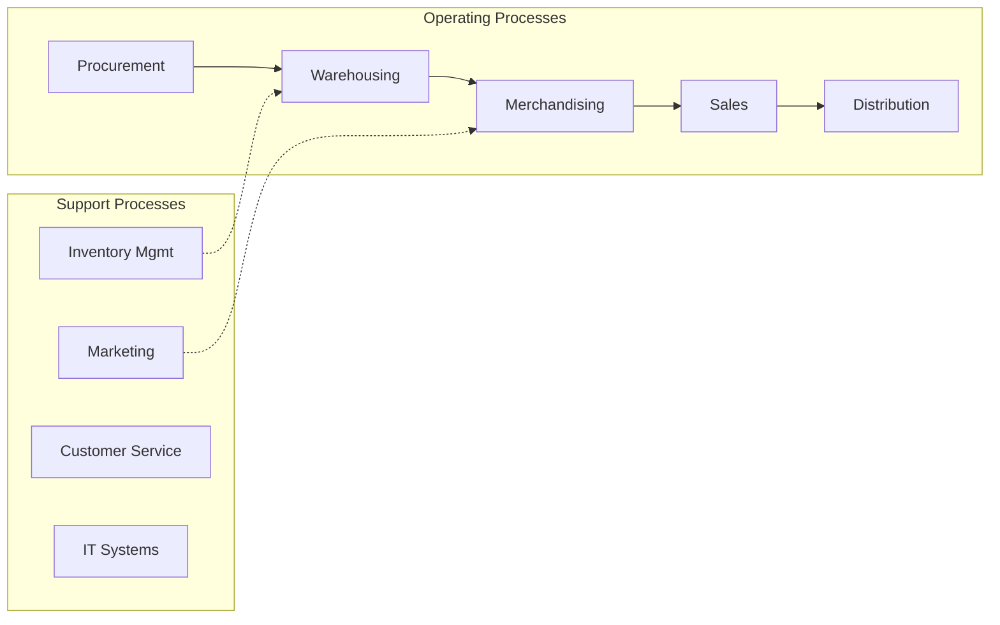

# Home Furnishing Merchant Wholesalers

> This industry group comprises establishments primarily engaged in the merchant wholesale distribution of furniture (except hospital beds, medical furniture, and drafting tables), home furnishings, and/or housewares.

## Overview

Home Furnishing Merchant Wholesalers represents an important category within the Wholesale Trade sector (NAICS 42). This industry group encompasses establishments primarily engaged in home furnishing merchant wholesalers.

This industry group comprises establishments primarily engaged in the merchant wholesale distribution of furniture (except hospital beds, medical furniture, and drafting tables), home furnishings, and/or housewares.

## Industry Hierarchy

## Key Statistics

| Metric | Value |
|--------|-------|
| NAICS Code | 4232 |
| Level | Industry Group |
| Parent | [Merchant Wholesalers, Durable Goods](../) |
| Child Industries | 1 |

## Sub-Industries

| Industry | Code | Description |
|----------|------|-------------|
| [Furniture Merchant Wholesalers](./FurnitureMerchantWholesalers/) | 42321 | See industry description for 423210 |

## Core Business Processes

## Industry Value Chain

```mermaid
graph LR
    subgraph Inputs["Inputs"]
        I1["Products"]
        I2["Inventory"]
        I3["Store/Warehouse"]
    end

    subgraph Primary["Primary Activities"]
        A1["Inbound Logistics"]
        A2["Core Operations"]
        A3["Quality Assurance"]
        A4["Outbound/Delivery"]
    end

    subgraph Outputs["Products/Services"]
        O1["Goods for Sale"]
        O2["Services"]
        O3["Delivery"]
    end

    subgraph Customers["Markets"]
        C1["Businesses"]
        C2["Consumers"]
        C3["Institutions"]
        C4["Government"]
    end

    Inputs --> Primary --> Outputs --> Customers
```

---

*Source: NAICS 4232 - Home Furnishing Merchant Wholesalers*
