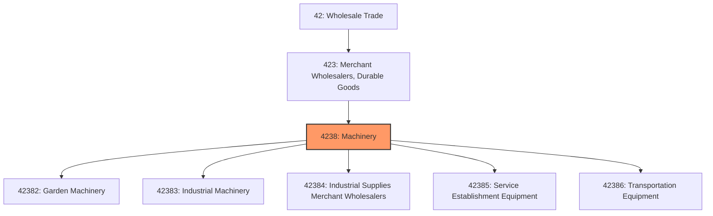

# Machinery

> This industry group comprises establishments primarily engaged in the merchant wholesale distribution of construction, mining, farm, garden, industrial, service establishment, and transportation machinery, equipment, and supplies.

## Overview

Machinery Merchant Wholesalers form a critical component of the capital equipment supply chain, connecting manufacturers of heavy equipment, industrial machinery, and specialized tools with end users across agriculture, construction, manufacturing, and service industries. These distributors typically offer comprehensive solutions including equipment sales, parts distribution, rental programs, and aftermarket services.

The machinery wholesale sector is characterized by high-value transactions, long sales cycles, and the importance of technical expertise and customer relationships. Distributors often maintain significant parts inventories and service capabilities to support installed equipment bases. Many operate as authorized dealers for major manufacturers, providing warranty service and factory-trained technicians.

Cyclical demand patterns tied to construction activity, agricultural commodity prices, and industrial capital spending create both opportunities and challenges for inventory management and capacity planning. The industry is increasingly leveraging telematics, predictive maintenance, and e-commerce to enhance customer value and operational efficiency.

## Industry Hierarchy

## Key Statistics

| Metric | Value |
|--------|-------|
| NAICS Code | 4238 |
| Level | Industry Group |
| Parent | [Merchant Wholesalers, Durable Goods](../) |
| Child Industries | 5 |

## Sub-Industries

| Industry | Code | Description |
|----------|------|-------------|
| [Garden Machinery](./GardenMachinery/) | 42382 | Lawn and garden equipment, outdoor power equipment |
| [Industrial Machinery](./IndustrialMachinery/) | 42383 | Manufacturing equipment, machine tools, and industrial systems |
| [Industrial Supplies Merchant Wholesalers](./IndustrialSuppliesMerchantWholesalers/) | 42384 | MRO supplies, cutting tools, and industrial consumables |
| [Service Establishment Equipment](./ServiceEstablishmentEquipment/) | 42385 | Restaurant, beauty salon, and service industry equipment |
| [Transportation Equipment](./TransportationEquipment/) | 42386 | Marine, aircraft, and railroad equipment and supplies |

## Related Occupations

- [Purchasing Managers](/occupations/Management/PurchasingManagers) - Manage vendor relationships and equipment procurement
- [Sales Representatives, Wholesale](/occupations/Sales/SalesRepresentativesWholesaleAndManufacturingTechnicalAndScientificProducts) - Technical sales for capital equipment
- [First-Line Supervisors of Mechanics](/occupations/Installation/FirstLineSupervisorsOfMechanicsInstallersAndRepairers) - Oversee equipment service operations
- [Industrial Machinery Mechanics](/occupations/Installation/IndustrialMachineryMechanics) - Install, maintain, and repair equipment
- [Logisticians](/occupations/Business/Logisticians) - Coordinate heavy equipment logistics
- [Parts Salespersons](/occupations/Sales/PartsSalespersons) - Sell replacement parts and accessories

## Core Business Processes

### Equipment Sales

Managing the complete sales cycle for capital equipment from lead generation through delivery and commissioning.

**Key Activities:**
- Qualify leads and conduct site assessments for equipment requirements
- Prepare equipment specifications and competitive proposals
- Coordinate equipment financing, leasing, and payment programs
- Manage trade-in evaluations and used equipment sales
- Facilitate factory orders and allocation for high-demand equipment

### Parts Distribution

Maintaining comprehensive parts inventories to support the installed equipment base and minimize customer downtime.

**Key Activities:**
- Stock critical and fast-moving parts based on demand analysis
- Process emergency parts orders with expedited shipping
- Manage obsolete parts and supersession programs
- Coordinate parts returns and warranty claims with manufacturers
- Implement e-commerce parts ordering platforms

### Service and Support

Providing factory-authorized service, preventive maintenance, and repair capabilities for distributed equipment.

**Key Activities:**
- Deploy field service technicians for on-site repairs
- Operate service shops for major overhauls and rebuilds
- Implement telematics monitoring for predictive maintenance
- Manage warranty administration and claim processing
- Conduct operator training and safety programs

## Industry Value Chain

## Regulatory Environment

- **OSHA** (Occupational Safety and Health Administration) - Workplace safety requirements for equipment operation and maintenance
- **EPA** (Environmental Protection Agency) - Emissions standards, fuel requirements, and hazardous materials handling
- **DOT** (Department of Transportation) - Oversize/overweight permits and transportation regulations
- **CPSC** (Consumer Product Safety Commission) - Safety standards for consumer equipment
- **State Dealer Licensing** - Dealer licensing and franchise law compliance
- **Emissions Regulations** - Tier 4 and emerging emissions standards for off-road equipment
- **USDA** (Department of Agriculture) - Agricultural equipment safety and subsidy programs

## Technology & Innovation

- **Telematics Platforms** - Remote equipment monitoring for location, utilization, and diagnostic data
- **Dealer Management Systems (DMS)** - Integrated ERP for sales, parts, service, and rental operations
- **E-Commerce Parts Portals** - Online parts ordering with VIN/serial lookup and parts diagrams
- **Electronic Data Interchange (EDI)** - Automated ordering and inventory replenishment with manufacturers
- **CRM Systems** - Customer relationship management for complex B2B sales cycles
- **Predictive Maintenance** - AI-driven analytics using telematics data to anticipate service needs
- **Mobile Service Applications** - Field technician apps for work orders, parts lookup, and time tracking
- **3D Printing** - Emerging use for obsolete parts and rapid prototyping

## Market Trends

The machinery wholesale sector is experiencing significant transformation:

- **Electrification** - Growing demand for electric and hybrid equipment across all categories
- **Autonomous Equipment** - Emerging adoption of autonomous tractors, construction equipment, and drones
- **Rental Growth** - Increasing customer preference for rental and equipment-as-a-service models
- **Consolidation** - Continued dealer consolidation creating larger, multi-location dealer groups
- **Precision Technology** - GPS, machine control, and precision agriculture driving technology adoption
- **Sustainability** - Customer focus on fuel efficiency, emissions reduction, and sustainable practices
- **Skills Gap** - Ongoing challenge recruiting and training qualified service technicians
- **Digital Commerce** - Accelerating adoption of online channels for parts and equipment sales

---

*Source: NAICS 4238 - Machinery*
