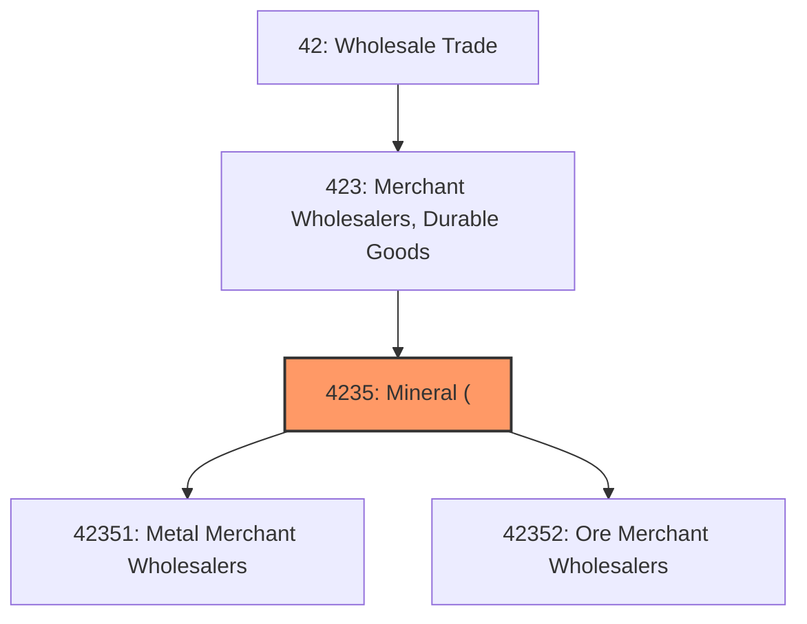
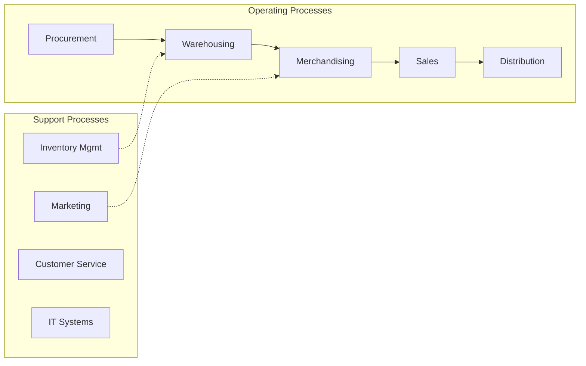

# Mineral (

> This industry group comprises establishments primarily engaged in the merchant wholesale distribution of products of the primary metals industries (including metal service centers) and coal, coke, metal ores, and/or nonmetallic minerals (except precious and semiprecious stones and minerals used in construction).

## Overview

Mineral ( represents an important category within the Wholesale Trade sector (NAICS 42). This industry group encompasses establishments primarily engaged in mineral (.

This industry group comprises establishments primarily engaged in the merchant wholesale distribution of products of the primary metals industries (including metal service centers) and coal, coke, metal ores, and/or nonmetallic minerals (except precious and semiprecious stones and minerals used in construction).

## Industry Hierarchy

## Key Statistics

| Metric | Value |
|--------|-------|
| NAICS Code | 4235 |
| Level | Industry Group |
| Parent | [Merchant Wholesalers, Durable Goods](../) |
| Child Industries | 2 |

## Sub-Industries

| Industry | Code | Description |
|----------|------|-------------|
| [Metal Merchant Wholesalers](./MetalMerchantWholesalers/) | 42351 | See industry description for 423510 |
| [Ore Merchant Wholesalers](./OreMerchantWholesalers/) | 42352 | See industry description for 423520 |

## Core Business Processes

## Industry Value Chain

```mermaid
graph LR
    subgraph Inputs["Inputs"]
        I1["Products"]
        I2["Inventory"]
        I3["Store/Warehouse"]
    end

    subgraph Primary["Primary Activities"]
        A1["Inbound Logistics"]
        A2["Core Operations"]
        A3["Quality Assurance"]
        A4["Outbound/Delivery"]
    end

    subgraph Outputs["Products/Services"]
        O1["Goods for Sale"]
        O2["Services"]
        O3["Delivery"]
    end

    subgraph Customers["Markets"]
        C1["Businesses"]
        C2["Consumers"]
        C3["Institutions"]
        C4["Government"]
    end

    Inputs --> Primary --> Outputs --> Customers
```

---

*Source: NAICS 4235 - Mineral (*
