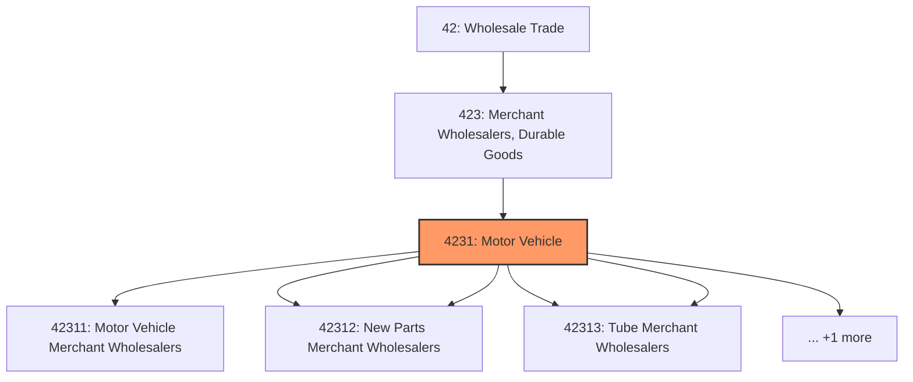
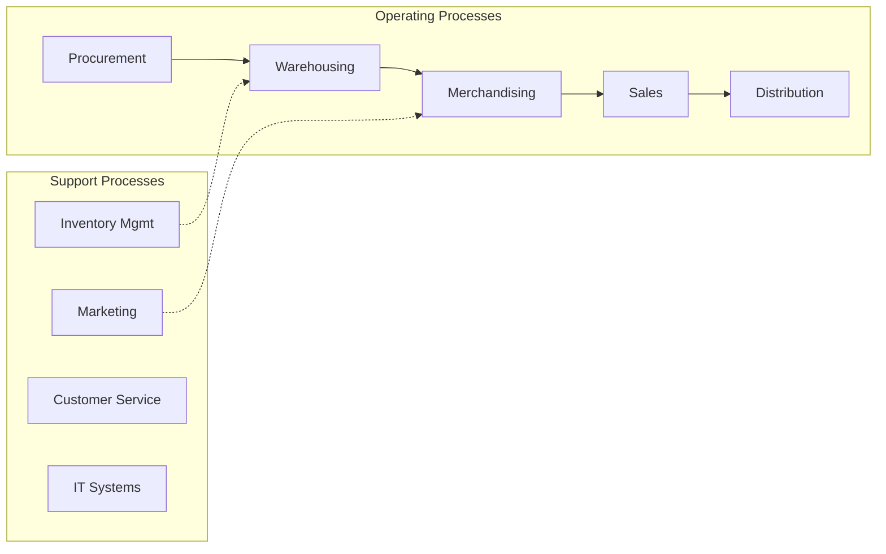

# Motor Vehicle

> This industry group comprises establishments primarily engaged in the merchant wholesale distribution of automobiles and other motor vehicles, motor vehicle supplies, tires, and new and used parts.

## Overview

Motor Vehicle represents an important category within the Wholesale Trade sector (NAICS 42).

This industry group comprises establishments primarily engaged in the merchant wholesale distribution of automobiles and other motor vehicles, motor vehicle supplies, tires, and new and used parts.

## Industry Hierarchy

## Key Statistics

| Metric | Value |
|--------|-------|
| NAICS Code | 4231 |
| Level | Industry Group |
| Parent | [Merchant Wholesalers, Durable Goods](../) |
| Child Industries | 6 |

## Sub-Industries

| Industry | Code | Description |
|----------|------|-------------|
| [Motor Vehicle Merchant Wholesalers](./MotorVehicleMerchantWholesalers/) | 42311 | See industry description for 423110 |
| [Motor Vehicle Supplies](./MotorVehicleSupplies/) | 42312 | See industry description for 423120 |
| [New Parts Merchant Wholesalers](./NewPartsMerchantWholesalers/) | 42312 | See industry description for 423120 |
| [Tire](./Tire/) | 42313 | See industry description for 423130 |
| [Tube Merchant Wholesalers](./TubeMerchantWholesalers/) | 42313 | See industry description for 423130 |
| [Motor Vehicle Parts (Used) Merchant Wholesalers](./MotorVehiclePartsUsedMerchantWholesalers/) | 42314 | See industry description for 423140 |

## Related Occupations

See the [occupations directory](/occupations) for roles commonly found in this industry.

## Core Business Processes

## Industry Value Chain

---

*Source: NAICS 4231 - Motor Vehicle*
