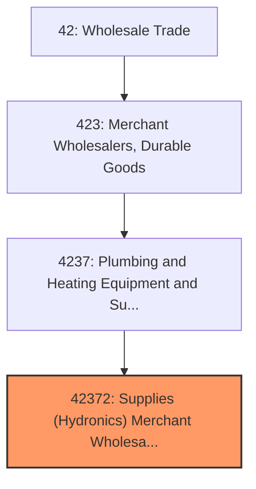
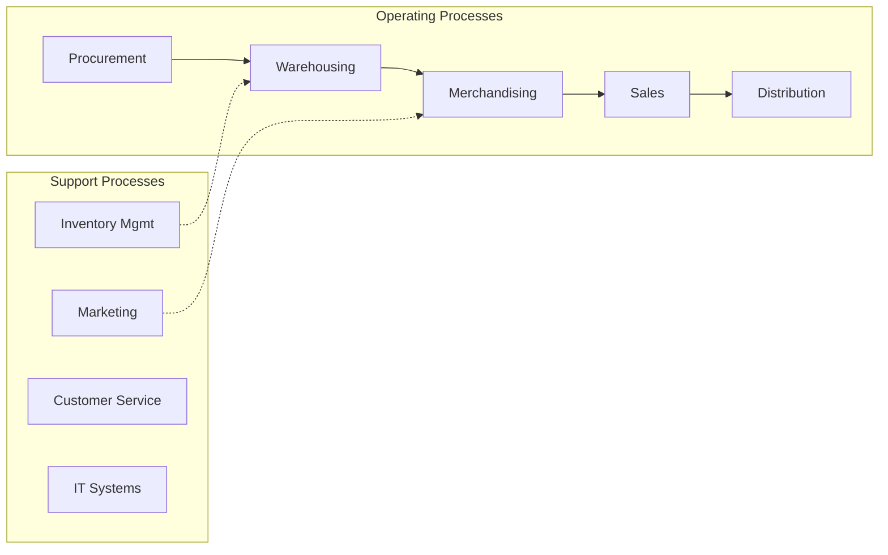

# Supplies (Hydronics) Merchant Wholesalers

> See industry description for 423720.

## Overview

Supplies (Hydronics) Merchant Wholesalers represents an important category within the Wholesale Trade sector (NAICS 42). This industry encompasses establishments primarily engaged in supplies (hydronics) merchant wholesalers.

## Industry Hierarchy

## Key Statistics

| Metric | Value |
|--------|-------|
| NAICS Code | 42372 |
| Level | Industry |
| Parent | [Plumbing and Heating Equipment and Supplies Merchant Wholesalers](../) |
| Child Industries | 0 |

## Core Business Processes

## Industry Value Chain

```mermaid
graph LR
    subgraph Inputs["Inputs"]
        I1["Products"]
        I2["Inventory"]
        I3["Store/Warehouse"]
    end

    subgraph Primary["Primary Activities"]
        A1["Inbound Logistics"]
        A2["Core Operations"]
        A3["Quality Assurance"]
        A4["Outbound/Delivery"]
    end

    subgraph Outputs["Products/Services"]
        O1["Goods for Sale"]
        O2["Services"]
        O3["Delivery"]
    end

    subgraph Customers["Markets"]
        C1["Businesses"]
        C2["Consumers"]
        C3["Institutions"]
        C4["Government"]
    end

    Inputs --> Primary --> Outputs --> Customers
```

---

*Source: NAICS 42372 - Supplies (Hydronics) Merchant Wholesalers*
