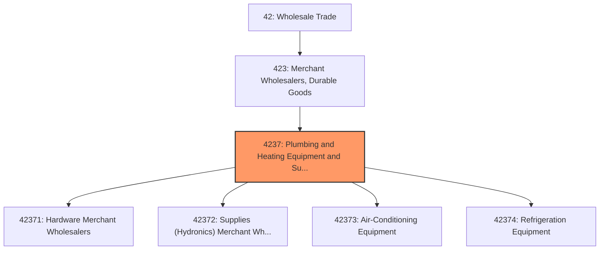
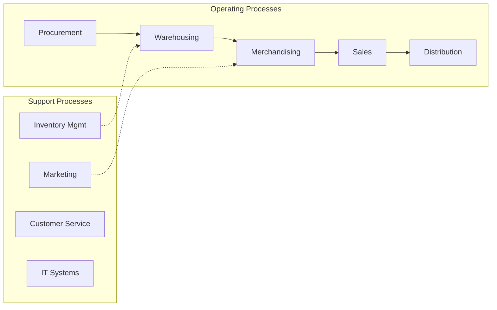

# Plumbing and Heating Equipment and Supplies Merchant Wholesalers

> This industry group comprises establishments primarily engaged in the merchant wholesale distribution of hardware; plumbing and heating equipment and supplies (hydronics); warm air heating and air-conditioning equipment and supplies; and refrigeration equipment and supplies.

## Overview

Plumbing and Heating Equipment and Supplies Merchant Wholesalers represents an important category within the Wholesale Trade sector (NAICS 42). This industry group encompasses establishments primarily engaged in plumbing and heating equipment and supplies merchant wholesalers.

This industry group comprises establishments primarily engaged in the merchant wholesale distribution of hardware; plumbing and heating equipment and supplies (hydronics); warm air heating and air-conditioning equipment and supplies; and refrigeration equipment and supplies.

## Industry Hierarchy

## Key Statistics

| Metric | Value |
|--------|-------|
| NAICS Code | 4237 |
| Level | Industry Group |
| Parent | [Merchant Wholesalers, Durable Goods](../) |
| Child Industries | 4 |

## Sub-Industries

| Industry | Code | Description |
|----------|------|-------------|
| [Hardware Merchant Wholesalers](./HardwareMerchantWholesalers/) | 42371 | See industry description for 423710 |
| [Supplies (Hydronics) Merchant Wholesalers](./SuppliesHydronicsMerchantWholesalers/) | 42372 | See industry description for 423720 |
| [Air-Conditioning Equipment](./AirconditioningEquipment/) | 42373 | See industry description for 423730 |
| [Refrigeration Equipment](./RefrigerationEquipment/) | 42374 | See industry description for 423740 |

## Core Business Processes

## Industry Value Chain

---

*Source: NAICS 4237 - Plumbing and Heating Equipment and Supplies Merchant Wholesalers*
