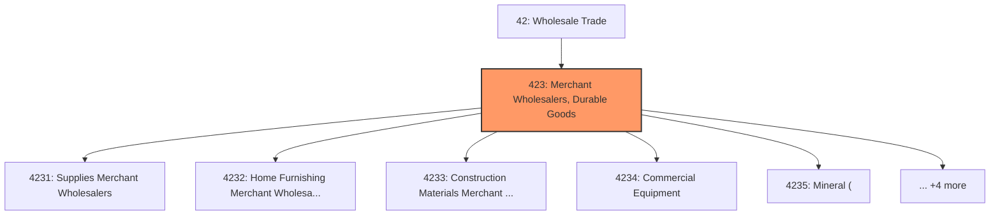
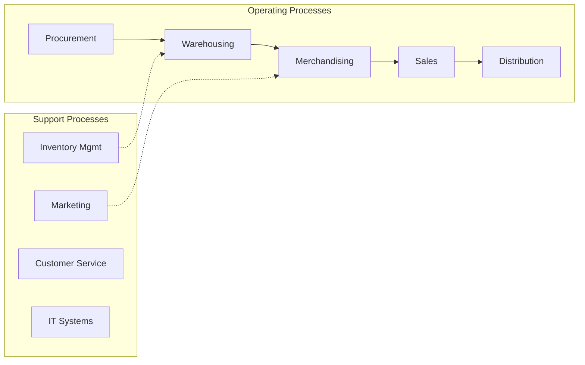

# Merchant Wholesalers, Durable Goods

> Industries in the Merchant Wholesalers, Durable Goods subsector sell capital or durable goods to other businesses.

## Overview

Merchant Wholesalers, Durable Goods represents an important category within the Wholesale Trade sector (NAICS 42). This subsector encompasses establishments primarily engaged in merchant wholesalers, durable goods.

Industries in the Merchant Wholesalers, Durable Goods subsector sell capital or durable goods to other businesses. Merchant wholesalers generally take title to the goods that they sell; in other words, they buy and sell goods on their own account. Durable goods are new or used items generally with a normal life expectancy of three years or more. Durable goods merchant wholesale trade establishments are engaged in wholesaling products, such as motor vehicles, furniture, construction materials, machinery and equipment (including household-type appliances), metals and minerals (except petroleum), sporting goods, toys and hobby goods, recyclable materials, and parts. Agents and brokers primarily engaged in wholesaling durable goods, generally on a commission or fee basis, are classified in Subsector 425, Wholesale Trade Agents and Brokers.

## Industry Hierarchy

## Key Statistics

| Metric | Value |
|--------|-------|
| NAICS Code | 423 |
| Level | Subsector |
| Parent | [Wholesale Trade](../) |
| Child Industries | 9 |

## Sub-Industries

| Industry | Code | Description |
|----------|------|-------------|
| [Supplies Merchant Wholesalers](./SuppliesMerchantWholesalers/) | 4231 | This industry group comprises establishments primarily engaged in the merchant w |
| [Home Furnishing Merchant Wholesalers](./HomeFurnishingMerchantWholesalers/) | 4232 | This industry group comprises establishments primarily engaged in the merchant w |
| [Construction Materials Merchant Wholesalers](./ConstructionMaterialsMerchantWholesalers/) | 4233 | This industry group comprises establishments primarily engaged in the merchant w |
| [Commercial Equipment](./CommercialEquipment/) | 4234 | This industry group comprises establishments primarily engaged in the merchant w |
| [Mineral (](./Mineral/) | 4235 | This industry group comprises establishments primarily engaged in the merchant w |
| [Electronic Goods Merchant Wholesalers](./ElectronicGoodsMerchantWholesalers/) | 4236 | This industry group comprises establishments primarily engaged in the merchant w |
| [Plumbing and Heating Equipment and Supplies Merchant Wholesalers](./PlumbingAndHeatingEquipmentAndSuppliesMerchantWholesalers/) | 4237 | This industry group comprises establishments primarily engaged in the merchant w |
| [Machinery](./Machinery/) | 4238 | This industry group comprises establishments primarily engaged in the merchant w |
| [Durable Goods Merchant Wholesalers](./DurableGoodsMerchantWholesalers/) | 4239 | This industry group comprises establishments primarily engaged in the merchant w |

## Core Business Processes

## Industry Value Chain

```mermaid
graph LR
    subgraph Inputs["Inputs"]
        I1["Products"]
        I2["Inventory"]
        I3["Store/Warehouse"]
    end

    subgraph Primary["Primary Activities"]
        A1["Inbound Logistics"]
        A2["Core Operations"]
        A3["Quality Assurance"]
        A4["Outbound/Delivery"]
    end

    subgraph Outputs["Products/Services"]
        O1["Goods for Sale"]
        O2["Services"]
        O3["Delivery"]
    end

    subgraph Customers["Markets"]
        C1["Businesses"]
        C2["Consumers"]
        C3["Institutions"]
        C4["Government"]
    end

    Inputs --> Primary --> Outputs --> Customers
```

---

*Source: NAICS 423 - Merchant Wholesalers, Durable Goods*
