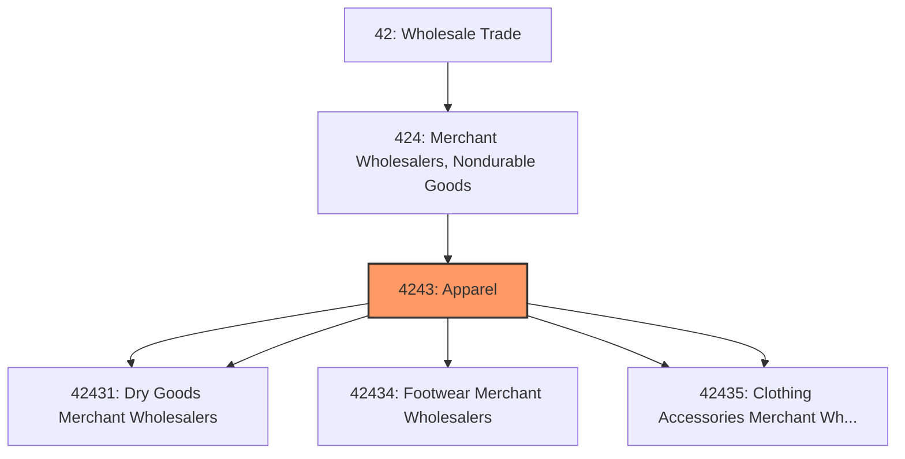
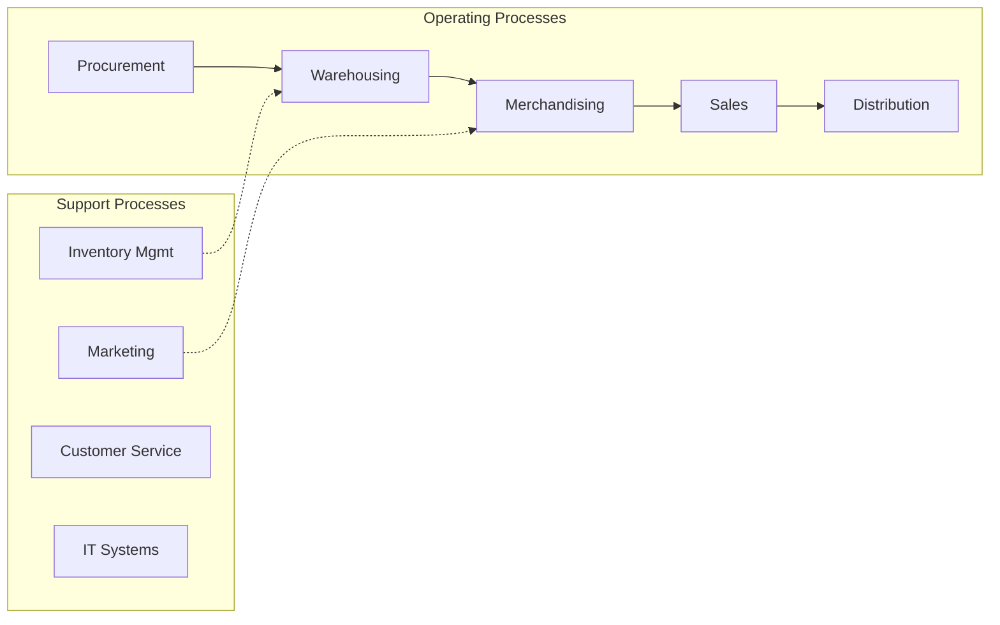

# Apparel

> This industry group comprises establishments primarily engaged in the merchant wholesale distribution of piece goods, notions, and other dry goods; footwear; and clothing and clothing accessories.

## Overview

Apparel represents an important category within the Wholesale Trade sector (NAICS 42).

This industry group comprises establishments primarily engaged in the merchant wholesale distribution of piece goods, notions, and other dry goods; footwear; and clothing and clothing accessories.

## Industry Hierarchy

## Key Statistics

| Metric | Value |
|--------|-------|
| NAICS Code | 4243 |
| Level | Industry Group |
| Parent | [Merchant Wholesalers, Nondurable Goods](../) |
| Child Industries | 5 |

## Sub-Industries

| Industry | Code | Description |
|----------|------|-------------|
| [Notions](./Notions/) | 42431 | See industry description for 424310 |
| [Dry Goods Merchant Wholesalers](./DryGoodsMerchantWholesalers/) | 42431 | See industry description for 424310 |
| [Footwear Merchant Wholesalers](./FootwearMerchantWholesalers/) | 42434 | See industry description for 424340 |
| [Clothing](./Clothing/) | 42435 | See industry description for 424350 |
| [Clothing Accessories Merchant Wholesalers](./ClothingAccessoriesMerchantWholesalers/) | 42435 | See industry description for 424350 |

## Related Occupations

See the [occupations directory](/occupations) for roles commonly found in this industry.

## Core Business Processes

## Industry Value Chain

## Market Context

Wholesale trade bridges manufacturers and retailers, with digital transformation enabling more efficient B2B transactions and supply chain integration.

| Aspect | Details |
|--------|---------|
| Industry Sector | Wholesale |
| NAICS/SIC Code | 4243 |
| Market Segment | Apparel |

## Key Business Processes

- Sourcing and procurement
- Inventory management
- Order fulfillment
- Sales and distribution
- Customer relationship management

## Common Occupations

- [Wholesale Sales Representatives](/occupations/Sales/WholesaleAndManufacturingSalesRepresentatives)
- [Purchasing Managers](/occupations/Business/PurchasingManagers)
- [Warehouse Managers](/occupations/Management/TransportationStorageAndDistributionManagers)
- [Order Clerks](/occupations/Administrative/OrderClerks)

## Regulations and Standards

- Trade and commerce regulations
- Industry-specific licensing
- Product safety standards
- Import/export compliance
- Contract and commercial law

## Technology and Tools

- Enterprise Resource Planning (ERP)
- Electronic Data Interchange (EDI)
- Inventory management systems
- B2B e-commerce platforms
- Supply chain analytics

## Industry Trends

- Digital transformation and automation adoption
- Sustainability and environmental compliance focus
- Workforce development and skills training
- Supply chain resilience and optimization
- Customer experience enhancement

---

*Source: NAICS 4243 - Apparel*
