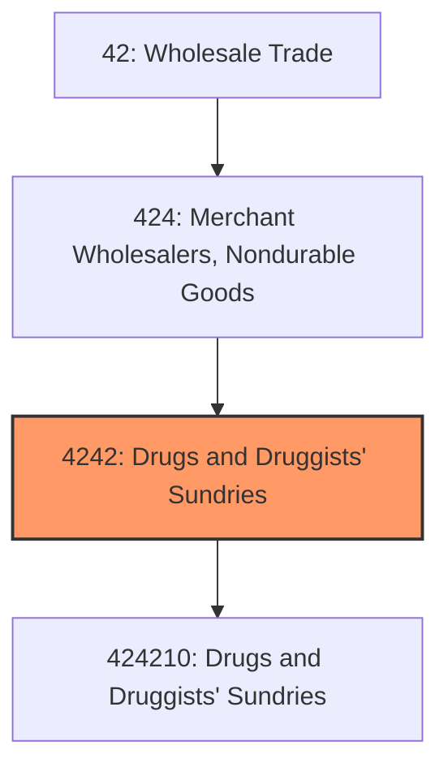

# Drugs and Druggists' Sundries Merchant Wholesalers

> This industry group comprises establishments primarily engaged in the merchant wholesale distribution of biological and medical products; botanical drugs and herbs; and pharmaceutical products intended for internal and external consumption in such forms as ampoules, tablets, capsules, vials, ointments, powders, solutions, and suspensions.

## Overview

Drugs and Druggists' Sundries Merchant Wholesalers represent one of the most regulated and essential segments of the wholesale trade sector, serving as the primary distribution channel between pharmaceutical manufacturers and healthcare providers. This industry handles the complex logistics of distributing prescription drugs, over-the-counter medications, medical supplies, and health and beauty products to pharmacies, hospitals, clinics, and other healthcare facilities.

The pharmaceutical distribution industry is characterized by extremely tight margins, high inventory turnover requirements, and stringent regulatory compliance obligations. The "Big Three" national distributors (McKesson, Cardinal Health, and AmerisourceBergen/Cencora) dominate the market, though regional and specialty distributors continue to serve important niches. The industry has faced significant challenges including opioid-related litigation, drug pricing pressures, and the growth of specialty and biosimilar medications.

Cold chain logistics, controlled substance tracking, and supply chain security are critical operational requirements. Distributors increasingly provide value-added services including repackaging, clinical services, technology solutions, and practice management support to their pharmacy and healthcare customers.

## Industry Hierarchy

## Key Statistics

| Metric | Value |
|--------|-------|
| NAICS Code | 4242 |
| Level | Industry Group |
| Parent | [Merchant Wholesalers, Nondurable Goods](../) |
| Child Industries | 1 |

## Related Occupations

- [Purchasing Managers](/occupations/Management/PurchasingManagers) - Plan and coordinate pharmaceutical purchasing activities
- [Wholesale and Retail Buyers](/occupations/Business/WholesaleAndRetailBuyersExceptFarmProducts) - Buy pharmaceutical merchandise for distribution
- [Pharmacists](/occupations/Healthcare/Pharmacists) - Provide pharmaceutical expertise and regulatory oversight
- [Logisticians](/occupations/Business/Logisticians) - Coordinate pharmaceutical supply chain operations
- [Compliance Officers](/occupations/Business/ComplianceOfficers) - Ensure regulatory compliance across operations
- [Quality Control Analysts](/occupations/LifeScience/QualityControlAnalysts) - Maintain product quality and integrity
- [Medical and Health Services Managers](/occupations/Management/MedicalAndHealthServicesManagers) - Oversee healthcare-related operations

## Core Business Processes

```mermaid
flowchart LR
    subgraph Sourcing["Sourcing & Compliance"]
        S1["Manufacturer Contracts"]
        S2["DEA Ordering"]
        S3["Receiving/Verification"]
        S4["Pedigree Documentation"]
    end

    subgraph Operations["Warehouse Operations"]
        O1["Temperature Control"]
        O2["Lot/Expiry Tracking"]
        O3["Controlled Substance Vault"]
        O4["Order Fulfillment"]
    end

    subgraph Distribution["Distribution"]
        D1["Route Optimization"]
        D2["Cold Chain Shipping"]
        D3["Signature Verification"]
        D4["Returns Processing"]
    end

    subgraph Services["Value-Added Services"]
        V1["Generic Sourcing"]
        V2["Specialty Distribution"]
        V3["Practice Management"]
        V4["Clinical Programs"]
    end

    S1 --> S2 --> S3 --> S4
    S4 --> O1 --> O2 --> O3 --> O4
    O4 --> D1 --> D2 --> D3 --> D4
    D4 --> V1 --> V2 --> V3 --> V4
```

### Pharmaceutical Sourcing and Procurement

Managing relationships with pharmaceutical manufacturers and ensuring consistent supply of prescription and OTC medications.

**Key Activities:**
- Negotiate pricing and rebate agreements with pharmaceutical manufacturers
- Manage DEA quotas and ordering for controlled substances
- Coordinate with GPOs (Group Purchasing Organizations) on contract pricing
- Monitor drug shortages and alternative sourcing strategies
- Implement track-and-trace compliance for drug pedigree requirements

### Regulatory Compliance

Maintaining strict compliance with FDA, DEA, and state pharmacy board requirements across all operations.

**Key Activities:**
- Implement Drug Supply Chain Security Act (DSCSA) requirements
- Manage DEA controlled substance licensing, quotas, and reporting
- Maintain state wholesale drug distributor licenses
- Conduct suspicious order monitoring and reporting
- Execute product recalls and market withdrawals

### Cold Chain and Specialty Distribution

Managing temperature-sensitive medications and high-cost specialty pharmaceuticals with stringent handling requirements.

**Key Activities:**
- Operate temperature-controlled storage and transportation
- Manage specialty drug distribution with patient support programs
- Coordinate limited distribution drug (LDD) programs
- Implement biosimilar and specialty generic distribution strategies
- Provide clinical support and patient adherence programs

## Industry Value Chain

```mermaid
graph LR
    subgraph Inputs["Inputs"]
        I1["Brand Pharmaceuticals"]
        I2["Generic Drugs"]
        I3["Specialty/Biologics"]
        I4["OTC/Sundries"]
    end

    subgraph Primary["Primary Activities"]
        A1["Procurement"]
        A2["Warehousing"]
        A3["Order Fulfillment"]
        A4["Delivery"]
    end

    subgraph Outputs["Products/Services"]
        O1["Drug Distribution"]
        O2["Generic Programs"]
        O3["Specialty Services"]
        O4["Technology Solutions"]
    end

    subgraph Customers["Customer Segments"]
        C1["Retail Pharmacies"]
        C2["Hospital Systems"]
        C3["Specialty Pharmacies"]
        C4["Long-Term Care"]
    end

    Inputs --> Primary --> Outputs --> Customers
```

## Regulatory Environment

- **FDA** (Food and Drug Administration) - Drug safety, labeling, and DSCSA track-and-trace requirements
- **DEA** (Drug Enforcement Administration) - Controlled substance licensing, quotas, and suspicious order monitoring
- **State Pharmacy Boards** - Wholesale drug distributor licensing and inspection requirements
- **CMS** (Centers for Medicare & Medicaid) - Prescription drug pricing and Medicaid rebate compliance
- **FTC** (Federal Trade Commission) - Antitrust oversight and competition regulation
- **340B Program** - Compliance with discounted drug pricing for covered entities
- **HIPAA** - Patient privacy requirements for health information

## Technology & Innovation

- **Warehouse Management Systems (WMS)** - Lot tracking, expiry management, and pick optimization for pharmaceuticals
- **Track-and-Trace Systems** - DSCSA compliance with serialization and verification capabilities
- **Temperature Monitoring** - IoT sensors for continuous cold chain monitoring and alerting
- **Electronic Data Interchange (EDI)** - Automated ordering, invoicing, and chargeback processing
- **Pharmacy Management Integration** - Real-time inventory and ordering connections with pharmacy systems
- **Analytics Platforms** - Drug utilization analysis, formulary optimization, and purchasing insights
- **Robotic Fulfillment** - Automated picking and packing for high-volume distribution centers
- **Blockchain** - Emerging use for supply chain transparency and product authentication

## Market Trends

The pharmaceutical distribution industry faces significant changes:

- **Specialty Drug Growth** - High-cost specialty medications becoming larger share of pharmaceutical spending
- **Biosimilar Adoption** - Increasing distribution of biosimilar alternatives to biologic drugs
- **Direct-to-Patient** - Growth in specialty pharmacy and direct-to-patient fulfillment models
- **Vertical Integration** - Continued integration between distributors, PBMs, and retail pharmacy
- **340B Program Evolution** - Ongoing regulatory changes and manufacturer restrictions on 340B pricing
- **Opioid Compliance** - Heightened scrutiny and controls on opioid distribution
- **Drug Shortage Management** - Increasing role in managing pharmaceutical supply disruptions
- **Value-Based Arrangements** - Emerging outcome-based contracts and risk-sharing models

---

*Source: NAICS 4242 - Drugs and Druggists' Sundries Merchant Wholesalers*
