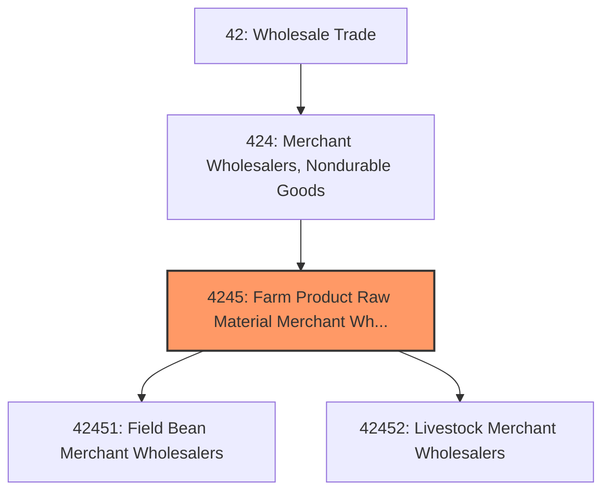
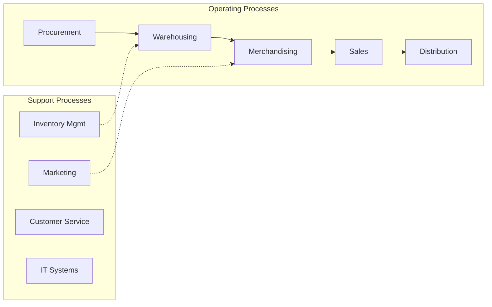

# Farm Product Raw Material Merchant Wholesalers

> This industry group comprises establishments primarily engaged in the merchant wholesale distribution of agricultural products (except raw milk, live poultry, and fresh fruits and vegetables), such as grains, field beans, livestock, and other farm product raw materials (excluding seeds).

## Overview

Farm Product Raw Material Merchant Wholesalers represents an important category within the Wholesale Trade sector (NAICS 42). This industry group encompasses establishments primarily engaged in farm product raw material merchant wholesalers.

This industry group comprises establishments primarily engaged in the merchant wholesale distribution of agricultural products (except raw milk, live poultry, and fresh fruits and vegetables), such as grains, field beans, livestock, and other farm product raw materials (excluding seeds).

## Industry Hierarchy

## Key Statistics

| Metric | Value |
|--------|-------|
| NAICS Code | 4245 |
| Level | Industry Group |
| Parent | [Merchant Wholesalers, Nondurable Goods](../) |
| Child Industries | 2 |

## Sub-Industries

| Industry | Code | Description |
|----------|------|-------------|
| [Field Bean Merchant Wholesalers](./FieldBeanMerchantWholesalers/) | 42451 | See industry description for 424510 |
| [Livestock Merchant Wholesalers](./LivestockMerchantWholesalers/) | 42452 | See industry description for 424520 |

## Core Business Processes

## Industry Value Chain

```mermaid
graph LR
    subgraph Inputs["Inputs"]
        I1["Products"]
        I2["Inventory"]
        I3["Store/Warehouse"]
    end

    subgraph Primary["Primary Activities"]
        A1["Inbound Logistics"]
        A2["Core Operations"]
        A3["Quality Assurance"]
        A4["Outbound/Delivery"]
    end

    subgraph Outputs["Products/Services"]
        O1["Goods for Sale"]
        O2["Services"]
        O3["Delivery"]
    end

    subgraph Customers["Markets"]
        C1["Businesses"]
        C2["Consumers"]
        C3["Institutions"]
        C4["Government"]
    end

    Inputs --> Primary --> Outputs --> Customers
```

## Market Context

Wholesale trade bridges manufacturers and retailers, with digital transformation enabling more efficient B2B transactions and supply chain integration.

| Aspect | Details |
|--------|---------|
| Industry Sector | Wholesale |
| NAICS/SIC Code | 4245 |
| Market Segment | Farm Product Raw Material Merchant Wholesalers |

## Key Business Processes

- Sourcing and procurement
- Inventory management
- Order fulfillment
- Sales and distribution
- Customer relationship management

## Common Occupations

- [Wholesale Sales Representatives](/occupations/Sales/WholesaleAndManufacturingSalesRepresentatives)
- [Purchasing Managers](/occupations/Business/PurchasingManagers)
- [Warehouse Managers](/occupations/Management/TransportationStorageAndDistributionManagers)
- [Order Clerks](/occupations/Administrative/OrderClerks)

## Regulations and Standards

- Trade and commerce regulations
- Industry-specific licensing
- Product safety standards
- Import/export compliance
- Contract and commercial law

## Technology and Tools

- Enterprise Resource Planning (ERP)
- Electronic Data Interchange (EDI)
- Inventory management systems
- B2B e-commerce platforms
- Supply chain analytics

## Industry Trends

- Digital transformation and automation adoption
- Sustainability and environmental compliance focus
- Workforce development and skills training
- Supply chain resilience and optimization
- Customer experience enhancement

---

*Source: NAICS 4245 - Farm Product Raw Material Merchant Wholesalers*
