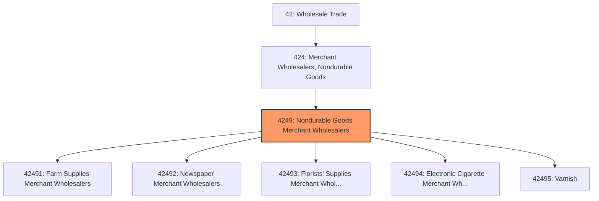
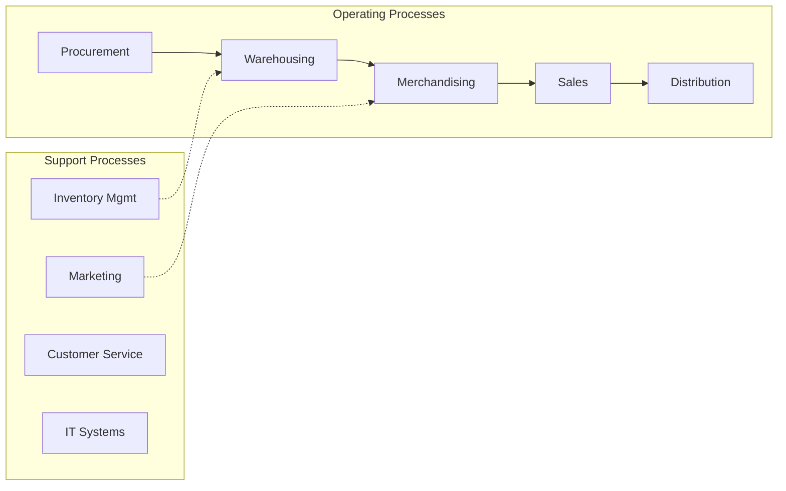

# Nondurable Goods Merchant Wholesalers

> This industry group comprises establishments primarily engaged in the merchant wholesale distribution of nondurable goods, such as farm supplies; books, periodicals, and newspapers; flowers; nursery stock; paints; varnishes; tobacco and tobacco products; and other miscellaneous nondurable goods, such as cut Christmas trees and pet supplies.

## Overview

Nondurable Goods Merchant Wholesalers represents an important category within the Wholesale Trade sector (NAICS 42). This industry group encompasses establishments primarily engaged in nondurable goods merchant wholesalers.

This industry group comprises establishments primarily engaged in the merchant wholesale distribution of nondurable goods, such as farm supplies; books, periodicals, and newspapers; flowers; nursery stock; paints; varnishes; tobacco and tobacco products; and other miscellaneous nondurable goods, such as cut Christmas trees and pet supplies.

## Industry Hierarchy

## Key Statistics

| Metric | Value |
|--------|-------|
| NAICS Code | 4249 |
| Level | Industry Group |
| Parent | [Merchant Wholesalers, Nondurable Goods](../) |
| Child Industries | 5 |

## Sub-Industries

| Industry | Code | Description |
|----------|------|-------------|
| [Farm Supplies Merchant Wholesalers](./FarmSuppliesMerchantWholesalers/) | 42491 | See industry description for 424910 |
| [Newspaper Merchant Wholesalers](./NewspaperMerchantWholesalers/) | 42492 | See industry description for 424920 |
| [Florists' Supplies Merchant Wholesalers](./FloristsSuppliesMerchantWholesalers/) | 42493 | See industry description for 424930 |
| [Electronic Cigarette Merchant Wholesalers](./ElectronicCigaretteMerchantWholesalers/) | 42494 | See industry description for 424940 |
| [Varnish](./Varnish/) | 42495 | See industry description for 424950 |

## Core Business Processes

## Industry Value Chain

```mermaid
graph LR
    subgraph Inputs["Inputs"]
        I1["Products"]
        I2["Inventory"]
        I3["Store/Warehouse"]
    end

    subgraph Primary["Primary Activities"]
        A1["Inbound Logistics"]
        A2["Core Operations"]
        A3["Quality Assurance"]
        A4["Outbound/Delivery"]
    end

    subgraph Outputs["Products/Services"]
        O1["Goods for Sale"]
        O2["Services"]
        O3["Delivery"]
    end

    subgraph Customers["Markets"]
        C1["Businesses"]
        C2["Consumers"]
        C3["Institutions"]
        C4["Government"]
    end

    Inputs --> Primary --> Outputs --> Customers
```

---

*Source: NAICS 4249 - Nondurable Goods Merchant Wholesalers*
