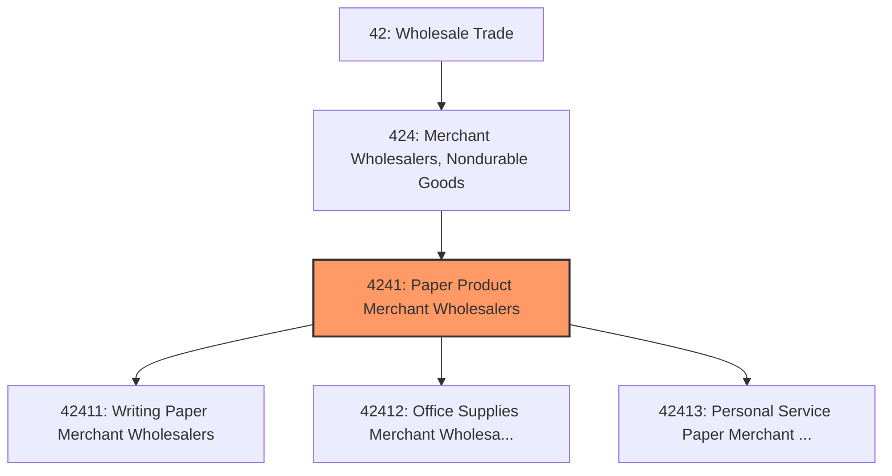
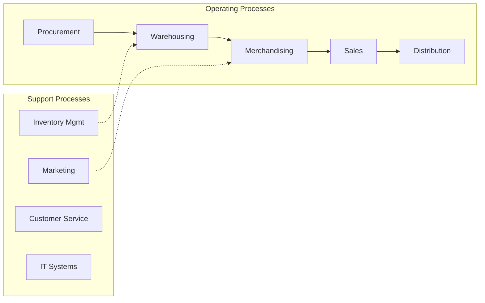

# Paper Product Merchant Wholesalers

> This industry group comprises establishments primarily engaged in the merchant wholesale distribution of bulk printing and writing paper; stationery and office supplies; and industrial and personal service paper.

## Overview

Paper Product Merchant Wholesalers represents an important category within the Wholesale Trade sector (NAICS 42). This industry group encompasses establishments primarily engaged in paper product merchant wholesalers.

This industry group comprises establishments primarily engaged in the merchant wholesale distribution of bulk printing and writing paper; stationery and office supplies; and industrial and personal service paper.

## Industry Hierarchy

## Key Statistics

| Metric | Value |
|--------|-------|
| NAICS Code | 4241 |
| Level | Industry Group |
| Parent | [Merchant Wholesalers, Nondurable Goods](../) |
| Child Industries | 3 |

## Sub-Industries

| Industry | Code | Description |
|----------|------|-------------|
| [Writing Paper Merchant Wholesalers](./WritingPaperMerchantWholesalers/) | 42411 | See industry description for 424110 |
| [Office Supplies Merchant Wholesalers](./OfficeSuppliesMerchantWholesalers/) | 42412 | See industry description for 424120 |
| [Personal Service Paper Merchant Wholesalers](./PersonalServicePaperMerchantWholesalers/) | 42413 | See industry description for 424130 |

## Core Business Processes

## Industry Value Chain

```mermaid
graph LR
    subgraph Inputs["Inputs"]
        I1["Products"]
        I2["Inventory"]
        I3["Store/Warehouse"]
    end

    subgraph Primary["Primary Activities"]
        A1["Inbound Logistics"]
        A2["Core Operations"]
        A3["Quality Assurance"]
        A4["Outbound/Delivery"]
    end

    subgraph Outputs["Products/Services"]
        O1["Goods for Sale"]
        O2["Services"]
        O3["Delivery"]
    end

    subgraph Customers["Markets"]
        C1["Businesses"]
        C2["Consumers"]
        C3["Institutions"]
        C4["Government"]
    end

    Inputs --> Primary --> Outputs --> Customers
```

---

*Source: NAICS 4241 - Paper Product Merchant Wholesalers*
