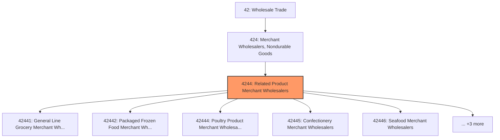
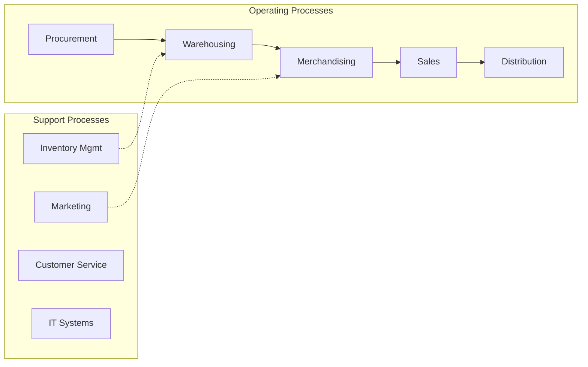

# Related Product Merchant Wholesalers

> This industry group comprises establishments primarily engaged in the merchant wholesale distribution of (1) a general line of groceries; (2) packaged frozen food; (3) dairy products; (4) poultry and poultry products; (5) confectioneries; (6) fish and seafood; (7) meats and meat products; (8) fresh fruits and vegetables; and (9) other grocery and related products.

## Overview

Related Product Merchant Wholesalers represents an important category within the Wholesale Trade sector (NAICS 42). This industry group encompasses establishments primarily engaged in related product merchant wholesalers.

This industry group comprises establishments primarily engaged in the merchant wholesale distribution of (1) a general line of groceries; (2) packaged frozen food; (3) dairy products; (4) poultry and poultry products; (5) confectioneries; (6) fish and seafood; (7) meats and meat products; (8) fresh fruits and vegetables; and (9) other grocery and related products.

## Industry Hierarchy

## Key Statistics

| Metric | Value |
|--------|-------|
| NAICS Code | 4244 |
| Level | Industry Group |
| Parent | [Merchant Wholesalers, Nondurable Goods](../) |
| Child Industries | 8 |

## Sub-Industries

| Industry | Code | Description |
|----------|------|-------------|
| [General Line Grocery Merchant Wholesalers](./GeneralLineGroceryMerchantWholesalers/) | 42441 | See industry description for 424410 |
| [Packaged Frozen Food Merchant Wholesalers](./PackagedFrozenFoodMerchantWholesalers/) | 42442 | See industry description for 424420 |
| [Poultry Product Merchant Wholesalers](./PoultryProductMerchantWholesalers/) | 42444 | See industry description for 424440 |
| [Confectionery Merchant Wholesalers](./ConfectioneryMerchantWholesalers/) | 42445 | See industry description for 424450 |
| [Seafood Merchant Wholesalers](./SeafoodMerchantWholesalers/) | 42446 | See industry description for 424460 |
| [Meat Product Merchant Wholesalers](./MeatProductMerchantWholesalers/) | 42447 | See industry description for 424470 |
| [Vegetable Merchant Wholesalers](./VegetableMerchantWholesalers/) | 42448 | See industry description for 424480 |
| [Related Products Merchant Wholesalers](./RelatedProductsMerchantWholesalers/) | 42449 | See industry description for 424490 |

## Core Business Processes

## Industry Value Chain

```mermaid
graph LR
    subgraph Inputs["Inputs"]
        I1["Products"]
        I2["Inventory"]
        I3["Store/Warehouse"]
    end

    subgraph Primary["Primary Activities"]
        A1["Inbound Logistics"]
        A2["Core Operations"]
        A3["Quality Assurance"]
        A4["Outbound/Delivery"]
    end

    subgraph Outputs["Products/Services"]
        O1["Goods for Sale"]
        O2["Services"]
        O3["Delivery"]
    end

    subgraph Customers["Markets"]
        C1["Businesses"]
        C2["Consumers"]
        C3["Institutions"]
        C4["Government"]
    end

    Inputs --> Primary --> Outputs --> Customers
```

---

*Source: NAICS 4244 - Related Product Merchant Wholesalers*
