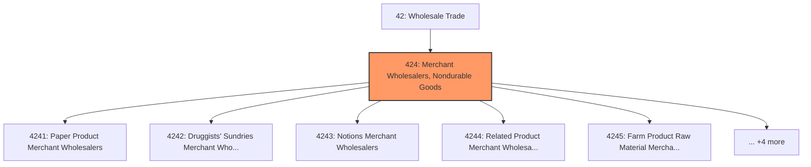
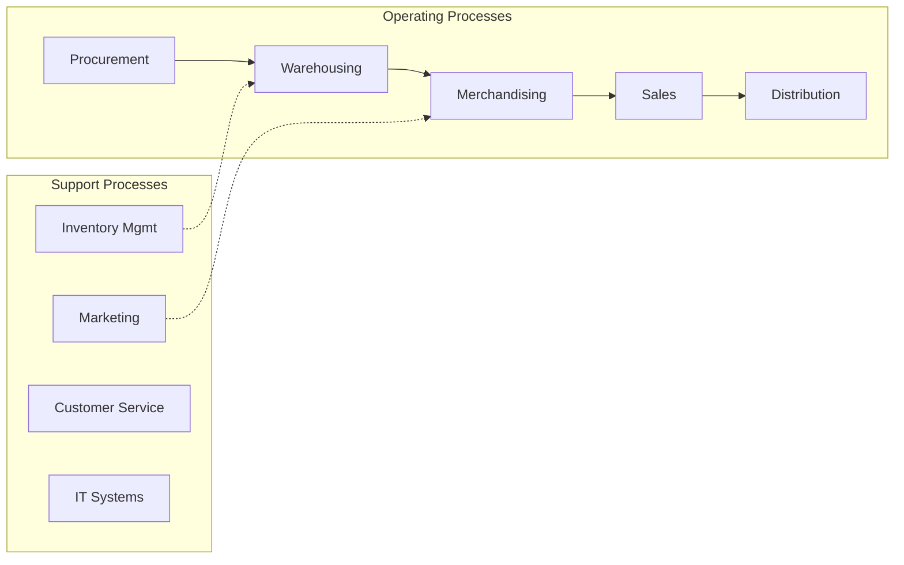

# Merchant Wholesalers, Nondurable Goods

> Industries in the Merchant Wholesalers, Nondurable Goods subsector sell nondurable goods to other businesses.

## Overview

Merchant Wholesalers, Nondurable Goods represents an important category within the Wholesale Trade sector (NAICS 42). This subsector encompasses establishments primarily engaged in merchant wholesalers, nondurable goods.

Industries in the Merchant Wholesalers, Nondurable Goods subsector sell nondurable goods to other businesses. Nondurable goods are items generally with a normal life expectancy of less than three years. Nondurable goods merchant wholesale trade establishments are engaged in wholesaling products, such as paper and paper products, chemicals and chemical products, drugs, textiles and textile products, apparel, footwear, groceries, farm products, petroleum and petroleum products, alcoholic beverages, books, magazines, newspapers, flowers and nursery stock, and tobacco products. The detailed industries within the subsector are organized in the classification structure based on the products sold. Agents and brokers primarily engaged in wholesaling nondurable goods, generally on a commission or fee basis, are classified in Subsector 425, Wholesale Trade Agents and Brokers.

## Industry Hierarchy

## Key Statistics

| Metric | Value |
|--------|-------|
| NAICS Code | 424 |
| Level | Subsector |
| Parent | [Wholesale Trade](../) |
| Child Industries | 9 |

## Sub-Industries

| Industry | Code | Description |
|----------|------|-------------|
| [Paper Product Merchant Wholesalers](./PaperProductMerchantWholesalers/) | 4241 | This industry group comprises establishments primarily engaged in the merchant w |
| [Druggists' Sundries Merchant Wholesalers](./DruggistsSundriesMerchantWholesalers/) | 4242 | Druggists' Sundries Merchant Wholesalers |
| [Notions Merchant Wholesalers](./NotionsMerchantWholesalers/) | 4243 | This industry group comprises establishments primarily engaged in the merchant w |
| [Related Product Merchant Wholesalers](./RelatedProductMerchantWholesalers/) | 4244 | This industry group comprises establishments primarily engaged in the merchant w |
| [Farm Product Raw Material Merchant Wholesalers](./FarmProductRawMaterialMerchantWholesalers/) | 4245 | This industry group comprises establishments primarily engaged in the merchant w |
| [Allied Products Merchant Wholesalers](./AlliedProductsMerchantWholesalers/) | 4246 | This industry group comprises establishments primarily engaged in the merchant w |
| [Petroleum Products Merchant Wholesalers](./PetroleumProductsMerchantWholesalers/) | 4247 | This industry group comprises establishments primarily engaged in the merchant w |
| [Distilled Alcoholic Beverage Merchant Wholesalers](./DistilledAlcoholicBeverageMerchantWholesalers/) | 4248 | This industry group comprises establishments primarily engaged in the merchant w |
| [Nondurable Goods Merchant Wholesalers](./NondurableGoodsMerchantWholesalers/) | 4249 | This industry group comprises establishments primarily engaged in the merchant w |

## Core Business Processes

## Industry Value Chain

```mermaid
graph LR
    subgraph Inputs["Inputs"]
        I1["Products"]
        I2["Inventory"]
        I3["Store/Warehouse"]
    end

    subgraph Primary["Primary Activities"]
        A1["Inbound Logistics"]
        A2["Core Operations"]
        A3["Quality Assurance"]
        A4["Outbound/Delivery"]
    end

    subgraph Outputs["Products/Services"]
        O1["Goods for Sale"]
        O2["Services"]
        O3["Delivery"]
    end

    subgraph Customers["Markets"]
        C1["Businesses"]
        C2["Consumers"]
        C3["Institutions"]
        C4["Government"]
    end

    Inputs --> Primary --> Outputs --> Customers
```

---

*Source: NAICS 424 - Merchant Wholesalers, Nondurable Goods*
