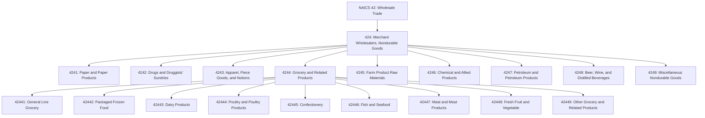
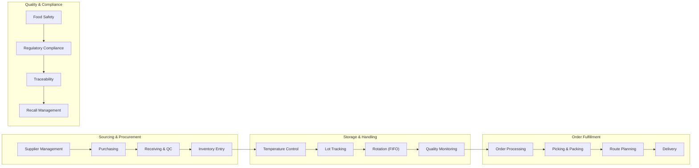

# Merchant Wholesalers, Nondurable Goods

> Industries in the Merchant Wholesalers, Nondurable Goods subsector sell nondurable goods to other businesses. Nondurable goods are items generally with a normal life expectancy of less than three years. Merchant wholesalers take title to the goods they sell and typically operate from warehouses or offices.

## Overview

The Merchant Wholesalers, Nondurable Goods subsector (NAICS 424) encompasses establishments primarily engaged in the wholesale distribution of nondurable goods - products with a useful life of less than three years or that are consumed in use. This includes paper products, pharmaceuticals, apparel, groceries, farm products, chemicals, petroleum products, alcoholic beverages, and other consumable goods.

Merchant wholesalers in this subsector take ownership (title) of the goods they sell, distinguishing them from agents and brokers. They typically maintain inventory and operate distribution facilities, serving as critical intermediaries between manufacturers/producers and retailers, food service establishments, institutions, and other business customers.

The nondurable goods wholesale sector is characterized by higher inventory turnover, time-sensitive distribution requirements, and often more regulated product categories (food, pharmaceuticals, alcohol, tobacco). Many establishments specialize in specific product categories, with supply chain efficiency being a critical competitive factor.

## Industry Hierarchy

## Key Statistics

| Metric | Value |
|--------|-------|
| NAICS Code | 424 |
| Level | Subsector |
| Parent Sector | [Wholesale Trade](../) (42) |
| Industry Groups | 9 |
| Industries | 25+ |
| National Industries | 35+ |

## Sub-Industries

| Industry Group | Code | Description |
|----------------|------|-------------|
| Paper and Paper Products | 4241 | Printing paper, stationery, office supplies, and industrial paper products |
| Drugs and Druggists' Sundries | 4242 | Pharmaceuticals, medical sundries, and health products |
| Apparel, Piece Goods, and Notions | 4243 | Clothing, textiles, footwear, and apparel accessories |
| Grocery and Related Products | 4244 | Food products, frozen foods, dairy, meat, produce, and confectionery |
| Farm Product Raw Materials | 4245 | Grains, livestock, and agricultural commodities |
| Chemical and Allied Products | 4246 | Industrial chemicals, plastics materials, and agricultural chemicals |
| Petroleum and Petroleum Products | 4247 | Gasoline, fuel oil, lubricants, and LP gas |
| Beer, Wine, and Distilled Alcoholic Beverages | 4248 | Alcoholic beverages distribution |
| Miscellaneous Nondurable Goods | 4249 | Farm supplies, books, tobacco, flowers, and other nondurable goods |

### Paper and Paper Products (4241)

| Industry | Code | Description |
|----------|------|-------------|
| Printing and Writing Paper | 42411 | Bulk paper for commercial printing and office use |
| Stationery and Office Supplies | 42412 | Office supplies, envelopes, and business forms |
| Industrial and Personal Service Paper | 42413 | Tissue, towels, packaging, and sanitary paper products |

### Grocery and Related Products (4244)

| Industry | Code | Description |
|----------|------|-------------|
| General Line Grocery | 42441 | Full-line grocery distribution including canned goods, dry goods, and general food items |
| Packaged Frozen Food | 42442 | Frozen fruits, vegetables, juices, and prepared frozen foods |
| Dairy Products (except Dried or Canned) | 42443 | Milk, cheese, butter, ice cream, and other refrigerated dairy |
| Poultry and Poultry Products | 42444 | Fresh, frozen, and processed poultry and eggs |
| Confectionery | 42445 | Candy, chocolate, gum, and confectionery products |
| Fish and Seafood | 42446 | Fresh, frozen, and prepared fish and shellfish |
| Meat and Meat Products | 42447 | Fresh, cured, and processed meats |
| Fresh Fruit and Vegetable | 42448 | Fresh produce distribution |
| Other Grocery and Related Products | 42449 | Specialty foods, baked goods, and related items |

### Beer, Wine, and Distilled Alcoholic Beverages (4248)

| Industry | Code | Description |
|----------|------|-------------|
| Beer and Ale | 42481 | Beer, ale, malt beverages, and non-alcoholic beer |
| Wine and Distilled Alcoholic Beverages | 42482 | Wine, spirits, liquor, and related products |

### Miscellaneous Nondurable Goods (4249)

| Industry | Code | Description |
|----------|------|-------------|
| Farm Supplies | 42491 | Animal feed, seeds, fertilizers, and agricultural supplies |
| Book, Periodical, and Newspaper | 42492 | Books, magazines, newspapers, and publications |
| Flower, Nursery Stock, and Florists' Supplies | 42493 | Cut flowers, potted plants, and florist supplies |
| Tobacco and Tobacco Products | 42494 | Cigarettes, cigars, e-cigarettes, and tobacco products |
| Paint, Varnish, and Supplies | 42495 | Paints, coatings, and related supplies |
| Other Miscellaneous Nondurable Goods | 42499 | Pet supplies, Christmas trees, and other nondurable goods |

## Related Occupations

- [Wholesale and Retail Buyers](/occupations/WholesaleAndRetailBuyers) - Purchase merchandise for resale
- [Sales Representatives, Wholesale and Manufacturing](/occupations/SalesRepresentativesWholesaleAndManufacturing) - Sell products to business customers
- [Logisticians](/occupations/Logisticians) - Manage supply chain operations
- [Truck Drivers, Heavy and Tractor-Trailer](/occupations/TruckDriversHeavyAndTractorTrailer) - Transport goods between facilities
- [Laborers and Freight, Stock, and Material Movers](/occupations/LaborersAndFreightStockAndMaterialMovers) - Handle warehouse operations
- [Food Scientists and Technologists](/occupations/FoodScientistsAndTechnologists) - Ensure food safety and quality
- [Pharmacists](/occupations/Pharmacists) - Oversee pharmaceutical distribution compliance

## Core Business Processes

### Procurement and Supplier Management

Managing relationships with manufacturers, producers, and importers to ensure consistent supply of quality products.

**Key Activities:**
- Develop and qualify suppliers and manufacturers
- Negotiate pricing, terms, and promotional programs
- Forecast demand based on seasonality and trends
- Manage purchase orders and supplier performance
- Coordinate product launches and promotions with suppliers

### Inventory and Cold Chain Management

Operating distribution facilities with appropriate storage conditions for perishable and temperature-sensitive products.

**Key Activities:**
- Maintain temperature-controlled storage environments
- Implement lot tracking and FIFO rotation
- Monitor shelf life and product freshness
- Manage inventory turns and minimize spoilage
- Ensure compliance with food safety requirements

### Order Fulfillment and Distribution

Processing customer orders and delivering products efficiently to meet service requirements.

**Key Activities:**
- Process orders through EDI and e-commerce platforms
- Execute efficient picking and packing operations
- Optimize delivery routes and schedules
- Manage delivery fleet operations
- Handle returns and credits

### Quality Assurance and Regulatory Compliance

Ensuring product safety, quality, and compliance with industry regulations.

**Key Activities:**
- Implement HACCP and food safety programs
- Maintain required licenses and certifications
- Execute product recalls when necessary
- Ensure traceability throughout the supply chain
- Conduct supplier audits and quality inspections

## Industry Value Chain

```mermaid
graph LR
    subgraph Inputs["Inputs & Resources"]
        I1["Manufactured Products"]
        I2["Farm Products"]
        I3["Imported Goods"]
        I4["Distribution Centers"]
        I5["Transportation Fleet"]
    end

    subgraph Primary["Primary Activities"]
        A1["Procurement"]
        A2["Storage & Handling"]
        A3["Order Processing"]
        A4["Distribution"]
        A5["Customer Service"]
    end

    subgraph Outputs["Products & Services"]
        O1["Food & Beverage"]
        O2["Pharmaceuticals"]
        O3["Consumables"]
        O4["Delivery Services"]
    end

    subgraph Customers["Customer Segments"]
        C1["Supermarkets"]
        C2["Restaurants & Foodservice"]
        C3["Pharmacies"]
        C4["Convenience Stores"]
        C5["Institutions"]
    end

    Inputs --> Primary --> Outputs --> Customers
```

## Market Segments

### By Customer Channel
- **Retail Grocery**: Supermarkets, grocery stores, mass merchandisers
- **Foodservice**: Restaurants, hotels, cafeterias, caterers
- **Convenience**: C-stores, gas stations, vending
- **Institutional**: Hospitals, schools, government facilities
- **Independent Retailers**: Specialty stores, pharmacies, liquor stores

### By Product Temperature
- **Ambient/Dry**: Shelf-stable products, paper goods, chemicals
- **Refrigerated**: Dairy, fresh meat, produce, beverages
- **Frozen**: Frozen foods, ice cream, frozen proteins
- **Controlled Substance**: Pharmaceuticals, restricted products

## Regulatory Environment

Merchant wholesalers of nondurable goods operate under extensive regulatory oversight:

- **Food Safety**: FDA Food Safety Modernization Act (FSMA), HACCP requirements
- **Pharmaceutical**: FDA drug distribution regulations, state pharmacy board licensing
- **Alcohol and Tobacco**: TTB federal licensing, state liquor authority requirements, PACT Act
- **Chemical Products**: EPA FIFRA for pesticides, TSCA for chemicals, DOT hazmat
- **Organic Products**: USDA National Organic Program certification
- **Import Requirements**: FDA prior notice, USDA import permits, customs compliance

Key compliance areas include:
- Sanitary transportation requirements (food)
- Drug supply chain security (track and trace)
- Three-tier alcohol distribution system compliance
- Age-restricted product compliance
- Product labeling and nutritional requirements
- Good Distribution Practice (GDP) for pharmaceuticals

## Technology & Innovation

The nondurable goods wholesale sector is transforming through technology adoption:

- **Warehouse Management Systems (WMS)**: Real-time inventory, directed picking, and lot tracking
- **Transportation Management Systems (TMS)**: Route optimization, fleet management, and proof of delivery
- **Cold Chain Monitoring**: IoT temperature sensors, continuous monitoring, and alerts
- **EDI and E-Commerce**: Electronic ordering, catalog management, and customer portals
- **Voice and RF Picking**: Hands-free order selection and verification
- **Traceability Systems**: Blockchain and serialization for supply chain transparency
- **Predictive Analytics**: Demand forecasting, spoilage prediction, and route optimization
- **Automation**: Automated storage systems, robotic picking, and conveyor systems

## Industry Trends

- **Direct Store Delivery (DSD)**: Growing importance of merchandising and in-store service
- **Private Label Growth**: Increasing demand for store brand products
- **Health and Wellness**: Organic, natural, and specialty product expansion
- **E-Commerce**: B2B platforms and click-and-collect services
- **Consolidation**: Industry consolidation creating larger regional and national distributors
- **Sustainability**: Reducing food waste, sustainable packaging, and carbon footprint

## Related Industries

- [Merchant Wholesalers, Durable Goods](../DurableGoods/) - Distribution of long-lasting products
- [Wholesale Trade Agents and Brokers](../Agents/) - Commission-based sales arrangements
- [Food and Beverage Stores](/industries/Retail/FoodAndBeverageStores/) - Primary customer segment for grocery
- [Food Manufacturing](/industries/Manufacturing/FoodManufacturing/) - Primary suppliers of food products
- [Transportation and Warehousing](/industries/Transportation/) - Logistics service providers

---

*Source: NAICS 424 - Merchant Wholesalers, Nondurable Goods*
