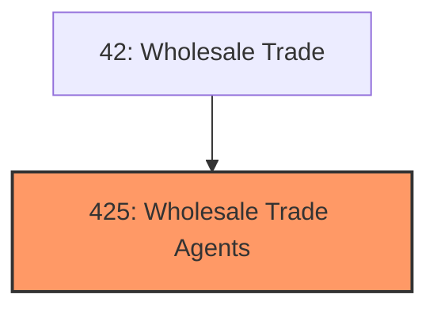
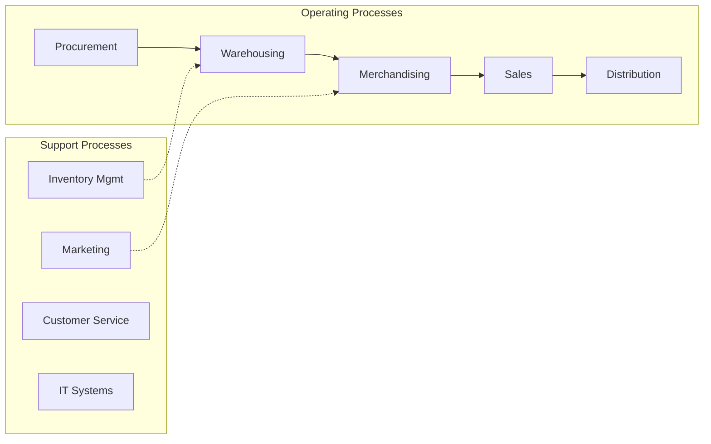

# Wholesale Trade Agents

> The Wholesale Trade Agents and Brokers subsector groups establishments that arrange for the sale of goods owned by others, generally on a fee or commission basis.

## Overview

Wholesale Trade Agents represents an important category within the Wholesale Trade sector (NAICS 42). This subsector encompasses establishments primarily engaged in wholesale trade agents.

The Wholesale Trade Agents and Brokers subsector groups establishments that arrange for the sale of goods owned by others, generally on a fee or commission basis. They act on behalf of the buyers and sellers of goods to facilitate wholesale trade.

## Industry Hierarchy

## Key Statistics

| Metric | Value |
|--------|-------|
| NAICS Code | 425 |
| Level | Subsector |
| Parent | [Wholesale Trade](../) |
| Child Industries | 0 |

## Core Business Processes

## Industry Value Chain

```mermaid
graph LR
    subgraph Inputs["Inputs"]
        I1["Products"]
        I2["Inventory"]
        I3["Store/Warehouse"]
    end

    subgraph Primary["Primary Activities"]
        A1["Inbound Logistics"]
        A2["Core Operations"]
        A3["Quality Assurance"]
        A4["Outbound/Delivery"]
    end

    subgraph Outputs["Products/Services"]
        O1["Goods for Sale"]
        O2["Services"]
        O3["Delivery"]
    end

    subgraph Customers["Markets"]
        C1["Businesses"]
        C2["Consumers"]
        C3["Institutions"]
        C4["Government"]
    end

    Inputs --> Primary --> Outputs --> Customers
```

---

*Source: NAICS 425 - Wholesale Trade Agents*
