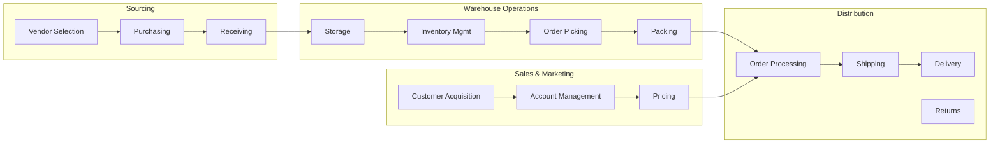
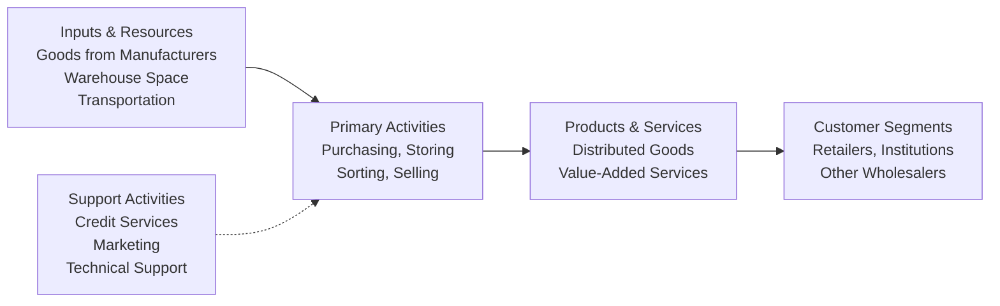

# Wholesale Trade

> The Wholesale Trade sector comprises establishments engaged in wholesaling merchandise, generally without transformation, and rendering services incidental to the sale of merchandise.

## Overview

Wholesalers serve as an intermediate step in the distribution of merchandise, organized to sell or arrange the purchase or sale of goods for resale, capital or durable nonconsumer goods, and raw and intermediate materials. The merchandise includes outputs of agriculture, mining, manufacturing, and certain information industries such as publishing.

Wholesalers typically operate from warehouses or offices characterized by having little or no display of merchandise. Neither the design nor location is intended to solicit walk-in traffic. Customers are reached through telephone, in-person marketing, or specialized advertising including Internet and electronic means.

The sector comprises two main types: merchant wholesalers (selling goods on their own account) and agents/brokers (arranging sales for others on commission or fee basis).

## Industry Hierarchy

```mermaid
graph TD
    S42["NAICS 42: Wholesale Trade"]
    S42 --> SS423["423: Merchant Wholesalers, Durable Goods"]
    S42 --> SS424["424: Merchant Wholesalers, Nondurable Goods"]
    S42 --> SS425["425: Wholesale Trade Agents and Brokers"]

    SS423 --> G4231["4231: Motor Vehicle Parts"]
    SS423 --> G4232["4232: Furniture and Home Furnishings"]
    SS423 --> G4233["4233: Lumber and Construction Materials"]
    SS423 --> G4234["4234: Professional and Commercial Equipment"]
    SS423 --> G4235["4235: Metal and Mineral"]
    SS423 --> G4236["4236: Household Appliances and Electronics"]
    SS423 --> G4237["4237: Hardware and Plumbing"]
    SS423 --> G4238["4238: Machinery and Equipment"]
    SS423 --> G4239["4239: Miscellaneous Durable Goods"]

    SS424 --> G4241["4241: Paper Products"]
    SS424 --> G4242["4242: Drugs and Druggists' Sundries"]
    SS424 --> G4243["4243: Apparel and Piece Goods"]
    SS424 --> G4244["4244: Grocery and Related Products"]
    SS424 --> G4245["4245: Farm Product Raw Materials"]
    SS424 --> G4246["4246: Chemical and Allied Products"]
    SS424 --> G4247["4247: Petroleum Products"]
    SS424 --> G4248["4248: Beer, Wine, and Distilled Alcoholic Beverages"]
    SS424 --> G4249["4249: Miscellaneous Nondurable Goods"]
```

## Key Statistics

| Metric | Value |
|--------|-------|
| NAICS Code | 42 |
| Level | Sector |
| Subsectors | 3 |
| Industry Groups | 19 |
| Industries | 70+ |

## Sub-Industries

| Subsector | Code | Description |
|-----------|------|-------------|
| [Merchant Wholesalers, Durable Goods](./DurableGoods/) | 423 | Capital and durable goods with 3+ year life expectancy - vehicles, furniture, machinery, metals |
| [Merchant Wholesalers, Nondurable Goods](./NondurableGoods/) | 424 | Consumable goods with less than 3-year life - paper, drugs, apparel, groceries, petroleum |
| [Wholesale Trade Agents and Brokers](./Agents/) | 425 | Establishments arranging sales for others on commission or fee basis |

## Related Occupations

- [Wholesale and Retail Buyers](/occupations/WholesaleAndRetailBuyers) - Purchasing and inventory management
- [Sales Representatives, Wholesale](/occupations/SalesRepresentativesWholesale) - Business-to-business sales
- [Logisticians](/occupations/Logisticians) - Supply chain management
- [Shipping and Receiving Clerks](/occupations/ShippingAndReceivingClerks) - Warehouse operations
- [Stock Clerks and Order Fillers](/occupations/StockClerksAndOrderFillers) - Inventory handling
- [First-Line Supervisors of Non-Retail Sales](/occupations/FirstLineSupervisorsOfNonRetailSales) - Sales team management

## Core Business Processes

### Procurement and Inventory Management

Managing the acquisition of goods from manufacturers and the optimization of inventory levels to meet customer demand while minimizing carrying costs.

**Key Activities:**
- Negotiate pricing and terms with suppliers
- Forecast demand and plan inventory levels
- Manage purchase orders and receiving
- Monitor inventory turnover and obsolescence
- Coordinate with suppliers on lead times

### Sales and Customer Relationship Management

Building and maintaining relationships with business customers including retailers, other wholesalers, and institutional clients.

**Key Activities:**
- Identify and prospect new customers
- Manage key account relationships
- Process orders and quotes
- Provide product information and support
- Handle customer service inquiries

### Warehousing and Logistics

Operating distribution facilities and managing the physical flow of goods from receipt through delivery.

**Key Activities:**
- Operate warehouse management systems
- Coordinate transportation and delivery
- Manage cross-docking and consolidation
- Ensure proper storage conditions
- Process returns and exchanges

## Industry Value Chain

## Wholesaler Types

### Merchant Wholesalers
Take title to goods and sell on their own account. Known as wholesale merchants, distributors, jobbers, drop shippers, or import/export merchants. Includes sales offices maintained by manufacturers apart from their plants.

### Agents and Brokers
Arrange purchase or sale of goods owned by others, generally on commission. Known as business-to-business electronic markets, commission merchants, auction companies, and manufacturers' representatives.

### Drop Shippers
Arrange sales without physically handling goods - products ship directly from manufacturer to customer.

## Integral Services

Wholesalers often provide value-added services including:

- **Sorting and Packaging**: Breaking bulk into smaller quantities
- **Labeling and Marking**: Custom branding for resellers
- **Technical Support**: Product expertise and training
- **Credit and Financing**: Extended payment terms
- **Delivery Services**: Transportation and logistics

## Regulatory Environment

The wholesale trade sector operates under various regulations:

- **Product Safety**: Consumer Product Safety Commission requirements
- **Food Safety**: FDA regulations for food and drug distribution
- **Hazardous Materials**: DOT and EPA requirements for chemical distribution
- **Alcohol and Tobacco**: ATF licensing and state regulations
- **Import/Export**: Customs and trade compliance

## Technology & Innovation

The wholesale trade sector is transforming through technology:

- **E-Commerce Platforms**: B2B online ordering and marketplaces
- **Warehouse Management Systems**: Real-time inventory tracking and automation
- **Transportation Management**: Route optimization and carrier management
- **Electronic Data Interchange (EDI)**: Automated ordering and invoicing
- **Mobile Sales Tools**: Field sales applications and CRM integration
- **Analytics and AI**: Demand forecasting and pricing optimization
- **Robotics and Automation**: Automated picking and packing systems

---

*Source: NAICS 42 - Wholesale Trade*
