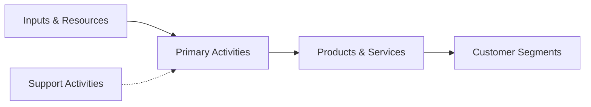

# {name}

> {description}

## Overview

{overview}

## Industry Hierarchy

```mermaid
graph TD
    {sector}["{sectorName}"] --> {subsector}["{subsectorName}"]
    {subsector} --> {group}["{groupName}"]
    {group} --> {industry}["{name}"]
```

## Key Statistics

| Metric | Value |
|--------|-------|
| NAICS Code | {code} |
| Level | {level} |
| Parent Sector | [{sectorName}](../{sectorPath}) |
| Child Industries | {childCount} |

## Related Occupations

{#each relatedOccupations}
- [{name}](/occupations/{path}) - {taskCount} tasks
{/each}

## Core Business Processes

```mermaid
flowchart LR
    subgraph Operating["Operating Processes"]
        {#each operatingProcesses}
        {id}["{name}"]
        {/each}
    end

    subgraph Support["Support Processes"]
        {#each supportProcesses}
        {id}["{name}"]
        {/each}
    end
```

{#each coreProcesses}
### {name}

{description}

**Key Activities:**
{#each activities}
- {name}
{/each}
{/each}

## Industry Value Chain



## Sub-Industries

{#if hasChildren}
| Industry | Code | Description |
|----------|------|-------------|
{#each children}
| [{name}](./{path}) | {code} | {shortDescription} |
{/each}
{/if}

## Related Industries

{#each relatedIndustries}
- [{name}](../{path}) - {relationship}
{/each}

## Regulatory Environment

{regulatoryNotes}

## Technology & Innovation

{technologyTrends}

---

*Source: NAICS {code} - {sourceType}*
