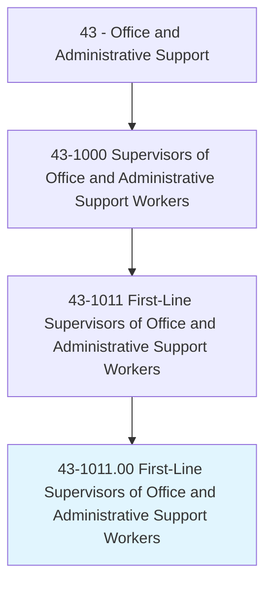
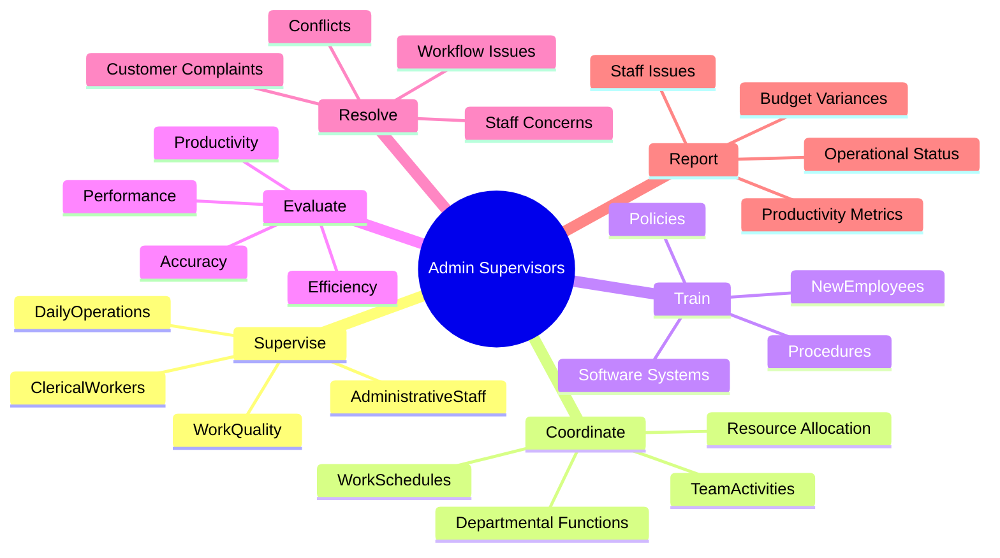
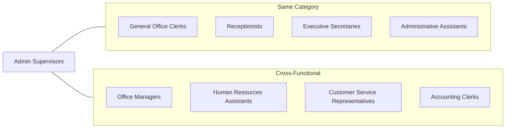
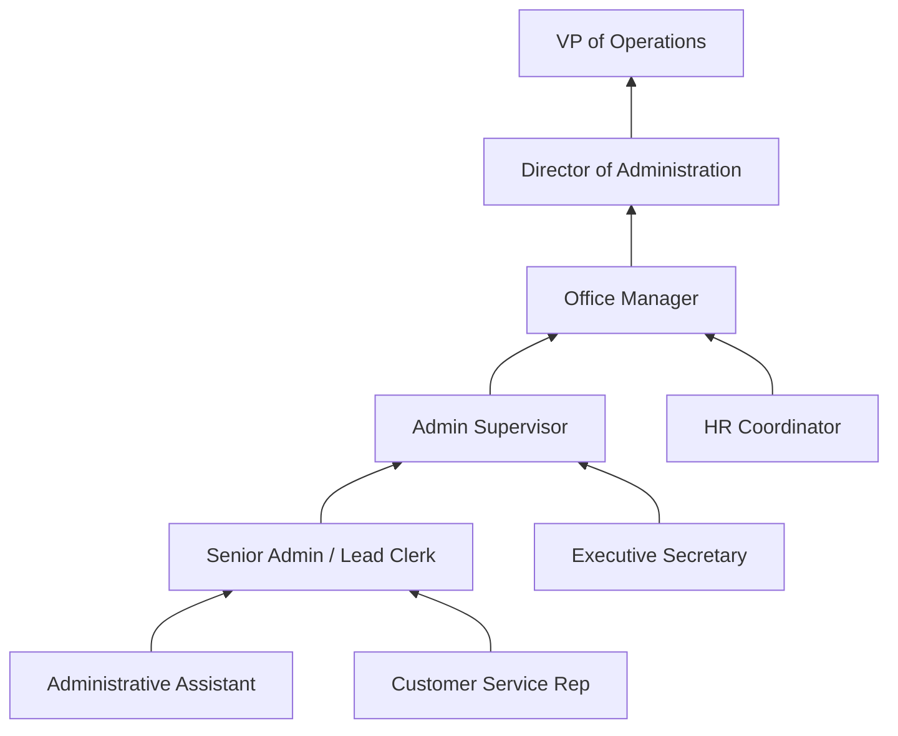

# First-Line Supervisors of Office and Administrative Support Workers

> Directly supervise and coordinate the activities of clerical and administrative support workers.

## Overview

First-Line Supervisors of Office and Administrative Support Workers serve as the essential link between management and front-line administrative staff. They oversee daily operations of office functions, ensuring that clerical tasks are completed accurately and efficiently. These supervisors manage teams ranging from a few employees to large departments, handling scheduling, performance evaluation, training, and workflow coordination. Their role requires balancing people management with operational expertise, making them critical to organizational productivity across virtually every industry.

## Classification Hierarchy

## Key Statistics

| Metric | Value |
|--------|-------|
| SOC Code | 43-1011.00 |
| Job Zone | 3 (Medium Preparation) |
| Category | [Office and Administrative Support](/occupations/Administrative/index) |
| Core Tasks | 12+ |
| Source | O*NET |

## Core Tasks

### supervise.ClericalWorkers

Admin Supervisors directly oversee the work of clerical and administrative employees to ensure quality and productivity.

**Actions:**
- `supervise.ClericalWorkers.to.ensure.Quality` - Monitor work output for accuracy and completeness
- `supervise.ClericalWorkers.to.maintain.Productivity` - Track individual and team productivity metrics
- `supervise.AdministrativeStaff.to.meet.Deadlines` - Ensure timely completion of assignments
- `supervise.DailyOperations.to.optimize.Workflow` - Oversee routine office activities

### coordinate.WorkSchedules

Admin Supervisors manage staffing levels and schedules to meet operational demands.

**Actions:**
- `coordinate.WorkSchedules.for.Staff` - Create and maintain employee schedules
- `coordinate.TeamActivities.to.align.Priorities` - Synchronize work across team members
- `coordinate.DepartmentalFunctions.with.OtherUnits` - Facilitate cross-departmental collaboration
- `coordinate.ResourceAllocation.to.meet.Demands` - Assign personnel and resources effectively

### train.NewEmployees

Admin Supervisors develop staff capabilities through training and mentorship.

**Actions:**
- `train.NewEmployees.on.Procedures` - Orient new hires to office protocols
- `train.Staff.on.SoftwareSystems` - Provide instruction on technology tools
- `train.Team.on.Policies` - Communicate and explain organizational policies
- `train.Employees.for.SkillDevelopment` - Support ongoing professional growth

### evaluate.Performance

Admin Supervisors assess employee performance and provide constructive feedback.

**Actions:**
- `evaluate.Performance.using.Metrics` - Measure work against established standards
- `evaluate.Productivity.to.identify.Improvements` - Analyze efficiency opportunities
- `evaluate.Accuracy.of.WorkOutput` - Review quality of completed tasks
- `evaluate.Efficiency.to.optimize.Processes` - Assess workflow effectiveness

### resolve.Conflicts

Admin Supervisors address workplace issues and maintain team harmony.

**Actions:**
- `resolve.Conflicts.between.Employees` - Mediate interpersonal workplace disputes
- `resolve.CustomerComplaints.through.ServiceRecovery` - Handle escalated customer issues
- `resolve.WorkflowIssues.to.maintain.Operations` - Address process bottlenecks
- `resolve.StaffConcerns.through.Communication` - Listen to and address employee feedback

## Skills & Competencies

### Technical Skills
- **Office Administration** - Advanced
- **Scheduling Software** - Advanced
- **Performance Management Systems** - Proficient
- **Microsoft Office Suite** - Expert
- **Database Management** - Proficient

### Soft Skills
- **Leadership** - Critical
- **Communication** - Critical
- **Conflict Resolution** - Essential
- **Time Management** - Essential
- **Decision Making** - Essential

## Related Occupations

## Industries

- [Professional, Scientific, and Technical Services](/industries/Scientific) - High Employment
- [Healthcare and Social Assistance](/industries/Healthcare/index) - High Employment
- [Government](/industries/PublicAdministration) - High Employment
- [Finance and Insurance](/industries/Finance) - Moderate Employment
- [Educational Services](/industries/Education) - Moderate Employment
- [Manufacturing](/industries/Manufacturing/index) - Moderate Employment

## Industry Variations

### Healthcare Settings
In hospitals and clinics, Admin Supervisors manage medical records staff, patient registration teams, and billing clerks. They must understand healthcare regulations including HIPAA compliance and medical terminology.

### Government Agencies
Public sector supervisors oversee clerical staff handling citizen services, records management, and administrative processing. They navigate civil service rules and union regulations.

### Corporate Environments
In large corporations, these supervisors manage executive support teams, mail rooms, and centralized administrative pools. They often coordinate with multiple departments and executives.

### Small Business
Small business Admin Supervisors often perform hands-on administrative work alongside supervision, requiring versatility across bookkeeping, customer service, and office management.

## Career Progression

## Education & Training

| Requirement | Details |
|-------------|---------|
| Typical Education | High school diploma; some college preferred |
| Work Experience | 1-3 years of office or clerical experience |
| On-the-Job Training | Moderate (1-2 months) |
| Common Certifications | CAP (Certified Administrative Professional), MOS (Microsoft Office Specialist) |

## Tools & Technology

### Software Systems
- Microsoft Office 365 / Google Workspace
- Scheduling and time-tracking systems (Kronos, ADP)
- Project management tools (Asana, Monday.com)
- Customer relationship management (CRM) systems
- Enterprise resource planning (ERP) systems

### Equipment
- Multi-line telephone systems
- Office machinery (copiers, scanners, printers)
- Video conferencing equipment
- Building access and security systems

## Departments

This occupation typically works in:
- Administrative Services
- [Human Resources](/departments/HR/index)
- [Operations](/departments/Operations/index)
- Customer Service

## Related Processes

- [Office Administration](/processes/OfficeAdministration)
- [Staff Management](/processes/StaffManagement)
- [Performance Management](/processes/PerformanceManagement)
- [Training and Development](/processes/TrainingDevelopment)

---

*Source: O*NET 43-1011.00 - ONETOccupation*
