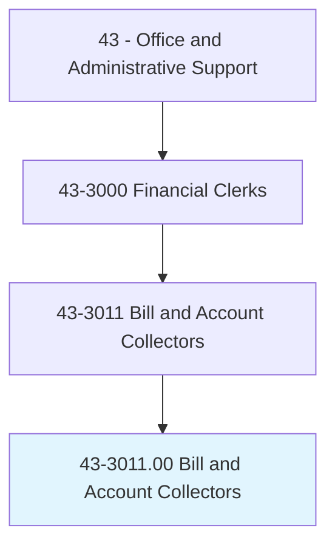
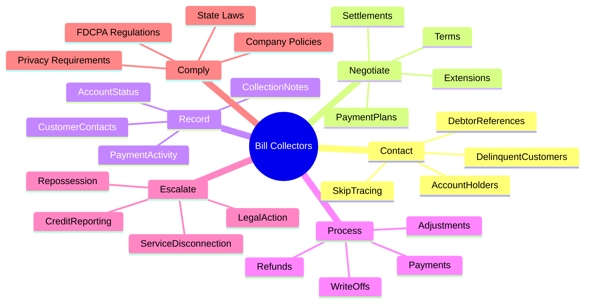
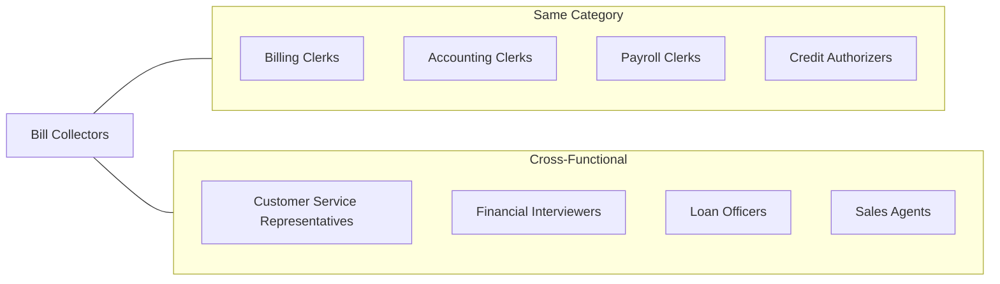
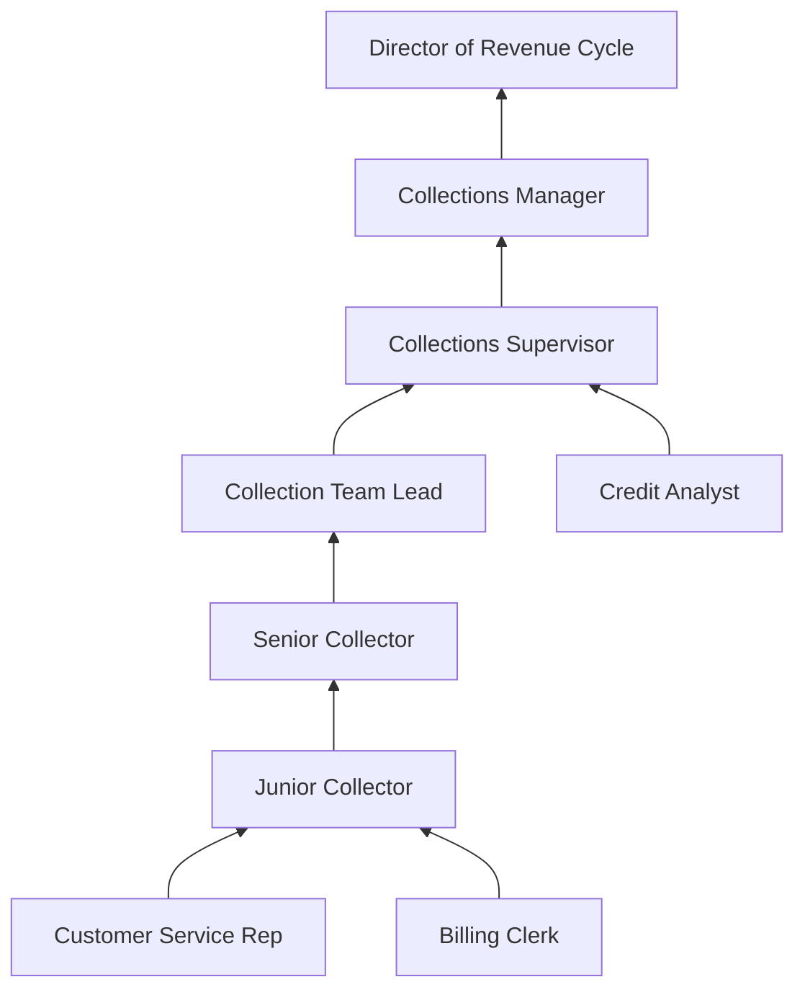

# Bill and Account Collectors

> Locate and notify customers of delinquent accounts by mail, telephone, or personal visit to solicit payment. Duties include receiving payment and posting amount to customer's account, preparing statements to credit department if customer fails to respond, initiating repossession proceedings or service disconnection, and keeping records of collection and status of accounts.

## Overview

Bill and Account Collectors play a vital role in maintaining organizational cash flow by recovering outstanding debts from individuals and businesses. They work across industries including healthcare, financial services, utilities, telecommunications, and retail, using communication skills and negotiation tactics to secure payment arrangements. Modern collectors balance assertiveness with empathy, adhering to strict regulations like the Fair Debt Collection Practices Act (FDCPA) while helping debtors find manageable payment solutions. This role requires persistence, strong communication abilities, and proficiency with billing and collections software systems.

## Classification Hierarchy

## Key Statistics

| Metric | Value |
|--------|-------|
| SOC Code | 43-3011.00 |
| Job Zone | 2 (Some Preparation) |
| Category | [Office and Administrative Support](/occupations/Administrative) |
| Core Tasks | 15+ |
| Source | O*NET |

## Core Tasks

### contact.DelinquentCustomers

Bill Collectors initiate communication with customers who have overdue accounts to discuss payment obligations.

**Actions:**
- `contact.DelinquentCustomers.by.Telephone` - Make outbound collection calls to past-due accounts
- `contact.DelinquentCustomers.by.Mail` - Send collection letters and payment notices
- `contact.AccountHolders.to.verify.Information` - Confirm debtor contact details and account accuracy
- `contact.DebtorReferences.for.SkipTracing` - Locate customers who have moved or changed numbers

### negotiate.PaymentPlans

Bill Collectors work with debtors to establish realistic payment arrangements.

**Actions:**
- `negotiate.PaymentPlans.with.Customers` - Create structured payment schedules
- `negotiate.Settlements.for.ReducedAmounts` - Offer discounted payoffs when authorized
- `negotiate.Extensions.on.DueDate` - Grant additional time for payment when appropriate
- `negotiate.Terms.to.resolve.Accounts` - Find mutually acceptable payment solutions

### record.PaymentActivity

Bill Collectors maintain accurate records of all collection activities and account changes.

**Actions:**
- `record.PaymentActivity.in.System` - Log payments received and post to accounts
- `record.AccountStatus.for.Reporting` - Update account classification and status codes
- `record.CustomerContacts.with.Notes` - Document all debtor communications
- `record.CollectionNotes.for.Compliance` - Maintain detailed activity logs

### process.Payments

Bill Collectors handle the receipt and application of payments to customer accounts.

**Actions:**
- `process.Payments.to.CustomerAccounts` - Apply funds received to outstanding balances
- `process.Adjustments.for.Disputes` - Make corrections when account errors are identified
- `process.WriteOffs.for.UncollectibleAccounts` - Remove bad debt from active collection
- `process.Refunds.for.Overpayments` - Return excess payments to customers

### escalate.LegalAction

Bill Collectors initiate formal collection procedures when standard methods are unsuccessful.

**Actions:**
- `escalate.LegalAction.for.NonPayment` - Refer accounts to legal department or collection attorneys
- `escalate.Repossession.for.SecuredDebts` - Initiate asset recovery procedures
- `escalate.ServiceDisconnection.for.Utilities` - Trigger service termination processes
- `escalate.CreditReporting.for.Delinquency` - Report payment history to credit bureaus

## Skills & Competencies

### Technical Skills
- **Collections Software** - Proficient
- **Skip Tracing Tools** - Proficient
- **Payment Processing Systems** - Advanced
- **Microsoft Office** - Intermediate
- **CRM Systems** - Proficient

### Soft Skills
- **Negotiation** - Critical
- **Communication** - Critical
- **Persistence** - Essential
- **Empathy** - Essential
- **Stress Management** - Essential

## Related Occupations

## Industries

- [Finance and Insurance](/industries/FinanceInsurance) - High Employment
- [Healthcare and Social Assistance](/industries/Healthcare) - High Employment
- [Utilities](/industries/Utilities) - Moderate Employment
- [Administrative and Support Services](/industries/AdminSupport) - High Employment
- [Telecommunications](/industries/Telecommunications) - Moderate Employment
- [Retail Trade](/industries/RetailTrade) - Moderate Employment

## Industry Variations

### Healthcare Collections
Medical debt collectors navigate complex insurance situations, patient financial assistance programs, and charity care policies. They must understand medical billing codes, insurance verification, and healthcare-specific regulations including HIPAA.

### Financial Services
Bank and credit card collectors handle various debt types from credit cards to personal loans. They often have authority to negotiate settlements and must understand consumer lending regulations.

### Third-Party Collection Agencies
Agency collectors work purchased or placed debt portfolios from multiple creditors. They face stricter FDCPA requirements and often work on commission-based compensation structures.

### Utilities and Telecommunications
These collectors manage service accounts with ongoing relationships, balancing collection efforts with customer retention goals. They coordinate with service departments on disconnection and reconnection procedures.

### Government Collections
Public sector collectors handle tax debts, court fines, and benefit overpayments. They work within specific statutory frameworks and may have access to wage garnishment and tax refund intercept programs.

## Career Progression

## Education & Training

| Requirement | Details |
|-------------|---------|
| Typical Education | High school diploma or equivalent |
| Work Experience | None to 1 year preferred |
| On-the-Job Training | Short-term (1 month or less) |
| Common Certifications | ACA Collector Certification, RMAI Certification |

## Regulatory Compliance

### Fair Debt Collection Practices Act (FDCPA)
- Restrictions on contact times (8 AM - 9 PM local time)
- Required debt validation notices
- Prohibition on harassment and abuse
- Consumer dispute rights

### State Regulations
- Licensing requirements vary by state
- Additional consumer protection laws
- Statute of limitations on debt

### Credit Reporting
- Fair Credit Reporting Act compliance
- Accurate reporting obligations
- Dispute investigation requirements

## Tools & Technology

### Software Systems
- Collections management software (FACS, Collect!, CUBE)
- Auto-dialers and predictive dialers
- Skip tracing databases (LexisNexis, TLO)
- Payment portals and IVR systems
- CRM and account management systems

### Communication Tools
- Multi-line phone systems
- Email and SMS platforms
- Document management systems
- Call recording and quality monitoring

## Performance Metrics

| Metric | Description |
|--------|-------------|
| Collection Rate | Percentage of assigned debt recovered |
| Right Party Contact Rate | Percentage of calls reaching the debtor |
| Promise to Pay Rate | Percentage of contacted debtors making commitments |
| Payment Plan Retention | Percentage of plans completed as arranged |
| Compliance Score | Adherence to regulations and policies |

## Departments

This occupation typically works in:
- [Collections](/departments/Collections)
- [Accounts Receivable](/departments/AccountsReceivable)
- [Revenue Cycle](/departments/RevenueCycle)
- [Finance](/departments/Finance)

## Related Processes

- [Accounts Receivable Management](/processes/AccountsReceivable)
- [Credit and Collections](/processes/CreditCollections)
- [Customer Service](/processes/CustomerService)
- [Financial Operations](/processes/FinancialOperations)

---

*Source: O*NET 43-3011.00 - ONETOccupation*
