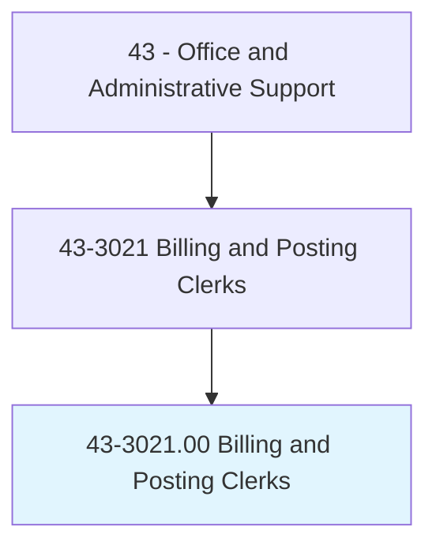
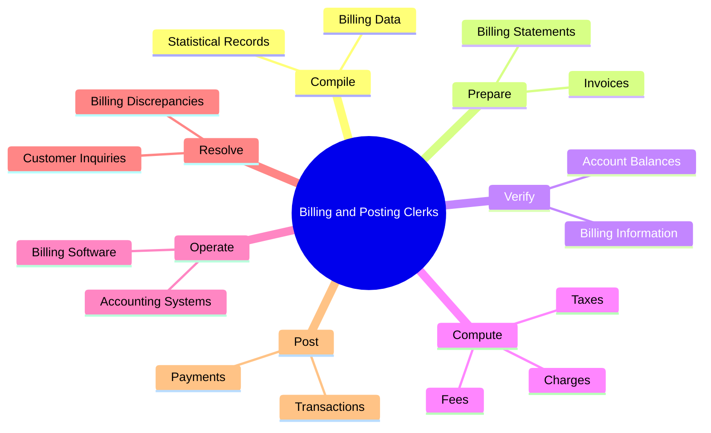
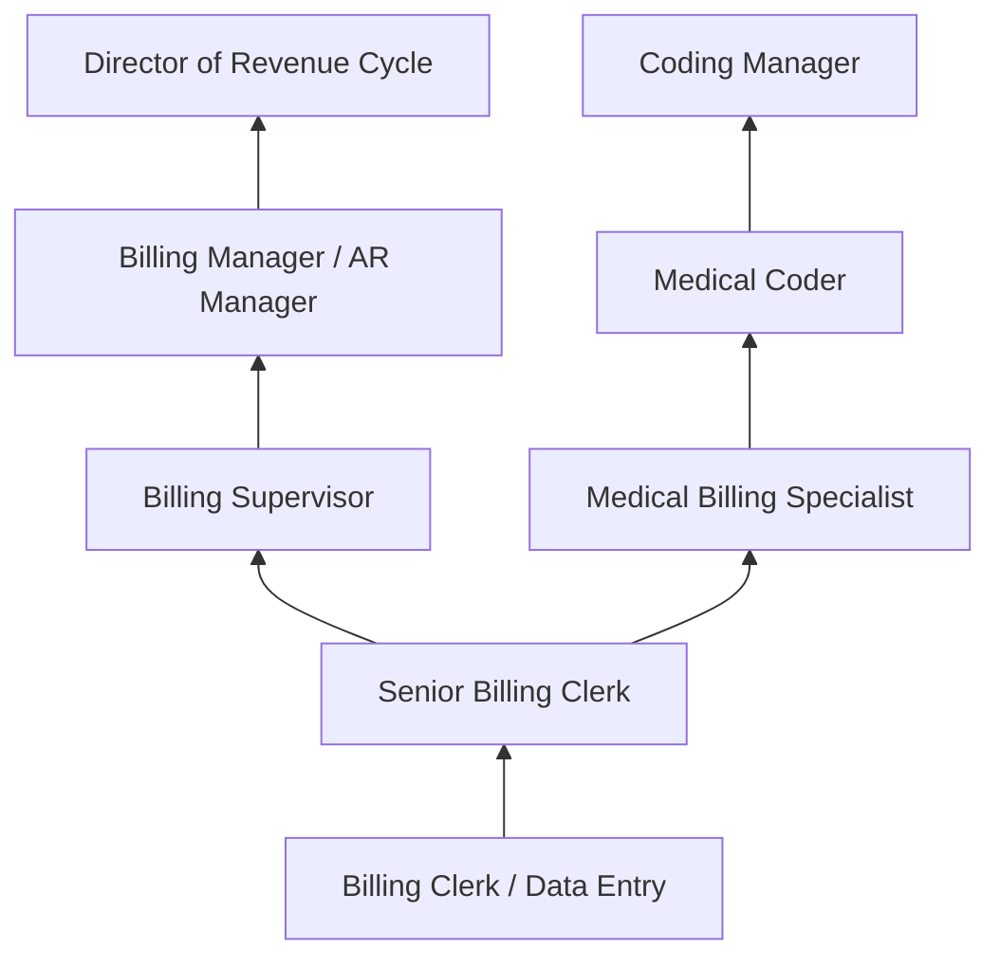
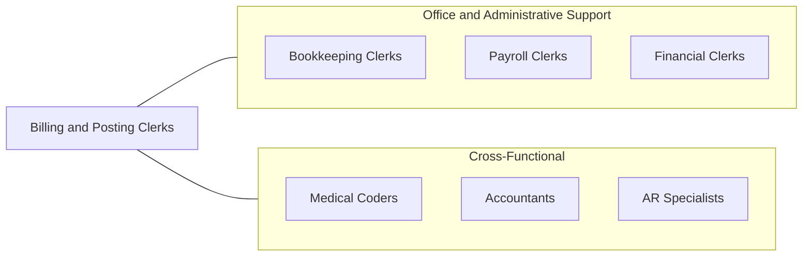

# Billing and Posting Clerks

> Compile, compute, and record billing, accounting, statistical, and other numerical data for billing purposes. Prepare billing invoices for services rendered or for delivery or shipment of goods.

## Overview

Billing and Posting Clerks are financial recordkeeping professionals responsible for compiling, computing, and recording billing data, preparing invoices, and managing accounts receivable. They ensure organizations receive timely payment by generating accurate invoices, posting transactions, resolving billing discrepancies, and maintaining detailed financial records. Their work is essential to organizational cash flow and revenue cycle management.

These professionals work across virtually every industry, from healthcare and utilities to manufacturing and professional services. In healthcare, billing clerks navigate complex insurance coding and reimbursement systems. In utilities, they calculate consumption-based charges. In manufacturing, they process invoices based on contracts and purchase orders. Accuracy, attention to detail, and proficiency with accounting software are fundamental requirements regardless of setting.

The role has evolved with automation and electronic billing systems, but human oversight in exception handling, dispute resolution, and complex billing scenarios remains essential. Many billing clerks specialize in specific systems or industries, developing expertise in medical coding (CPT/ICD), utility rate structures, or ERP billing modules.

## Classification Hierarchy

## Key Statistics

| Metric | Value |
|--------|-------|
| SOC Code | 43-3021.00 |
| Job Zone | 2 (Some Preparation) |
| Category | [Office and Administrative Support](/occupations/Administrative/index) |
| Median Annual Salary | $42,500 |
| Employment | ~490,000 |
| Projected Growth | -4% (declining) |
| Core Tasks | 65 |
| Source | O*NET |

## Core Tasks

### compile.BillingData

Billing and Posting Clerks compile financial data for invoicing purposes.

**Actions:**
- `compile.BillingData.for.InvoicePreparation` - Gather charges and fees
- `compile.StatisticalRecords.for.Reports` - Aggregate billing metrics

### prepare.Invoices

Billing and Posting Clerks generate and distribute billing documents.

**Actions:**
- `prepare.Invoices.for.ServicesRendered` - Create invoices for completed services
- `prepare.BillingStatements.for.Customers` - Generate periodic account statements

### verify.BillingInformation

Billing and Posting Clerks validate billing accuracy.

**Actions:**
- `verify.BillingInformation.for.Accuracy` - Cross-check charges against contracts
- `verify.AccountBalances.for.Reconciliation` - Ensure accounts are current

## Skills & Competencies

### Technical Skills
- **Billing and Invoicing Software** - Advanced
- **Accounts Receivable Management** - Advanced
- **Data Entry and Verification** - Advanced
- **Accounting Principles** - Intermediate
- **Spreadsheet Applications (Excel)** - Advanced
- **ERP Systems (SAP, Oracle)** - Intermediate
- **Medical Billing/Coding** - Intermediate (industry-specific)

### Soft Skills
- **Attention to Detail** - Critical
- **Accuracy** - Critical
- **Organizational Skills** - Essential
- **Communication** - Essential
- **Problem Solving** - Important
- **Time Management** - Essential
- **Confidentiality** - Important

## Education & Certifications

| Requirement | Details |
|-------------|---------|
| Typical Education | High school diploma; some college preferred |
| Certified Billing and Coding Specialist (CBCS) | NHA certification for healthcare billing |
| Certified Professional Biller (CPB) | AAPC medical billing certification |
| Bookkeeping Certification | AIPB Certified Bookkeeper |
| Microsoft Office Specialist | Excel and Office proficiency |
| On-the-Job Training | Moderate; company-specific systems |

## Career Progression

## Industry Variations

| Setting | Focus | Unique Aspects |
|---------|-------|----------------|
| Healthcare | Medical billing and coding | CPT/ICD coding; insurance claims; HIPAA compliance |
| Utilities | Consumption-based billing | Meter readings; rate structures; regulatory tariffs |
| Legal Services | Time-based billing | Billable hours; retainer management; LEDES format |
| Manufacturing | Order-based invoicing | Purchase orders; shipping documentation; volume discounts |

## Technology & Tools

- **Billing Software** - QuickBooks, FreshBooks, Sage, Epic (healthcare)
- **ERP Systems** - SAP, Oracle, NetSuite
- **Spreadsheets** - Microsoft Excel, Google Sheets
- **Medical Billing** - Epic, Cerner, Kareo
- **Payment Processing** - Stripe, ACH platforms
- **Document Management** - Electronic filing systems

## Related Occupations

## Departments

This occupation typically works in:
- [Finance Department](/departments/Finance) - Accounts receivable
- [Revenue Cycle](/departments/RevenueCycle) - Healthcare billing
- [Accounting](/departments/Accounting) - Financial recordkeeping
- [Customer Service](/departments/CustomerService) - Billing inquiries

---

*Source: O*NET 43-3021.00 - ONETOccupation*
