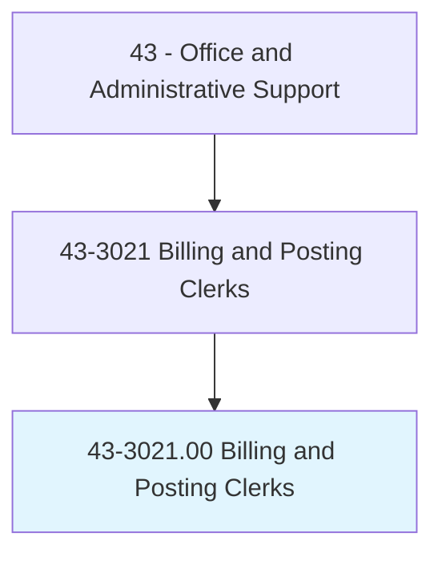
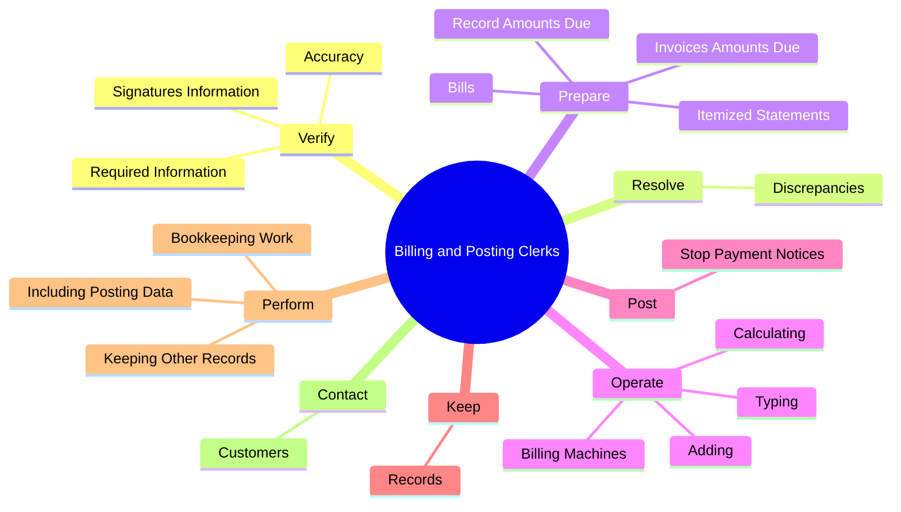
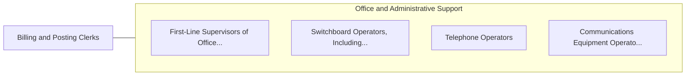

# Billing and Posting Clerks

> Compile, compute, and record billing, accounting, statistical, and other numerical data for billing purposes. Prepare billing invoices for services rendered or for delivery or shipment of goods.

## Overview

Billing and Posting Clerks is an occupation within the Office and Administrative Support category. Compile, compute, and record billing, accounting, statistical, and other numerical data for billing purposes. 

## Classification Hierarchy

## Key Statistics

| Metric | Value |
|--------|-------|
| SOC Code | 43-3021.00 |
| Category | [Office and Administrative Support](/occupations/Administrative) |
| Task Count | 121 |
| Source | O*NET |

## Core Tasks

### verify.Accuracy

Billing and Posting Clerks verify accuracy as part of their core responsibilities.

**Actions:**
- `verify.Accuracy.of.BillingData`
- `verify.Accuracy.of.ReviseErrors`
- `verify.SignaturesInformation.on.Checks`
- `verify.RequiredInformation.on.Checks`

### resolve.Discrepancies

Billing and Posting Clerks resolve discrepancies as part of their core responsibilities.

**Actions:**
- `resolve.Discrepancies.in.AccountingRecords`

### prepare.ItemizedStatements

Billing and Posting Clerks prepare itemized statements as part of their core responsibilities.

**Actions:**
- `prepare.ItemizedStatements.for.ItemsPurchased`
- `prepare.ItemizedStatements.for.ServicesRendered`
- `prepare.Bills.for.ItemsPurchased`
- `prepare.Bills.for.ServicesRendered`

## Skills & Competencies

### Technical Skills
- **Office Management** - Advanced
- **Data Entry** - Advanced
- **Records Management** - Advanced

### Soft Skills
- **Communication** - Essential
- **Problem Solving** - Essential
- **Critical Thinking** - Important
- **Teamwork** - Important
- **Adaptability** - Important

## Related Occupations

## Industries

This occupation is found across multiple industries. See [Industries](/industries) for sector-specific employment data.

## Career Progression

---

*Source: O*NET 43-3021.00 - ONETOccupation*
