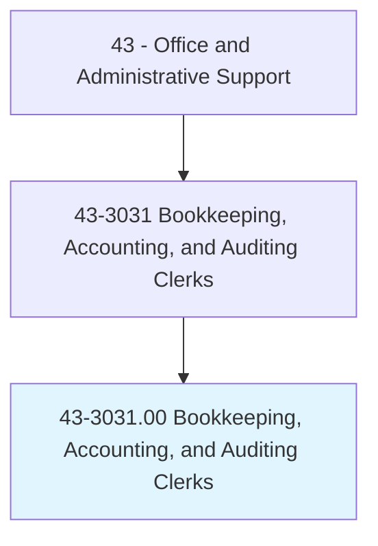
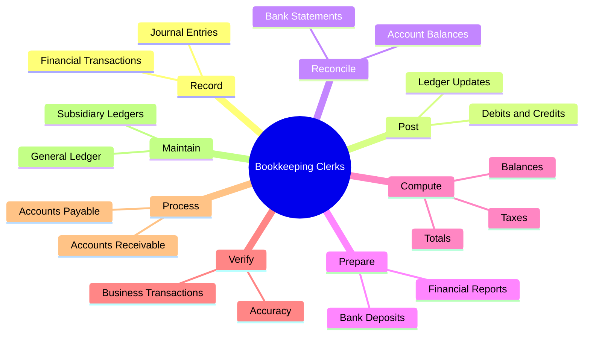
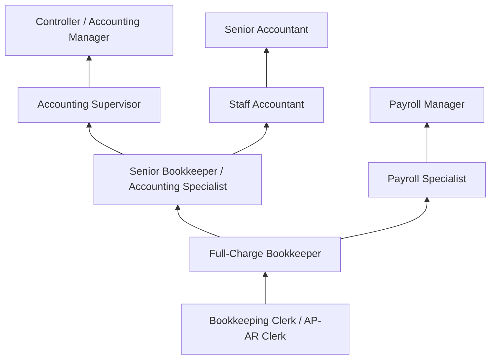
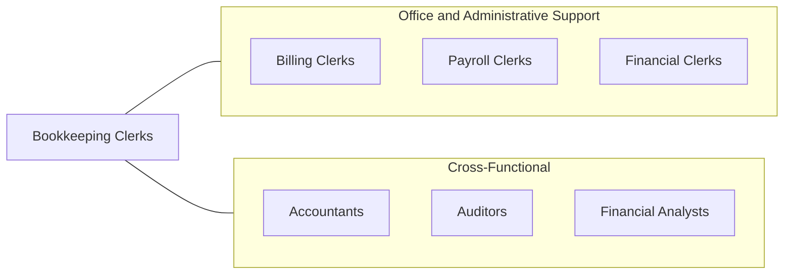

# Bookkeeping, Accounting, and Auditing Clerks

> Compute, classify, and record numerical data to keep financial records complete. Perform any combination of routine calculating, posting, and verifying duties to obtain primary financial data for use in maintaining accounting records. May also check the accuracy of figures, calculations, and postings pertaining to business transactions recorded by other workers.

## Overview

Bookkeeping, Accounting, and Auditing Clerks maintain the financial heartbeat of organizations by recording transactions, updating ledgers, reconciling accounts, and ensuring that financial data is accurate and complete. They process accounts payable and receivable, prepare bank deposits, manage petty cash, generate financial reports, and support accountants and auditors with the foundational data needed for financial statements, tax filings, and audits.

These professionals are found in every sector of the economy, from small businesses where a single bookkeeper handles all financial records to large corporations with specialized clerks managing specific accounting functions. The role requires strong mathematical skills, meticulous attention to detail, and proficiency with accounting software. Modern bookkeepers increasingly use cloud-based platforms that automate routine transactions while still requiring human judgment for categorization, reconciliation, and exception handling.

The profession offers multiple career pathways, from specialized accounting clerk roles to full-charge bookkeeping, and serves as a foundation for advancement into accounting, financial analysis, and management positions. Professional certifications such as the Certified Bookkeeper (CB) designation demonstrate competence and enhance career prospects.

## Classification Hierarchy

## Key Statistics

| Metric | Value |
|--------|-------|
| SOC Code | 43-3031.00 |
| Job Zone | 3 (Medium Preparation) |
| Category | [Office and Administrative Support](/occupations/Administrative/index) |
| Median Annual Salary | $45,860 |
| Employment | ~1,500,000 |
| Projected Growth | -6% (declining) |
| Core Tasks | 72 |
| Source | O*NET |

## Core Tasks

### record.FinancialTransactions

Bookkeeping Clerks document all business financial transactions.

**Actions:**
- `record.FinancialTransactions.in.Journals` - Enter debits and credits into accounting records
- `record.JournalEntries.for.AccountingPeriods` - Post period-end adjusting entries

### reconcile.BankStatements

Bookkeeping Clerks verify account accuracy through reconciliation.

**Actions:**
- `reconcile.BankStatements.with.CompanyRecords` - Match bank transactions to internal records
- `reconcile.AccountBalances.for.MonthEnd` - Verify subsidiary ledgers to general ledger

### prepare.FinancialReports

Bookkeeping Clerks generate financial summaries and reports.

**Actions:**
- `prepare.FinancialReports.for.Management` - Create income statements and balance sheets
- `prepare.BankDeposits.for.DailyOperations` - Process daily cash and check deposits

## Skills & Competencies

### Technical Skills
- **Double-Entry Bookkeeping** - Expert
- **Accounting Software (QuickBooks, Sage)** - Advanced
- **Spreadsheet Applications** - Advanced
- **Accounts Payable/Receivable** - Advanced
- **Bank Reconciliation** - Advanced
- **Payroll Processing** - Intermediate
- **Tax Preparation Basics** - Intermediate
- **General Ledger Management** - Advanced

### Soft Skills
- **Attention to Detail** - Critical
- **Mathematical Accuracy** - Critical
- **Organizational Skills** - Essential
- **Integrity and Confidentiality** - Critical
- **Time Management** - Essential
- **Communication** - Important
- **Problem Solving** - Important

## Education & Certifications

| Requirement | Details |
|-------------|---------|
| Typical Education | High school diploma; associate's degree preferred |
| Certified Bookkeeper (CB) | AIPB professional certification |
| QuickBooks Certified User | Intuit proficiency certification |
| Certified Public Bookkeeper (CPB) | NACPB certification |
| Microsoft Office Specialist | Excel and accounting tool proficiency |
| Continuing Education | Accounting updates, software training |

## Career Progression

## Industry Variations

| Setting | Focus | Unique Aspects |
|---------|-------|----------------|
| Small Business | Full-charge bookkeeping | All accounting functions; owner interface; broad responsibilities |
| Corporate | Specialized accounting functions | AP, AR, or GL specialization; high-volume processing |
| Accounting Firms | Client bookkeeping services | Multiple clients; varied industries; deadline-driven |
| Nonprofit | Fund accounting | Grant tracking; donor management; restricted funds |

## Technology & Tools

- **Accounting Software** - QuickBooks, Xero, Sage, FreshBooks
- **ERP Systems** - SAP, Oracle, NetSuite, Microsoft Dynamics
- **Spreadsheets** - Microsoft Excel, Google Sheets
- **Payroll** - ADP, Gusto, Paychex
- **Banking** - Online banking platforms, remote deposit
- **Document Management** - Receipt scanners, digital filing
- **Tax Preparation** - TurboTax, Drake, Lacerte

## Related Occupations

## Departments

This occupation typically works in:
- [Accounting Department](/departments/Accounting) - Financial recordkeeping
- [Finance Department](/departments/Finance) - Cash management
- [Administration](/departments/Administration) - Office financial operations
- [Payroll](/departments/Payroll) - Employee compensation processing

---

*Source: O*NET 43-3031.00 - ONETOccupation*
